<!-- markdownlint-disable MD013 -->

# AI-Assisted Software Delivery Lifecycle

> **Status:** Proposed  
> **Role:** Architecture proposal  
> **Audience:** Product owners, developers, maintainers of AI skills, agent
> orchestrator authors, and reviewers  
> **Last reviewed:** 2026-08-09

## 1. Purpose and scope

This document proposes a complete, repeatable lifecycle for creating and
operating high-quality software with AI agents. It covers the product
repository, GitHub Issues and pull requests, custom agents, skills, prompts,
instructions, hooks, CI, testing, review, deployment, and post-release
feedback.

The default product technology profile is:

- .NET 10 or later and modern C# for the backend.
- TypeScript for the browser application and tooling.
- React with Fluent UI as the default frontend.
- Vue with Fluent UI as a supported alternative when selected during setup.
- A modular monolith with vertical slices as the default application shape.
- SOLID, dependency injection, TDD, DRY, and explicit contracts.
- DDD only when domain complexity justifies the additional model and language.
- The optional MartiX.Platform profile for repositories that adopt the
  `MartiX.Platform` packages, generated-solution conventions, and migration
  lifecycle.
- Provider-neutral deployment and operations contracts.

This is a proposal for the process and its control plane. It does not prescribe
one cloud vendor, database engine, authentication provider, or hosting product.
Those choices are captured as explicit decisions during setup and shaping.

### 1.1 Decisions already incorporated

The following choices are treated as current working decisions:

| Decision | Choice |
| --- | --- |
| Deployment | Provider-neutral lifecycle; deployment profiles can be added later. |
| Frontend default | React + Fluent UI. |
| Frontend alternative | Vue + Fluent UI, selected per repository. |
| Interactive execution | Copilot CLI is the primary interactive runner. |
| Event-driven execution | GitHub Actions starts bounded, isolated agent runs. |
| Work tracking | GitHub Issues, native sub-issues, dependencies, labels, and PRs. |
| Issue types | MartiX organization `Task`, `Bug`, and `Feature` are canonical; `Epic`, `Spike`, and `Incident` are recommended additions when useful. |
| Architecture default | Modular monolith with vertical slices. |
| Platform profile | Opt-in `MartiX.Platform` conventions; the consuming repository's package references, manifest, source, tests, and quality gates outrank target-only guidance. |
| Production autonomy | Automate preparation and verification; require a human release gate by default. |

### 1.2 Goals

1. Turn an idea into an evidence-backed, implementable specification.
2. Make every implementation unit small enough for an isolated agent run.
3. Preserve human ownership of product, architecture, security, and release
   decisions.
4. Make agent work reproducible through issues, context packs, branches, and
   deterministic checks.
5. Treat user, technical, architecture, data-model, and operational
   documentation as first-class delivery outputs.
6. Keep topic documentation canonical and regenerate summaries and full
   documents deterministically so they cannot silently drift.
7. Use the cheapest capable model and smallest relevant context for each phase.
8. Prefer local deterministic CLI tools before spending LLM tokens.
9. Detect regressions with tests, static analysis, security checks, and review.
10. Automate routine work without treating instructions as a security boundary.
11. Capture enough evidence to improve skills, prompts, agents, and workflows.
12. Configure the MX control plane once per repository and reuse the resolved
    values across every skill, prompt, agent, hook, and deterministic script.

### 1.3 Non-goals

- Replacing product ownership or user research with an autonomous agent.
- Creating microservices by default.
- Applying DDD terminology to simple CRUD behavior without a domain reason.
- Allowing an agent to merge directly to the default branch.
- Allowing an agent to deploy to production with unrestricted credentials.
- Treating a prompt, skill, or instruction as a substitute for CI or policy
  enforcement.

## 2. Operating model

The system has two planes:

1. **Product plane:** the .NET application, frontend, tests, data, and runtime.
2. **AI delivery control plane:** GitHub Issues, agents, skills, prompts,
   instructions, hooks, orchestrators, CI, deployment automation, and evidence.

The control plane changes how work is performed; it must not silently change
the product requirements. The issue, specification, ADRs, tests, and Git diff
are the durable evidence of intent and behavior.

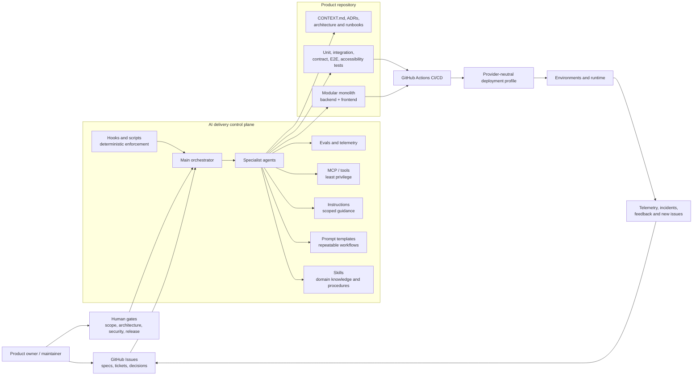

### 2.1 Guidance versus enforcement

Use the narrowest mechanism that can solve the problem:

| Mechanism | Primary purpose | Can enforce a rule? | Typical owner |
| --- | --- | --- | --- |
| Repository instructions | Universal repository facts and safe defaults | No, guidance only | Repository maintainer |
| File-scoped instructions | Backend, frontend, test, docs, or infrastructure conventions | No, guidance only | Area maintainer |
| Prompt | A user-invoked workflow with explicit inputs and outputs | No | Workflow owner |
| Agent | A role with a distinct tool set, model, or handoff | No by itself | Orchestrator owner |
| Skill | Reusable domain knowledge and procedure | No by itself | Skill maintainer |
| Hook or script | Formatting, policy checks, changed-file checks, and evidence | Yes, within its execution boundary | Platform maintainer |
| CI | Repository-wide deterministic quality and security gates | Yes | Repository maintainer |
| GitHub branch protection | Required checks and approval policy | Yes | Repository administrator |
| MCP tool | External data or action access | Only through tool/server policy | Platform maintainer |

Instructions should explain the desired behavior. Hooks, CI, permissions, and
branch protection must enforce behavior that matters for safety or correctness.

## 3. End-to-end lifecycle

The lifecycle is a gated flow, not a mandatory waterfall. A small, well-defined
bug may go directly to TDD and implementation. A new product or high-risk
feature should use the complete flow.

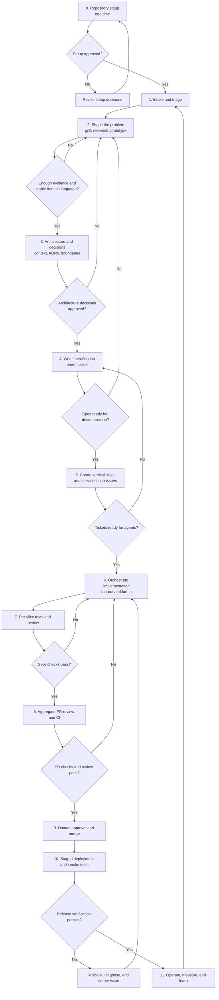

### 3.1 Phase selection rules

| Situation | Smallest recommended flow |
| --- | --- |
| One obvious code fix with a failing regression test | Triage -> TDD -> implementation -> review |
| Small feature in a known module | Shape briefly -> one vertical-slice issue -> TDD -> review |
| Feature spanning backend, frontend, and contracts | Shape -> architecture -> spec -> slice tickets -> orchestration |
| New product or unclear destination | Setup -> wayfinding/discovery -> research/prototypes -> spec |
| External bug report or feature request | Triage first; do not implement raw reporter text |
| Production incident | Diagnose and contain first; architecture improvement follows the verified fix |
| Repeated coupling or change friction | Read-only architecture scan -> human selects candidate -> normal shaping flow |
| New skill, agent, prompt, or guardrail | Artifact design -> evals -> package implementation -> repository validation |

## 4. Phase 0: repository setup

Repository setup is a one-time, explicit workflow. It must use a dedicated
setup skill or setup agent and must not implement product features. Re-running
setup must be idempotent and must show proposed changes before applying them.

### 4.1 Setup inputs

The setup interview records:

- Product name and repository owner.
- Default branch and branch protection policy.
- Backend and frontend choices.
- Package manager and supported runtime versions.
- Test runners, linters, formatters, and static analyzers.
- Data store, migrations policy, and local development dependencies.
- Whether the repository adopts `MartiX.Platform`; if so, record exact package
  references, target framework, `martix.platform.json`, generated-solution
  manifest, preset, capabilities, providers, and current-versus-target status.
- Authentication and authorization approach.
- Deployment profile name, while keeping its contract provider-neutral.
- Whether the repository is greenfield or an existing codebase.
- GitHub organization issue types: verify that `Task`, `Bug`, and `Feature`
  exist and are available to the repository.
- Whether the setup operator may manage organization issue types or must only
  report missing configuration.
- Human approval requirements and allowed agent autonomy.
- Required compliance, data classification, and retention constraints.

Unanswered decisions become `needs-info` or a decision ticket. They must not be
silently invented by the setup agent.

### 4.2 Setup outputs

| Output | Purpose |
| --- | --- |
| `CONTEXT.md` | Small, stable glossary, repository map, and domain facts. |
| `AGENTS.md` or equivalent | Maintainer and agent operating guidance. |
| `.github/copilot-instructions.md` | Short repository-wide AI policy and pointers. |
| `.github/instructions/*.instructions.md` | Narrow backend, frontend, testing, docs, and infrastructure rules. |
| `.github/agents/*.agent.md` | Specialized agent role definitions and tool boundaries. |
| `.github/prompts/*.prompt.md` | User-invoked lifecycle workflows. |
| `.github/ISSUE_TEMPLATE/` | Idea, bug, spec, slice, research, and incident forms. |
| `docs/architecture/` | Stable architecture and process decisions. |
| `docs/adr/` | Decisions whose rationale must survive implementation changes. |
| `docs/runbooks/` | Operational procedures and recovery steps. |
| `docs/topics/` | Small canonical Markdown files organized by audience and topic. |
| `docs/generated/` | Deterministically generated summary, full document, and index outputs. |
| `scripts/docs/` | Local documentation build, context-pack, and freshness checks. |
| Platform profile evidence | Exact `MartiX.Platform` packages, manifest, generated-solution topology, capability/provider status, migration commands, and quality-gate results. |
| `.github/martix/mx.config.json` | Single repository-owned MX configuration source. |
| `.github/martix/mx-config.schema.json` | Installed JSON Schema used to validate the central configuration. |
| `.github/martix/generated/` | Read-only resolved manifest, workflow views, and configuration evidence generated from `mx.config.json`. |
| `scripts/martix/` | Deterministic issue validation, transition, context, and evidence commands used by CLI and Actions. |
| GitHub organization issue types | Checks and records the canonical work types available to the repository. |
| GitHub labels | Lifecycle, area, layer, risk, priority, stack, and wayfinding vocabulary; labels do not duplicate native issue types. |
| GitHub issue dependency policy | Native dependencies with a documented fallback. |
| GitHub Actions workflows | Build, test, security, package, deployment, and release gates. |
| Local validation command | One documented command that agents can run before handoff. |
| Secret and sensitive-path policy | Files and values that agents must not read or modify. |
| Skill manifest and eval baseline | Installed skills, versions, supported clients, and regression cases. |

### 4.3 Setup gate

A human approves setup when:

- the repository can build and test locally;
- the selected frontend profile is explicit;
- the organization issue-type preflight confirms `Task`, `Bug`, and `Feature`,
  or reports an actionable `ready-for-human` setup blocker;
- the issue label and state model is provisioned;
- `.github/martix/mx.config.json` validates against its schema and the available
  organization issue types, repository labels, commands, paths, and profiles;
- generated MX manifests are reproducible from the central configuration and
  are not hand-edited;
- when selected, the MartiX.Platform manifest, package/profile evidence,
  generated-solution status, and current-versus-target classifications validate;
- when not selected, no Platform-specific skill or issue routing is enabled
  merely because the repository uses .NET;
- branch protection and required checks are understood;
- agent permissions and sensitive paths are bounded;
- the first example issue can pass through the complete lifecycle;
- no product code was changed as a side effect of setup.

### 4.4 GitHub organization issue-type preflight

GitHub issue types are organization-level configuration, while labels are
repository-level routing metadata. The setup workflow must check the issue
types before creating templates or publishing agent-ready issues.

The preflight should:

1. Query the repository and organization configuration through an approved
   GitHub UI, API, or CLI capability.
2. Confirm that `Task`, `Bug`, and `Feature` are present, enabled, and
   selectable in the target repository.
3. Record the mapping in the repository setup report:

   | Native type | Lifecycle meaning |
   | --- | --- |
   | `Feature` | Product outcome and parent specification. A small feature may also be implemented directly from this issue. |
   | `Task` | Vertical-slice issue, specialist sub-issue, maintenance work, or a follow-up implementation unit. |
   | `Bug` | Defect, regression, or verified incident follow-up. |

4. If a required type is missing or inaccessible, stop before creating
   agent-ready work and create or update a `ready-for-human` setup blocker.
5. Create or modify organization issue types only when an organization owner
   has explicitly approved that action. Otherwise, report the exact missing
   type and the human setup step.
6. Re-run the check after changes and fail closed on conflicting names or
   insufficient permissions. Do not create near-duplicate labels such as
   `type:feature` when native issue types are available.

#### Recommended additional organization issue types

Keep the organization vocabulary small. The existing three are sufficient for
many repositories. For the MartiX delivery workflow, add these only if the
organization will actively use the corresponding lifecycle:

| Recommendation | Type | Use it for | Why it is separate |
| --- | --- | --- | --- |
| Recommended | `Epic` | A multi-feature initiative that contains several `Feature` specifications. | It gives portfolio-scale work a parent without misusing a product feature. |
| Recommended | `Spike` | Timeboxed research, prototype, architecture investigation, or decision work. | It signals that the output is knowledge or an ADR, not production behavior. |
| Recommended for production systems | `Incident` | A live operational event requiring containment, communication, and recovery. | An incident has an operational timeline and may produce several Bugs and Tasks. |
| Optional | `Chore` | Dependency maintenance, automation, repository housekeeping, or routine platform work. | It separates non-user-facing maintenance when `Task` volume becomes difficult to route. |

Do not create organization issue types for `Backend`, `Frontend`, `Research`,
`Security`, `P0`, `In progress`, or `Architecture Decision`. Those are routing,
risk, priority, workflow, or documentation concerns and belong in labels, ADRs,
or issue fields. `Epic`, `Spike`, and `Incident` are recommendations, not
prerequisites for the first implementation.

## 5. Phase 1: intake, triage, and shaping

### 5.1 Intake issue contract

Every incoming request is first treated as an untrusted statement of intent. The
triage agent validates it against the repository and asks for missing
information. A triage result is one of:

- `needs-info`: the reporter or product owner must answer questions;
- `ready-for-human`: a human must make a product or architecture decision;
- `wontfix`: the request is intentionally declined with a recorded reason;
- `ready-for-agent`: acceptance criteria and constraints are sufficiently clear;
- a newly created `Feature`, `Spike`, or `Task` issue, depending on the outcome.

The triage agent must not convert a vague request directly into implementation
work.

### 5.2 Shaping loop

Use a short, evidence-oriented loop:

1. State the user or business outcome.
2. Identify actors, boundaries, and non-goals.
3. Clarify vocabulary and invariants.
4. Identify unknowns and classify them as product, technical, or operational.
5. Research only facts that need external evidence.
6. Prototype only questions that are cheaper to answer by running or seeing.
7. Record decisions and rejected alternatives.
8. Define measurable acceptance criteria.

Research findings are cited evidence, not product decisions. A prototype is
evidence for a design question, not production implementation. Product owners
approve the resulting trade-offs.

### 5.3 When to use DDD

Use a lightweight domain model for every feature, but use deeper DDD patterns
only when at least one of these signals is present:

- multiple bounded contexts or business capabilities;
- important invariants that cannot be expressed as simple validation;
- state transitions, policies, or workflows with business meaning;
- a domain vocabulary that is currently inconsistent or overloaded;
- multiple teams or modules sharing a business concept;
- a high cost of making the wrong boundary decision.

For simple CRUD, prefer clear application behavior and explicit persistence
models over ceremony. The decision to introduce aggregates, value objects,
domain events, or a richer domain layer is recorded in an ADR or the
specification.

## 6. Phase 2: architecture for the product

### 6.1 Default modular monolith

The default product architecture is one deployable application with explicit
module boundaries. A module owns a business capability and contains the code
needed to deliver a vertical slice. Modules communicate through explicit
contracts, not by reaching into each other's internals.

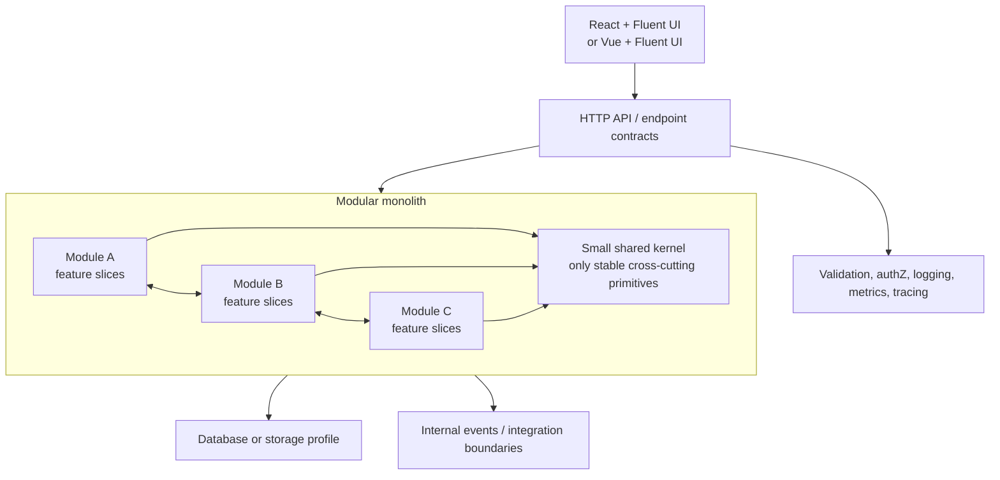

Do not split a module into a service merely because the code has layers. A
microservice or separately deployed component requires an ADR covering
ownership, data consistency, networking, deployment, observability, failure
handling, and operational cost.

### 6.2 Vertical slice shape

A vertical slice is the smallest end-to-end unit that proves user-visible or
business-visible behavior. It may contain:

```text
Modules/
  Orders/
    Features/
      CreateOrder/
        CreateOrderCommand.cs
        CreateOrderHandler.cs
        CreateOrderValidator.cs
        CreateOrderEndpoint.cs
        CreateOrderTests.cs
    Domain/
    Infrastructure/

Web/
  features/
    orders/
      create-order/
        CreateOrderPage.tsx
        createOrderApi.ts
        CreateOrderPage.test.tsx
```

The exact folder names can vary by framework, but the slice must make its
behavior, tests, contracts, and ownership discoverable. Avoid a global
`Services`, `Helpers`, or `Utils` dumping ground.

### 6.3 Backend rules

- Prefer feature-oriented endpoints, commands, queries, handlers, validators,
  and tests.
- Use dependency injection at composition roots; do not use a service locator.
- Depend on abstractions only when they protect a real boundary or test seam.
- Keep domain behavior independent from transport and persistence concerns.
- Validate input at the boundary and enforce invariants in the appropriate
  domain or application component.
- Return a consistent error contract, preferably a standards-based problem
  details shape.
- Make authorization explicit and test both allowed and denied paths.
- Keep persistence operations transactional where the business operation needs
  atomicity.
- Use asynchronous APIs correctly and pass cancellation through boundaries.
- Treat migrations as reviewed, backward-compatible delivery artifacts.
- Add structured logs, metrics, and traces at meaningful business boundaries.

#### 6.3.1 MartiX.Platform application profile

The [`martix-platform`](../../skills/martix-platform/SKILL.md) skill is an
opt-in profile for repositories that consume
`MartiX.Platform`, use its generated-solution conventions, or need its
Platform-specific migration and quality-gate lifecycle. It supplements the
generic .NET rules above; it does not replace repository evidence or the
stack-specific skills for TypeScript, React, Vue, Fluent UI, validation, or
testing.

When the setup profile selects MartiX.Platform:

- Start with one API, one one-shot Migrator, one project per genuine business
  module, and one consolidated test project unless a real boundary justifies
  another process or project.
- Keep the API as the composition root. Compose modules explicitly through
  `AddServices` and `MapEndpoints`; do not use service location, reflection
  scanning, generic module discovery, or hidden startup hooks.
- Keep each module's Contracts assembly as its public surface. Domain,
  Features, Infrastructure, endpoints, persistence, mappings, and migrations
  remain internal to the module, and module dependencies form an acyclic graph.
- Keep the Platform Kernel framework-independent. Use the appropriate
  ASP.NET Core, EF Core, hosting, and other adapter packages at the composition
  boundary rather than coupling the Kernel to them.
- Treat Minimal APIs as the canonical transport. A FastEndpoints adapter is
  allowed only when the selected profile and evidence support it, and must
  preserve the same contracts, ownership, authorization, validation, and
  observability behavior.
- Use typed Result/Error contracts and a Problem Details adapter for failures.
  Reliable events must define delivery, idempotency, observability, and
  recovery behavior rather than relying on an unspecified in-process callback.
- Keep migration execution separate from API startup. For the current
  modular-monolith profile, the Migrator exposes `validate`, `script`, and
  `apply`; use separate runtime and migration connection settings and never
  migrate or seed as a hidden startup side effect.
- Treat generated applications as application-owned after generation. A
  Platform Migration must inspect the current manifest and generated state,
  show a candidate diff, stop on ambiguity, preserve evidence and backups, and
  verify postconditions. Never blindly reapply a template over application-owned
  source.
- Make Native AOT, trimming, performance, and provider claims specific to the
  exact preset and capability profile. Persistence and migration claims remain
  JIT-first until the repository has evidence for the selected configuration.

The current-versus-target guardrail is mandatory: consuming-repository source,
project files, package references, `martix.platform.json`, tests, and quality
gates prove what the application uses; Platform repository guidance proves
current vocabulary and behavior; Wayfinder material describes approved target
architecture only. When they disagree, agents state both and use the current
verified behavior unless a human explicitly requests target design.

### 6.4 Frontend rules

- Use TypeScript strictness and runtime validation at external boundaries.
- Use React + Fluent UI by default; use Vue + Fluent UI only when the setup
  profile selects it.
- Organize by user-facing feature, not only by technical widget type.
- Keep server state, client state, and form state distinct.
- Prefer accessible Fluent UI components and semantic HTML.
- Cover keyboard navigation, focus behavior, loading, empty, error, and
  permission states.
- Keep API clients and generated contracts behind a small feature boundary.
- Avoid duplicating business rules that belong to the backend.
- Use stable keys, predictable state transitions, and explicit error handling.
- Test behavior and user outcomes, not component implementation details.

### 6.5 SOLID, DRY, and design patterns

These are decision tools, not reasons to add abstractions:

- **Single responsibility:** a unit has one reason to change.
- **Open/closed:** extend stable policy through an explicit seam when needed.
- **Liskov substitution:** implementations preserve the contract clients rely on.
- **Interface segregation:** keep interfaces small and role-specific.
- **Dependency inversion:** business policy does not depend on volatile details.
- **DRY:** remove duplicated knowledge, not merely repeated syntax.
- **Pattern selection:** use a named pattern only when it makes a recurring
  constraint clearer and cheaper to change.

Every abstraction should have a purpose, a seam, and a test. Agents should
prefer the simplest design that satisfies current acceptance criteria and
document why a more complex pattern is necessary.

## 7. Phase 3: specification and issue graph

### 7.1 Parent specification issue

The specification is the durable product and architecture contract. It remains
open until the resulting work is merged or explicitly cancelled.

Use the native issue types as follows:

- `Epic` (when enabled) is an optional portfolio parent for several related
  features.
- `Feature` is the parent specification and product outcome.
- `Task` is a vertical slice or one of its specialized implementation tasks.
- `Bug` is a defect or regression; it may contain `Task` children for the fix.
- `Spike` is research or a prototype that ends in findings, an ADR, or a
  decision; it is not a substitute for a production feature.
- `Incident` is an operational event and should link to the resulting Bugs,
  Tasks, and post-incident actions.

If `Epic` is not enabled, use `Feature` directly as the top-level specification.

Required sections:

```markdown
## Outcome
## Users and scenarios
## In scope
## Out of scope
## Domain language and invariants
## UX and accessibility behavior
## API and data contract
## Security and privacy
## Operational and performance expectations
## Architecture decisions and alternatives
## Acceptance criteria
## Test strategy
## Rollout and rollback
## Risks and open decisions
## Child vertical slices
```

The specification must link to relevant ADRs, research, prototypes, designs,
and existing issues. It must not contain a second, untracked implementation
plan that can drift from child issues.

### 7.2 Vertical-slice issue hierarchy

Use a single parent specification for a coherent outcome, one child issue for
each vertical slice, and specialized sub-issues only where a distinct agent
role or dependency makes them useful.

```text
Feature: Invite a member to a workspace (parent specification)
  - Task: Invite member with email and role (vertical slice)
    - Task: Backend command, validation, authorization, persistence
    - Task: Contract schema and generated TypeScript client
    - Task: Frontend form, Fluent UI states, error handling
    - Task: API, component, accessibility, and end-to-end coverage
    - Task: Audit event and useful telemetry
  - Task: Accept invitation (vertical slice)
    - Task: Backend token validation and membership transition
    - Task: Frontend acceptance screen and expired-token state
    - Task: Integration and end-to-end coverage
```

The vertical-slice issue is the implementation unit and owns the end-to-end
acceptance criteria. Its sub-issues are delivery tasks, not independent
features. Do not create a sub-issue for a trivial edit that adds no scheduling,
ownership, or review value.

### 7.3 Dependency and frontier rules

- Use native GitHub issue dependencies as the canonical blocker graph.
- Put `Blocked by: #123` in the body only as a fallback when native
  dependencies are unavailable.
- A ticket is eligible for an agent only when it is open, `ready-for-agent`,
  assigned by the orchestrator, and all blockers are closed.
- The orchestrator selects the ready frontier, not the lowest issue number.
- Contract, schema, or migration work blocks consumers when their output is
  required for safe parallel work.
- Overlapping file ownership blocks parallel execution even when issue
  dependencies are closed.
- A parent issue is not marked complete because one sub-issue passed locally;
  all required child evidence must be present.

### 7.4 Issue lifecycle

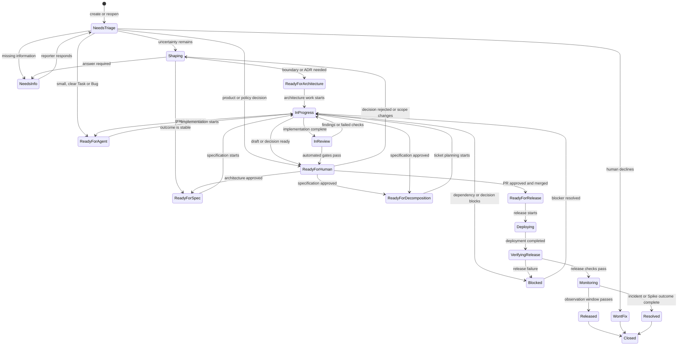

GitHub's open/closed state remains authoritative for completion. Labels express
the current workflow state and must be updated idempotently. The full label
mutation rules, including phase labels and parent/child propagation, are defined
in the lifecycle contract in Section 8.6.

### 7.5 Documentation as a first-class delivery stream

Documentation is part of the feature contract, not a post-release writing task.
Every specification and vertical-slice issue records its documentation impact:

| Documentation concern | Typical canonical topic | Required when |
| --- | --- | --- |
| User documentation | `docs/topics/user/<topic>.md` | A user-visible workflow, behavior, permission, or configuration changes. |
| Technical documentation | `docs/topics/technical/<topic>.md` | Local development, API usage, integration, or extension behavior changes. |
| Architecture documentation | `docs/topics/architecture/<topic>.md` and ADRs | A boundary, pattern, dependency, module, or deployment decision changes. |
| Data-model documentation | `docs/topics/technical/data-model.md` | Entities, relationships, constraints, migrations, or persistence behavior changes. |
| API and contract documentation | `docs/topics/technical/api/<topic>.md` | Endpoint, event, schema, generated client, or compatibility behavior changes. |
| Operational documentation | `docs/topics/operations/<topic>.md` | Deployment, monitoring, recovery, support, or incident behavior changes. |
| AI workflow documentation | `docs/topics/ai/<topic>.md` | An agent, skill, prompt, instruction, hook, or orchestrator contract changes. |

Each issue includes a small documentation section:

```markdown
## Documentation impact
- Categories: user, technical, architecture, data-model, api, operations
- Canonical topics: <topic ids>
- Generated outputs: summary, full, API, data-model, or none
- Verification command: <local command>
- No documentation change reason: <required when categories are empty>
```

The implementation agent updates canonical topic files in the same branch as
the code. A deterministic documentation builder then regenerates the summary
and full document. A documentation-only agent may improve wording, but it must
not invent behavior that is absent from the specification or code.

#### Topic files and generated outputs

The product repository should keep topics small enough to load independently:

```text
docs/
  topics/
    user/
      getting-started.md
      managing-members.md
    technical/
      local-development.md
      data-model.md
      api/
        authentication.md
    architecture/
      module-boundaries.md
      deployment-profile.md
    operations/
      deployment.md
      incident-response.md
    ai/
      agent-workflows.md
  adr/
  generated/
    summary.md
    full.md
    manifest.json
  README.md

scripts/
  docs/
    build-docs.ps1
    check-docs.ps1
    context-pack.ps1
```

Every topic file uses a small metadata header so local tools can build indexes
without an LLM:

```yaml
---
id: technical-data-model
title: Current data model
kind: technical
audience: developers, agents
order: 30
summary: Entities, relationships, constraints, and migration status.
source_of_truth: schema-and-migrations
---
```

The topic body contains the durable explanation, examples, diagrams, and links.
The `summary` field is deliberately short and authored with the topic; the
summary generator must not ask an LLM to rewrite it.

Generated outputs have one-way ownership:

- `docs/generated/summary.md` contains topic summaries, links, status, and
  freshness information. It is the low-token orientation document.
- `docs/generated/full.md` contains a deterministic, stable-order concatenation
  of approved topic files and generated technical snapshots. It is an export
  and reading surface, not a source file.
- `docs/generated/manifest.json` records topic IDs, source hashes, generator
  version, source commit, and generated timestamps.
- Generated files contain a warning header and must never be edited manually.

The builder must reject duplicate topic IDs, missing required metadata, broken
links, unsafe local paths, unknown source-of-truth values, and unstable
ordering. It must be idempotent: the same inputs produce byte-equivalent
outputs.

#### Source of truth for documentation

Markdown is not always the authority for a technical fact. The readable topic
must point to the source that can prove it:

| Subject | Authoritative source | Documentation output |
| --- | --- | --- |
| User behavior | Approved specification and accepted product decision | User topic and generated summaries |
| Architecture rationale | ADR and approved architecture issue | Architecture topic and ADR index |
| Current module map | Source tree and module contracts | Generated or reviewed architecture topic |
| Current data model | Schema, migrations, model configuration, and integration tests | Data-model topic, ER diagram, and freshness metadata |
| Current API contract | OpenAPI or contract source and compatibility checks | API topic and generated contract reference |
| Current Platform profile | Package references, `martix.platform.json`, generated-solution manifest, fixtures, tests, and quality gates | Platform profile topic, generated topology/status snapshot, and release evidence |
| Operational procedure | Reviewed runbook and deployment configuration | Operations topic and generated index |
| Issue state and dependencies | GitHub Issues, sub-issues, labels, and dependencies | Issue views and orchestrator context |

For the data model, the Markdown topic explains concepts and rationale while a
local exporter produces the current entities, relationships, keys, constraints,
and migration status. The exporter output is checked against the schema or
migrations in CI. Agents must not "update the data model document" by guessing
from an issue description.

#### Documentation lifecycle

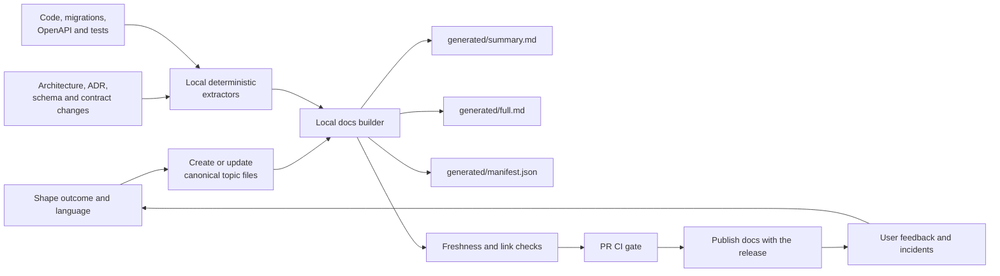

Documentation work is selected per issue, but generation and freshness checks
are deterministic and run for every relevant PR. This keeps user documentation,
technical guidance, architecture notes, and the current data model synchronized
without loading the entire documentation tree into an agent context.

## 8. GitHub issue label system

The label vocabulary should be provisioned once by setup and then treated as a
stable API for agents. Native organization issue types are the canonical work
classification; labels must not duplicate them. The lifecycle contract owns the
state and wayfinding vocabulary, with no parallel label system.

### 8.1 Native issue types

These types are selected in the GitHub issue type field, not in labels:

| Type | Canonical use | Required child or follow-up relationship |
| --- | --- | --- |
| `Epic` | Optional multi-feature initiative | Contains `Feature` specifications. |
| `Feature` | Product outcome and parent specification | Contains `Task` vertical slices. |
| `Task` | Vertical slice, specialist task, maintenance, or follow-up implementation | Links to its parent `Feature`, `Epic`, `Bug`, or `Incident`. |
| `Bug` | Defect or regression | May contain `Task` remediation and test work. |
| `Spike` | Timeboxed research, prototype, or architecture investigation | Ends with findings, an ADR, or a decision; does not ship product behavior. |
| `Incident` | Production operational event | Links to containment, `Bug`, `Task`, and post-incident work. |
| `Chore` | Optional non-user-facing maintenance | Use only if `Task` no longer routes maintenance clearly. |

For repositories that cannot use native issue types, add a compatibility
fallback with `type:feature`, `type:task`, `type:bug`, and any approved
`type:spike`, `type:incident`, or `type:chore` labels. The fallback must never
be enabled alongside native types for the same repository.

### 8.2 Required labels

| Group | Labels | Rule |
| --- | --- | --- |
| Triage and state | `needs-triage`, `needs-info`, `shaping`, `ready-for-architecture`, `ready-for-spec`, `ready-for-decomposition`, `ready-for-agent`, `in-progress`, `blocked`, `in-review`, `ready-for-human`, `ready-for-release`, `deploying`, `verifying-release`, `monitoring`, `released`, `resolved`, `wontfix` | Exactly one active lifecycle label. Closed issues retain the terminal label that explains the outcome. |
| Phase | `phase:setup`, `phase:intake`, `phase:shaping`, `phase:architecture`, `phase:specification`, `phase:decomposition`, `phase:implementation`, `phase:review`, `phase:release`, `phase:operations`, `phase:documentation` | Exactly one phase label on every open issue. `needs-info` and `blocked` retain the phase where the wait occurred. |
| Area | `area:backend`, `area:frontend`, `area:contract`, `area:data`, `area:testing`, `area:security`, `area:accessibility`, `area:observability`, `area:ci-cd`, `area:docs` | One or more labels describing specialist ownership. |
| Layer | `layer:domain`, `layer:application`, `layer:api`, `layer:infrastructure`, `layer:ui` | Optional; use when it narrows the implementation context. |
| Priority | `priority:p0`, `priority:p1`, `priority:p2`, `priority:p3` | Exactly one priority for agent scheduling. |
| Risk | `risk:security`, `risk:data-migration`, `risk:breaking-change`, `risk:architecture`, `risk:external-dependency` | Add all material risks. |
| Readiness | `ready-for-agent`, `ready-for-human`, `ready-for-release` | These are gates, not estimates. |

### 8.3 Wayfinding labels

When the destination is not yet clear, use the existing Wayfinder vocabulary:

- `wayfinder:map`
- `wayfinder:research`
- `wayfinder:prototype`
- `wayfinder:grilling`
- `wayfinder:task`

Wayfinding issues are decision artifacts. They must not be used to hide
production implementation work that should be represented by a specification
and vertical-slice issues.

### 8.4 Optional technology labels

Use technology labels only when they change routing:

- `stack:dotnet`
- `stack:martix-platform`
- `stack:typescript`
- `stack:react`
- `stack:vue`
- `stack:fluent-ui`

Use `stack:martix-platform` only for issues that depend on Platform-specific
packages, manifests, generated-solution topology, migration behavior, or
quality gates. Keep `stack:dotnet` as the broader routing label. Do not add
labels for every library. The repository setup profile and issue body should
carry normal implementation details.

### 8.5 Label governance

- Label creation and renaming are setup or coordinator operations.
- Agents may add or remove labels only within the documented transition rules.
- Do not use labels as a substitute for acceptance criteria.
- Do not create near-synonyms such as `ready`, `agent-ready`, and
  `ready-for-agent`.
- Keep label descriptions short enough for an agent to route reliably.
- Use native GitHub issue types as the primary work classification. Keep labels
  for workflow, area, layer, risk, priority, stack, and wayfinding routing.
- Use the compatibility `type:*` labels only when native issue types are not
  available, never both systems at once.

### 8.6 MartiX lifecycle contract

The custom MartiX skill set should be a workflow product, not a loose
collection of prompts. Its central contract maps every workflow action to:

- accepted native GitHub issue types;
- required and forbidden lifecycle labels;
- allowed state transitions;
- required parent, child, and blocker relationships;
- allowed tools and file paths;
- expected comments, issues, branches, commits, or generated documents;
- required continuation handoff naming the next workflow, owner, input, and gate;
- deterministic preflight and completion commands;
- human approval or escalation rules.

Store the canonical repository configuration in one product-repository file, for
example:

```text
.github/
  martix/
    mx.config.json                 # only repository-owned source to edit
    mx-config.schema.json          # schema installed by mx-setup
    generated/
      resolved.json                # defaults + preset + repository overrides
      workflows.json               # resolved workflow views
      evidence.json                # config hash and validation results
scripts/
  martix/
    validate-issue.ps1
    transition-issue.ps1
    build-context.ps1
```

`mx.config.json` is the only repository-owned MX configuration source. It is
the routing authority for prompts, skills, agents, hooks, and GitHub Actions.
The resolver combines the immutable plugin defaults, the selected preset, and
the repository overrides, then writes the read-only files under
`.github/martix/generated/`. Human-readable instructions and generated workflow
documentation point to the resolved manifest instead of repeating independent
label lists. Setup fails closed when required types, labels, commands, paths, or
profiles cannot be verified.

An illustrative resolved workflow entry is:

```yaml
version: 1
workflow: mx-implement
inputs:
  issue_types: [Task, Bug]
  required_labels: [ready-for-agent]
  forbidden_labels: [blocked, wontfix, in-review]
  required_parent: true
tools:
  allowed: [gh, git, rg, pwsh, dotnet, npm, docs-check]
transitions:
  start:
    add: [in-progress]
    remove: [ready-for-agent]
  success:
    add: [in-review]
    remove: [in-progress]
  blocked:
    add: [blocked]
    remove: [in-progress]
outputs:
  required: [changed-files, test-report, docs-report, commit, continuation]
human_gate: pull-request-review
```

The setup skill should generate or validate the complete resolved manifest; the
example is not a second configuration source.

#### Workflow-to-issue contract

| Workflow action | Accepted issue type | Required entry state | Allowed result | Required evidence |
| --- | --- | --- | --- | --- |
| `mx-setup` | No issue; repository scope | Setup not initialized | Central config, resolved manifest, and human approval | JSON Schema/config validation, type/label preflight, command inventory, baseline checks |
| `mx-ask` | No issue or any configured open issue type | No state requirement; reads the current state when present | One focused question, one recommended `mx-*` workflow, or a named human gate; no direct label mutation | Bounded context, question or recommendation, continuation object, and no-state-write proof |
| `mx-route` | No issue or any configured open issue type | Validated manifest and current context | One legal next workflow, human gate, or terminal action; no direct label mutation | Transition evaluation, selected route, and continuation object |
| `mx-handoff` | No issue or any configured open issue type | Any resumable workflow state or interruption | Resumable handoff; preserve the current state unless the contract authorizes a wait label | Context-pack reference, evidence IDs, owner, expiry, and continuation object |
| `mx-triage` | `Feature`, `Bug`, `Task`, or configured optional type | `needs-triage` or no state label | `needs-info`, `shaping`, `ready-for-architecture`, `ready-for-spec`, `ready-for-human`, or `ready-for-agent` | Issue inspection, type/label classification, and triage comment |
| `mx-shape` | `Feature`, `Bug`, or `Spike` | `shaping` | `ready-for-architecture`, `ready-for-spec`, or `needs-info` | Scenarios, non-goals, decisions, risks, and cleared wayfinding labels |
| `mx-domain` | `Feature`, `Spike`, or decision `Task` | `shaping` | `shaping`, `ready-for-architecture`, or `needs-info` | Glossary, domain model, invariants, examples, and unresolved questions |
| `mx-research` | `Spike` or configured decision `Task` | `shaping` plus `wayfinder:research` when used | Findings comment or linked Markdown; remain shaping until accepted | Cited sources and redacted evidence |
| `mx-prototype` | `Spike` or configured decision `Task` | `shaping` plus `wayfinder:prototype` when used | Prototype evidence and decision | Isolated artifact, branch, and findings |
| `mx-architecture` | `Feature`, `Spike`, or configured decision `Task` | `ready-for-architecture` | `ready-for-human` or `blocked` | ADR/options, boundary map, contracts, and decision evidence |
| `mx-spec` | `Feature` | `ready-for-spec` | `ready-for-human`, then approved `ready-for-decomposition` | Spec sections, ADR links, documentation impact, and acceptance criteria |
| `mx-tickets` | `Feature` | `ready-for-decomposition` | Parent `ready-for-agent`; child `Task` issues `ready-for-agent` or `blocked` | Issue tree, labels, blockers, ownership, and context packs |
| `mx-orchestrate` | `Feature`, `Task`, `Bug`, or configured `Epic` | `ready-for-agent` with dependencies evaluated | Ready frontier dispatched, parent `in-progress`, `blocked`, or `ready-for-human` | Dispatch plan, child assignments, dependency result, and fan-in record |
| `mx-implement` | `Task`, `Bug`, or explicitly approved single-slice `Feature` | `ready-for-agent` and blockers closed, or `in-progress` with a valid TDD handoff | `in-progress`, then `in-review` or `blocked` | Diff, tests, docs report, commit, and issue comment |
| `mx-tdd` | `Task`, `Bug`, or explicitly approved single-slice `Feature` | `ready-for-agent` or `in-progress` | `in-progress` or `blocked`; TDD does not claim review readiness | Red/green test evidence, test diff, deterministic command output, and continuation object |
| `mx-review` | `Task`, `Bug`, or `Feature` | `in-review` | `ready-for-human`, `in-progress`, or `blocked` | Fixed-point diff, standards/spec findings, check results |
| `mx-diagnose` | `Incident`, `Bug`, `Task`, or failed workflow handoff | `blocked`, `in-progress`, or `needs-triage` | `in-progress`, `ready-for-agent`, `ready-for-human`, `resolved`, or `blocked` | Reproduction, hypothesis, recovery action, and redacted diagnostic evidence |
| `mx-docs` | Any type with documentation impact | Parent workflow state unchanged | Topic changes and regenerated outputs | Source links, docs manifest, freshness result |
| `mx-data-docs` | Any type with data-model impact | Parent workflow state unchanged | Current data-model topic and snapshot | Schema/migration source, exporter output, freshness result |
| `mx-build-docs` | No issue or any issue with documentation work | Documentation build requested | Generated summary, full document, manifest, and freshness result | Topic manifest, source hashes, link and freshness checks |
| `mx-release` | `Feature`, `Bug`, `Task`, or configured `Chore` | `ready-for-human` with approved and merged PR | `ready-for-release`, `deploying`, `verifying-release`, `monitoring`, `released`, or `blocked` | Artifact identity, deployment, smoke, and rollback evidence |
| `mx-operate` | `Incident`, `Bug`, or `Task` | New operational signal or `needs-triage + phase:operations` | `in-progress`, `ready-for-human`, `blocked`, `resolved`, or closed follow-up | Redacted telemetry, runbook action, regression issue, and post-incident review |
| `mx-improve-artifact` | Artifact issue or repository scope | Artifact change requested | Proposal, evals, regression report, or `ready-for-human` | Artifact diff, eval results, compatibility checks, and continuation object |

The optional `Epic`, `Incident`, `Spike`, and `Chore` types are enabled in this
table only after setup confirms them in the organization.

#### Strict enforcement rules

1. Every manually invoked prompt accepts an issue number or URL, then runs
   `validate-issue.ps1` before asking an LLM to reason about the work.
2. Every automated trigger resolves the same workflow entry from
   `mx.config.json` and its resolved manifest; GitHub Actions must not embed a
   second transition matrix.
3. A skill may read and propose a transition, but a deterministic wrapper owns
   label and issue writes. The wrapper uses `gh` and is idempotent.
4. A missing type, label, parent, blocker result, acceptance section, or
   documentation impact classification stops the workflow and records
   `needs-info` or `blocked`.
5. An agent cannot add `ready-for-agent`, `ready-for-human`, or close an issue
   unless the contract's completion checks pass.
6. Every transition comment includes a run ID, workflow name, source state,
   target state, evidence paths, and the next human gate when applicable.
7. Prompts and skills refer to workflow IDs and contract fields, not copied
   literal label lists. Generated prompt context contains the resolved values.
8. Contract changes require a versioned diff, migration note, positive and
   negative evals, and a human maintainer review.
9. Every skill, prompt, and workflow-specific agent returns the continuation
   object; missing or illegal next-step guidance is a failed completion.

This gives the MartiX implementation a strong relationship between issue
types, labels, skills, prompts, instructions, hooks, and agents while keeping
the authoritative rules in one small machine-readable surface.

#### Transition matrix

The validator should expose transitions by action rather than allowing agents
to edit labels directly:

| Current state | Action | Successful next state | Failure or escalation state |
| --- | --- | --- | --- |
| Any request or open issue | `mx-ask` | No state mutation; return one focused question, one legal `mx-*` workflow, or a named human gate | `needs-info` or `ready-for-human` is proposed for the downstream workflow; direct writes are rejected |
| Any resumable workflow state | `mx-handoff` | Preserve state and phase; persist a resumable handoff | `blocked` only when the run was interrupted or its context cannot be safely resumed |
| No lifecycle state or `needs-triage` | `mx-triage` | `shaping`, `ready-for-architecture`, `ready-for-spec`, `ready-for-agent`, or `needs-info` | `ready-for-human` |
| `needs-info` | Reporter reply, then `mx-triage` | The state selected by the new evidence | `needs-info` |
| `shaping` | `mx-shape`, `mx-research`, or `mx-prototype` | `ready-for-architecture`, `ready-for-spec`, or `needs-info` | `ready-for-human` |
| `shaping` | `mx-domain` | Preserve `shaping`; record accepted language, invariants, and examples | `needs-info` or `ready-for-human` when a domain decision is missing |
| `ready-for-architecture` | `mx-architecture` | `in-progress` with `phase:architecture` | `blocked` or `ready-for-human` |
| `in-progress` with `phase:architecture` | ADR/options complete | `ready-for-human` | `blocked` |
| `ready-for-human` with approved architecture | `mx-architecture` approval action | `ready-for-spec` with `phase:specification` | `shaping` or `blocked` |
| `ready-for-spec` | `mx-spec` | `in-progress` with `phase:specification` | `shaping` or `needs-info` |
| `in-progress` with `phase:specification` | Specification complete | `ready-for-human` | `shaping`, `needs-info`, or `blocked` |
| `ready-for-human` with approved specification | `mx-spec` approval action | `ready-for-decomposition` | `shaping` or `blocked` |
| `ready-for-decomposition` | `mx-tickets` | `in-progress` with `phase:decomposition` | `blocked` or `ready-for-human` |
| `in-progress` with `phase:decomposition` | Graph and Definition of Ready pass | Parent `ready-for-agent`; children `ready-for-agent` or `blocked` | `ready-for-human` or `blocked` |
| `ready-for-agent` | `mx-implement` or `mx-tdd` start | `in-progress` with `phase:implementation` | `blocked` |
| `in-progress` with `phase:implementation` | `mx-tdd` red/green cycle | Preserve `in-progress`; record test-first evidence and continue implementation | `blocked` when a required test or tool cannot run |
| `in-progress` with `phase:implementation` | `mx-implement` completion | `in-review` with `phase:review` | `blocked` |
| `in-review` | `mx-review` and CI | `ready-for-human` or `in-progress` | `blocked` |
| `ready-for-human` with approved merged PR | `mx-release` preparation | `ready-for-release` with `phase:release` | `in-progress` or `blocked` |
| `ready-for-release` | `mx-release` | `deploying` | `ready-for-human` or `blocked` |
| `deploying` | Deployment exit code is successful | `verifying-release` | `blocked` and create `Incident` |
| `verifying-release` | Smoke and release gates pass | `monitoring` | `blocked` and create `Incident` or `Bug` |
| `monitoring` | Observation window passes | `released` for delivery issues or `resolved` for incidents | `blocked` or `Incident` |
| `blocked` | `mx-route`/`mx-orchestrate` unblock action | The recorded previous state | `blocked` |
| `wontfix`, `released`, or `resolved` | Human close | Closed | Reopen to `needs-triage` |
| Any open state | `reopen` after closure | `needs-triage` with `phase:intake` | `ready-for-human` |

The wrapper records the previous state when applying `blocked`; an agent must
not guess which state to restore. A closed issue is terminal unless a human
reopens it. `wontfix` is terminal for automation. Each transition is tested
with positive, invalid, and near-miss cases so a label typo or missing
relationship cannot silently route work.

#### Label mutation contract

The transition wrapper treats issue labels as a small transactional state
machine:

- Exactly one label from **Triage and state** is present on every open issue.
- Exactly one `phase:*` label is present on every open issue. The phase explains
  what `in-progress`, `blocked`, `needs-info`, or `ready-for-human` means.
- `area:*`, `layer:*`, `priority:*`, `risk:*`, `stack:*`, and `wayfinder:*` are
  supplementary routing labels. A state transition must preserve them unless
  the table explicitly says to add or clear one.
- `priority:*` becomes mandatory after triage. Triage may set a provisional
  priority only when the repository policy defines a safe default; otherwise it
  must stop at `ready-for-human`.
- `area:*` and `layer:*` identify ownership and code boundaries. They are not
  removed when work moves between phases.
- `risk:*` labels are add-only for automation. Removing a risk requires a
  recorded human or reviewer decision.
- `wayfinder:*` labels are temporary routing hints. They are cleared when the
  issue leaves shaping, unless the issue remains an active research or
  prototype decision artifact.
- Documentation impact adds `area:docs`; it never replaces the original
  implementation area.
- Issue type is assigned during triage when missing. It is not automatically
  changed after child issues or implementation work exist. A different native
  type requires a human-approved replacement issue or an explicit type-change
  decision.

The notation in the following table is exact: `-label` removes a label,
`+label` adds a label, and `preserve` means no mutation. The wrapper removes
the old state and phase in the same API operation as it adds the new ones, then
re-reads the issue to prove that one state and one phase remain.

#### Label mutation by workflow step

| Workflow step | Entry condition | Remove | Add | Successful result | Failure or wait result |
| --- | --- | --- | --- | --- | --- |
| Repository setup | No product issue; repository profile is absent or stale | None | For a setup blocker only: `+ready-for-human`, `+phase:setup`, `+area:ci-cd`, `+priority:p1`, and applicable `+risk:architecture` | Setup blocker is closed after the manifest, labels, types, permissions, and baseline checks pass | Keep `ready-for-human`; never publish `ready-for-agent` work |
| Resumable handoff | Any open issue or workflow run has enough context to pause safely | None | Preserve the current state, phase, and supplementary labels; write a handoff artifact and continuation object | The named owner can resume from the recorded checkpoint without reloading unrelated context | If the run was interrupted or context is unsafe, add `+blocked` and record `previous_state` |
| New request intake | New issue has no state or phase | None | `+needs-triage`, `+phase:intake`; trusted form values may add `+area:*` and `+stack:*` | Issue is queued for triage | If labeling fails, create or update the setup blocker and do not dispatch an agent |
| Triage: missing information | `needs-triage + phase:intake` and required facts are absent | `-needs-triage` | `+needs-info`, preserve `phase:intake`, and add known `+area:*`/`+risk:*` | Issue waits for reporter or product owner | Keep `needs-info`; do not create implementation children |
| Reporter answers | `needs-info` and a new qualifying comment exists | `-needs-info` | `+needs-triage`, preserve the stored phase | Issue returns to deterministic triage | Keep `needs-info` and ask a narrower question |
| Triage: shape required | `needs-triage` and the outcome is not yet stable | `-needs-triage`, `-phase:intake` | `+shaping`, `+phase:shaping`, exactly one `+priority:*`, required `+area:*`, and any verified `+risk:*` | Shaping, grilling, research, or prototype workflow may run | `+needs-info` with `phase:intake` when the request itself is incomplete |
| Triage: architecture gate | Triage or shaping finds a boundary, data, security, or deployment decision | `-needs-triage` or `-shaping`, remove the current `phase:*` | `+ready-for-architecture`, `+phase:architecture`, `+risk:architecture`; clear `wayfinder:*` that is no longer active | Architecture workflow is queued | `+needs-info` in the phase that lacks evidence |
| Triage: specification gate | Outcome and decisions are stable enough for a Feature specification | `-needs-triage` or `-shaping`, remove the current `phase:*`, clear completed `wayfinder:*` | `+ready-for-spec`, `+phase:specification` | Spec-author may run | `+ready-for-human` in the current phase when a product decision is required |
| Triage: small clear change | A `Task`, `Bug`, or explicitly approved single-slice `Feature` has testable acceptance criteria, known paths, and no open blockers | `-needs-triage`, `-phase:intake` | `+ready-for-agent`, `+phase:implementation`, exactly one `+priority:*`, required `+area:*`, and applicable `+layer:*` | Orchestrator may dispatch the ticket | `+ready-for-human` if any Definition of Ready item is uncertain |
| Shaping loop | `shaping + phase:shaping` | Preserve state and phase; remove only completed `wayfinder:*` labels | Add one active `wayfinder:grilling`, `wayfinder:research`, `wayfinder:prototype`, or `wayfinder:map` when routing requires it; add verified `+risk:*` | Continue shaping without changing implementation readiness | `-shaping +needs-info`; retain `phase:shaping` and record the question |
| Domain modeling | `shaping + phase:shaping` and a domain language or invariant question is in scope | Preserve state and phase; clear only a completed `wayfinder:map` | Add verified `+risk:architecture` or `+area:*`; preserve other routing labels | Record glossary, invariants, examples, and domain boundaries; route through shaping completion | `+needs-info` or `+ready-for-human` when a domain decision is unresolved |
| Shaping complete | Scenarios, non-goals, language, risks, and evidence are accepted | `-shaping`, `-phase:shaping`, clear all completed `wayfinder:*` | `+ready-for-architecture +phase:architecture` when an ADR is needed, otherwise `+ready-for-spec +phase:specification` | Next workflow is deterministic | `+ready-for-human +phase:shaping` for product approval |
| Spike or prototype decision complete | A `Spike` has findings, a decision, and any linked ADR or prototype evidence | `-ready-for-human` or `-shaping` | `+resolved`; preserve `phase:shaping` or `phase:architecture`, close after the decision comment, and create a `Feature` if product work follows | Decision artifact is terminal without becoming implementation work | `+ready-for-human` until the decision owner accepts the findings |
| Architecture starts | `ready-for-architecture + phase:architecture` | `-ready-for-architecture` | `+in-progress`; preserve area, priority, risk, and stack | Architect may create ADRs, boundaries, and contracts | `+blocked`; preserve `phase:architecture` and record the dependency |
| Architecture decision ready | ADR/options, boundary impact, and validation evidence are complete | `-in-progress` | `+ready-for-human`; preserve `phase:architecture` | Human approves or rejects the decision | `+blocked` if a required external dependency cannot be evaluated |
| Architecture approved | Human approves the architecture gate | `-ready-for-human`, `-phase:architecture` | `+ready-for-spec`, `+phase:specification` | Specification workflow is queued | `+shaping`, `+phase:shaping` when scope or evidence changes |
| Specification starts | `ready-for-spec + phase:specification` | `-ready-for-spec` | `+in-progress` | Spec-author writes or updates the parent Feature | `+blocked +phase:specification` only for an external dependency; otherwise `+needs-info` |
| Specification draft complete | Required spec sections, ADR links, documentation impact, and acceptance criteria exist | `-in-progress` | `+ready-for-human`; preserve `phase:specification` | Product/architecture owner reviews the specification | `+shaping` if scenarios or scope are not stable |
| Specification approved | Human accepts the Feature specification | `-ready-for-human`, `-phase:specification` | `+ready-for-decomposition`, `+phase:decomposition` | Ticket planner may create the issue graph | `+shaping` or `+needs-info`, depending on the rejected decision |
| Decomposition starts | `ready-for-decomposition + phase:decomposition` | `-ready-for-decomposition` | `+in-progress` | Planner builds vertical slices and specialist Tasks | `+blocked` if issue-type, dependency, or permission setup is missing |
| Child Task created without blockers | Child has a parent, acceptance criteria, owned paths, and closed prerequisites | None on the parent | Child: `+ready-for-agent`, `+phase:implementation`, required `+area:*`, `+layer:*`, `+priority:*`, and applicable `+risk:*` | Child enters the orchestrator frontier | Child receives `+blocked +phase:implementation` when a prerequisite is open |
| Child Task created with blockers | Native dependency or overlap prevents safe dispatch | None on the parent | Child: `+blocked`, `+phase:implementation`; record `previous_state: ready-for-agent` | Child waits without consuming an agent run | Remains blocked until the dependency or ownership conflict is resolved |
| Decomposition complete | All required children, dependencies, labels, and context packs pass validation | Parent `-in-progress`, `-phase:decomposition` | Parent `+ready-for-agent`, `+phase:implementation` | Orchestrator may fan out to ready children | Parent `+ready-for-human` if the graph needs a scope or ownership decision |
| Implementation starts | `ready-for-agent + phase:implementation`, assigned, blockers closed | `-ready-for-agent` | `+in-progress` | Agent works only in the owned paths | `+blocked` if a new dependency or decision appears |
| Test-first cycle starts | `ready-for-agent + phase:implementation`, assigned, blockers closed | `-ready-for-agent` | `+in-progress` | TDD records the failing test before the smallest production change | `+blocked` if the test strategy, fixture, or required tool is unavailable |
| Test-first cycle completes | `in-progress + phase:implementation` and red/green evidence is recorded | Preserve state and phase | No state-label mutation; add applicable `+area:testing` and `+risk:*` only when verified | `mx-implement` continues the slice, then completion moves it to review | `+blocked` for an unexecutable or unexplained required check |
| Implementation continues after TDD | `in-progress + phase:implementation` with a valid TDD handoff | Preserve `-in-progress` | Preserve `+in-progress` and all routing labels | Production code is completed under `mx-implement` | `+blocked` if the handoff or test evidence is invalid |
| Implementation discovers a decision | Active work cannot continue without product, architecture, security, or data approval | `-in-progress` | `+blocked`; preserve `phase:implementation`, add applicable `+risk:*`, and link a decision `Spike` or `Task` | No code completion claim is allowed | Remains blocked until the decision issue is resolved |
| Implementation complete | Acceptance tests, focused checks, documentation, and evidence pass | `-in-progress`, `-phase:implementation` | `+in-review`, `+phase:review` | PR and review workflows run | `+blocked` for an environment/tooling failure; otherwise remain `in-progress` |
| Review or CI fails | `in-review + phase:review` has a blocking finding or failed required check | `-in-review`, `-phase:review` | `+in-progress`, `+phase:implementation`; add applicable `+risk:*` | Agent repairs only the decided scope | `+blocked +phase:review` when an external decision or service blocks repair |
| Review and CI pass | Independent review and required checks are clean | `-in-review` | `+ready-for-human`; preserve `phase:review` | Human reviews the PR and merge decision | Keep `ready-for-human`; do not auto-merge unless policy explicitly permits it |
| Human rejects change | Human review identifies a product, architecture, or implementation problem | `-ready-for-human` | `+in-progress`; preserve `phase:review` for a code fix or set `+phase:shaping` for a scope decision | Work returns to the appropriate owner | `+blocked` when the rejection requires a separate decision |
| PR approved and merged | Protected branch accepts the PR and required checks remain green | `-ready-for-human`, `-phase:review` | `+ready-for-release`, `+phase:release`, add `+area:ci-cd` when the issue lacked release ownership | Release workflow may run | `+blocked +phase:release` for artifact, branch, or environment problems |
| Release starts | `ready-for-release` and release policy permits deployment | `-ready-for-release` | `+deploying` | Immutable artifact is promoted | `+ready-for-human` if a release approval is missing |
| Deployment succeeds | Deployment command exits successfully | `-deploying` | `+verifying-release` | Smoke, migration, accessibility, and critical-journey checks run | `+blocked`; create an `Incident` for production impact |
| Release verification succeeds | Required release checks and migration verification pass | `-verifying-release` | `+monitoring` | Observation window and telemetry checks run | `+blocked`; create a `Bug` or `Incident` with redacted evidence |
| Observation window succeeds | Health, telemetry, support signal, and rollback window are acceptable | `-monitoring` | `+released` for `Feature`, `Bug`, `Task`, or `Chore`; `+resolved` for `Incident` or `Spike` | Human or policy closes the issue, retaining the terminal label | `+blocked` or new `Incident`; never add `released` before verification |
| Operations incident created | Production signal, support escalation, or failed release creates an operational issue | None | `Incident: +needs-triage +phase:operations +area:observability +priority:p0/p1`; `Bug` follow-up uses `phase:operations` and verified area labels | Incident triage begins; the original released issue is not reopened automatically | If evidence is insufficient, keep `needs-triage` and request redacted details |
| Incident containment starts | `Incident + needs-triage` is validated and actionable | `-needs-triage` | `+in-progress`, `+phase:operations`, retain/add `risk:*` | Containment, diagnosis, and rollback/forward-fix runbooks execute | `+blocked +phase:operations` when access or decision is missing |
| Incident contained | Immediate risk is controlled and remediation tasks are linked | `-in-progress` | `+ready-for-human`; preserve `phase:operations` | Human selects rollback, forward fix, or accepted risk | `+blocked` if containment is incomplete |
| Incident resolved | Remediation is deployed or accepted risk is documented, post-incident review is complete, and monitoring is clean | `-ready-for-human`, `-monitoring` when present | `+resolved`; preserve `phase:operations`, then close | Incident closes without reopening the triggering Feature or Bug | `+in-progress` for further remediation or `+blocked` for a missing decision |
| Documentation-only work | A docs issue or docs child is created from documented impact | None on the parent | Docs Task: `+ready-for-agent +phase:documentation +area:docs` plus `+priority:*`; parent adds `+area:docs` and preserves its state | Docs Task follows implementation, review, and close transitions; parent state is unchanged | `+blocked +phase:documentation` if source-of-truth artifacts are missing |

The `ready-for-human` label is deliberately a generic approval gate; the
`phase:*` label identifies whether the human is deciding scope, architecture,
specification, review, or release. This avoids multiplying labels such as
`needs-architecture-approval` and `needs-release-approval`.

#### Parent and child propagation

Parent state is derived from the child graph and is never advanced because one
child happened to pass locally:

| Graph event | Parent Feature or vertical slice mutation | Child mutation |
| --- | --- | --- |
| Specification approved | `ready-for-human/phase:specification` -> `ready-for-decomposition/phase:decomposition` | None yet |
| First valid child graph exists | `in-progress/phase:decomposition` while planning | Each child gets `ready-for-agent` or `blocked`, `phase:implementation`, ownership, priority, and risk labels |
| Graph passes Definition of Ready | `in-progress/phase:decomposition` -> `ready-for-agent/phase:implementation` | Ready children remain `ready-for-agent`; blocked children remain `blocked` |
| One child starts | Parent `ready-for-agent` -> `in-progress`, preserve `phase:implementation` | Child `ready-for-agent` -> `in-progress` |
| One child blocks | Parent remains `in-progress` if another child is executable; otherwise `in-progress` -> `blocked` | Child becomes `blocked` and records its previous state |
| Child review fails | Parent remains `in-progress` | Child `in-review` -> `in-progress` |
| All required children pass review | Parent `in-progress` -> `in-review`, `phase:review` | Children remain `ready-for-human` or their repository-defined terminal state |
| Aggregate PR approved and merged | Parent `ready-for-human/phase:review` -> `ready-for-release/phase:release` | Merged children may be marked `released`/`resolved` and closed only when policy allows |
| Release verified | Parent `monitoring` -> `released` and close | All required children must already be terminal |
| Parent cancelled | Parent moves to `wontfix` only after human decision | Open children move to `wontfix` with a parent-cancellation comment; no silent deletion |

An open blocker never changes a dependent child to `ready-for-agent`. When the
blocker closes, the validator rechecks ownership, acceptance criteria, and
current branch state before changing `blocked` to `ready-for-agent`.

#### Failure, rollback, and reopening rules

| Situation | Label action | Required evidence |
| --- | --- | --- |
| Contract preflight fails | Make no mutation unless the issue is missing its initial state; use `ready-for-human` for repository setup or `needs-info`/`blocked` for issue-local failures | Validator exit code, failed rule, and remediation |
| Agent process is interrupted | `in-progress` -> `blocked`; preserve the phase and record the last successful checkpoint | Run ID, commit, changed paths, and safe resume command |
| A transition request is invalid | Reject atomically; keep the source labels | Requested action, source labels, and contract version |
| A reviewer requests changes | `in-review` -> `in-progress`; retain area, layer, priority, risk, and stack labels | Review finding IDs and selected repair scope |
| Deployment or smoke check fails | `deploying`/`verifying-release` -> `blocked`; create `Incident` when production or users are affected | Artifact ID, environment, redacted logs, rollback/forward-fix result |
| Human rejects a gate | `ready-for-human` -> `shaping`, `in-progress`, or `blocked` according to the decision | Decision comment and linked issue/ADR |
| Closed issue is reopened | Remove terminal `released`, `resolved`, or `wontfix`; add `needs-triage + phase:intake` | Reopen reason and link to the new evidence |
| Parent is reopened | Parent becomes `needs-triage`; child states are not bulk-reset | Reopen scope and explicit child actions |

No workflow may use a label-only rollback. The wrapper must store the previous
state and phase in the transition evidence, verify the current issue version,
and refuse to overwrite a newer human update.

#### Worked label traces

An ordinary cross-layer Feature follows this trace (supplementary ownership
labels such as `area:*`, `priority:*`, and `risk:*` are abbreviated):

```text
needs-triage + phase:intake
  -> shaping + phase:shaping + wayfinder:grilling
  -> ready-for-architecture + phase:architecture + risk:architecture
  -> in-progress + phase:architecture
  -> ready-for-human + phase:architecture
  -> ready-for-spec + phase:specification
  -> in-progress + phase:specification
  -> ready-for-human + phase:specification
  -> ready-for-decomposition + phase:decomposition
  -> in-progress + phase:decomposition
  -> ready-for-agent + phase:implementation
  -> in-progress + phase:implementation
  -> in-review + phase:review
  -> ready-for-human + phase:review
  -> ready-for-release + phase:release
  -> deploying + phase:release
  -> verifying-release + phase:release
  -> monitoring + phase:release
  -> released + phase:release, then closed
```

A clear regression Bug may bypass shaping and architecture:

```text
needs-triage + phase:intake
  -> ready-for-agent + phase:implementation
  -> in-progress + phase:implementation
  -> in-review + phase:review
  -> ready-for-human + phase:review
  -> ready-for-release + phase:release
  -> deploying -> verifying-release -> monitoring
  -> released + phase:release, then closed
```

## 9. Main orchestrator and subagent execution

### 9.1 Responsibilities of the main orchestrator

The main orchestrator is a coordinator, not a universal implementer. It:

1. Reads the specification and issue graph.
2. Validates labels, acceptance criteria, blockers, and repository state.
3. Selects the ready frontier.
4. Builds a minimal context pack for each sub-issue.
5. Chooses a specialist agent from issue labels and task metadata.
6. Creates an isolated branch or worktree for each independent unit.
7. Prevents parallel work when file ownership or generated outputs overlap.
8. Collects test, lint, security, and review evidence.
9. Merges completed sub-issues into the vertical-slice or integration branch
   only after checks pass.
10. Updates issue state and opens or updates the PR.
11. Escalates decisions instead of guessing.

The orchestrator must be idempotent: restarting it must discover existing
branches, comments, runs, and labels rather than creating duplicates.

### 9.2 Copilot CLI and GitHub Actions split

Use both execution surfaces with different responsibilities:

| Surface | Best use | Required controls |
| --- | --- | --- |
| Copilot CLI | Interactive shaping, architecture, local implementation, diagnosis, human-directed recovery | Local branch/worktree, explicit user approval for risky actions, scoped tools |
| GitHub Actions | Issue/PR events, deterministic checks, bounded background runs, scheduled audits, deployment pipelines | Ephemeral runner, least-privilege token, environment protection, timeouts, artifact retention |

GitHub Actions may enqueue or start an agent run, but an agent must not be able
to bypass branch protection, required checks, or environment approvals.

### 9.3 Fan-out and fan-in

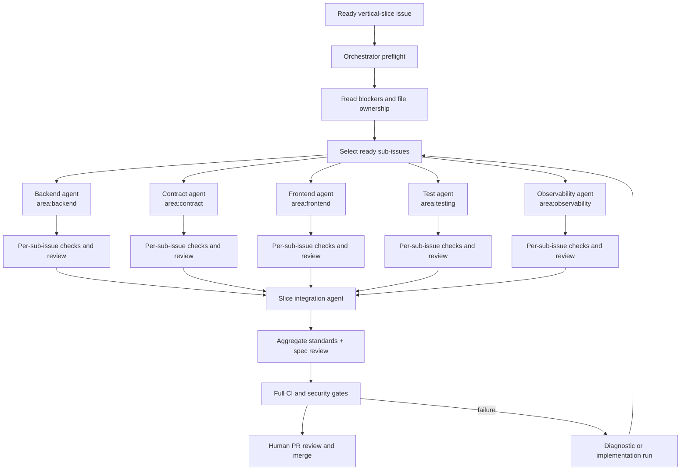

### 9.4 Context pack contract

Every implementation run receives only:

- the issue and its parent specification;
- acceptance criteria and explicit non-goals;
- closed blocker decisions and linked ADRs;
- relevant `CONTEXT.md` sections;
- applicable scoped instructions;
- the selected skill router and only the referenced rules;
- owned file paths and generated-file policy;
- test and validation commands;
- stopping condition and required output format.

The context pack must not include unrelated conversation history, every skill in
the catalog, or unredacted secrets and logs.

#### CLI-first context engineering

The orchestrator should use deterministic local commands to discover and
compress context before invoking an LLM. The agent receives bounded structured
output, not raw repository dumps.

| Need | Preferred local tool | Example output |
| --- | --- | --- |
| Issue, sub-issue, label, and comment state | `gh issue view`, `gh issue list`, `gh api` | Small JSON or Markdown issue brief |
| PR diff and checks | `gh pr diff`, `gh pr checks`, `gh pr view` | Changed paths, check status, review context |
| Branch and fixed point | `git status`, `git log`, `git diff`, `git merge-base` | Clean-state and bounded diff summary |
| Code and symbol discovery | `rg`, `Get-ChildItem`, compiler or LSP queries | Matching files, symbols, and selected excerpts |
| Backend structure and checks | `dotnet sln`, `dotnet build`, test runner commands | Project inventory and exit-coded results |
| Frontend structure and checks | `npm` or `pnpm` scripts, TypeScript compiler | Package scripts, typecheck, lint, and test results |
| Documentation inventory | `scripts/docs/build-docs.ps1`, `check-docs.ps1` | Topic manifest, hashes, stale-output list |
| Data model and API snapshots | Repository-approved schema, migration, and contract exporters | Bounded Markdown or JSON snapshots |

Use `--json` and `--jq` where available, select only required fields, cap
output size, redact secrets, and persist the command plus exit code as evidence.
Prefer a short generated context file over repeatedly asking an agent to inspect
the same repository.

Recommended local commands are documented in prompts and instructions as
profiles, for example:

```powershell
gh issue view <number> --json number,title,body,labels,assignees,comments
gh issue list --state open --json number,title,issueType,labels --limit 100
git diff --stat <fixed-point>...
pwsh -File .\scripts\docs\context-pack.ps1 -Issue <number> -Mode Compact
pwsh -File .\scripts\docs\check-docs.ps1
dotnet build .\src\App.slnx --no-restore
```

The exact solution, package, and exporter commands come from the repository
setup profile. The prompt must not invent a command that has not been verified
in that repository.

Token-saving rules:

- Run deterministic discovery before an exploration or implementation agent.
- Load `docs/generated/summary.md` first, then only the topic files selected by
  issue labels and context-pack rules.
- Never attach `docs/generated/full.md` to ordinary implementation work.
- Keep stable instructions and tool definitions early and variable issue content
  late so repeated runs can benefit from prompt caching where supported.
- Replace repeated prose analysis with scripts that emit bounded JSON or tables.
- Use a fresh handoff at phase boundaries instead of carrying a long transcript.
- Do not spend an LLM call regenerating a summary that can be assembled from
  topic metadata.

### 9.5 Branch and worktree safety

- Never implement on the default branch.
- Use one isolated branch or worktree per independent sub-issue.
- Use one integration branch per parent specification when fan-in is needed.
- Rebase or merge only through a deliberate integration step.
- Record source commit, target branch, issue IDs, and validation results.
- Do not include untracked research or local configuration in a product PR
  unless the specification explicitly requires it.
- If two agents need the same generated file, serialize them or give ownership
  to one integration agent.

## 10. Agent catalog

Agents are roles with bounded tools and permissions. Skills provide reusable
knowledge to those roles; they are not interchangeable with agents.

| Agent role | Trigger | Main inputs | Main outputs | Default tier |
| --- | --- | --- | --- | --- |
| `repository-setup` | New repository or explicit reconfiguration | Setup answers, existing repo scan | Setup files, labels, workflows, baseline report | Premium, human gated |
| `triage` | New or changed issue | Issue, comments, repo map | State, type, questions, validated brief | Medium |
| `product-shaper` | Ambiguous product request | Idea, users, constraints | Scenarios, non-goals, decisions, risks | Premium |
| `researcher` | External fact blocks a decision | Focused question and source policy | Cited findings, confidence, unresolved trade-offs | Medium or cheap |
| `prototype` | Runnable or visual uncertainty | Design question | Isolated prototype and findings | Medium |
| `domain-modeler` | Ambiguous language or invariants | Scenarios and code context | Glossary, model, ADR candidates | Premium |
| `architect` | Boundary or structural decision, including a selected MartiX.Platform profile | Context, constraints, existing code, package/manifest authority | Architecture options, recommendation, ADR, current-versus-target classification | Premium |
| `spec-author` | Shaped outcome is approved | Decisions and evidence | Parent specification issue | Premium |
| `ticket-planner` | Specification is ready | Spec, architecture, dependencies | Vertical slices, sub-issues, blocker graph | Premium |
| `documentation-planner` | Specification or ticket has documentation impact | Outcome, source-of-truth map, topic manifest | Topic IDs, audience, update plan, verification command | Medium |
| `orchestrator` | Ready frontier exists | Issue graph and repo state | Dispatch plan, run state, integrated branch | Premium or medium |
| `backend-implementer` | `area:backend` sub-issue, optionally `stack:martix-platform` | Backend context pack and Platform profile when routed | C# code, tests, migration notes, Platform evidence where applicable | Medium |
| `frontend-implementer` | `area:frontend` sub-issue | Frontend context pack | TypeScript/UI code, tests, a11y evidence | Medium |
| `contract-implementer` | `area:contract` sub-issue | API and schema decisions | Contracts, adapters, generated client changes | Medium |
| `user-documentation-writer` | User-visible behavior changes | Specification, UI behavior, approved screenshots or examples | Task-oriented user topic updates | Medium |
| `technical-documentation-writer` | Technical, architecture, API, or data-model changes | Source code, schema, contracts, ADRs, generated snapshots | Technical topic updates with source links | Medium |
| `test-engineer` | `area:testing` or missing coverage | Acceptance criteria and seams | Tests, fixtures, test report | Medium |
| `security-reviewer` | Security risk or release gate | Diff, threat model, dependencies | Findings and required remediations | Premium |
| `accessibility-reviewer` | UI change or release gate | UI diff, flows, keyboard states | Findings and evidence | Medium |
| `standards-reviewer` | Every completed sub-issue or PR | Diff and repository standards | Prioritized standards findings | Medium |
| `spec-reviewer` | Spec-backed PR | Diff, specification, acceptance criteria | Spec conformance findings | Premium |
| `documentation-reviewer` | Documentation change or generated-output diff | Topic files, source-of-truth artifacts, generated manifest | Freshness, accuracy, audience, and link findings | Medium |
| `diagnostics` | Failed check, incident, or regression | Reproduction, logs, diff | Minimal fix plan and regression test | Premium |
| `integration` | Completed sub-issues | Branches, checks, dependency graph | Conflict-free slice branch and report | Medium |
| `release` | Approved PR or release candidate, including Platform migrations | Artifact, checks, environment policy, selected Platform profile when routed | Deployment request, migration/release evidence, smoke report, rollback record | Medium, human gated |
| `operations` | Post-deploy signal or incident | Telemetry, runbook, environment state, Platform migration/event evidence when routed | Diagnosis, issue, rollback or follow-up plan | Premium, human gated |

No role receives production secrets by default. Release and operations roles use
short-lived, environment-scoped credentials only when the deployment profile
requires them.

## 11. Skill portfolio

### 11.1 Skill versus plugin layout

Follow the repository boundary:

- Put reusable domain knowledge in standalone `skills/martix-*` packages.
- Put the composed lifecycle, agents, prompts, hooks, and optional MCP/LSP
  configuration in a thin `plugins/martix-*` bundle.
- Keep `SKILL.md` files as compact activation routers.
- Put detailed rules, references, templates, scripts, assets, and evals behind
  the router.
- Do not duplicate a rule across several skills; link to one authority.

A proposed bundle for this lifecycle is:

```text
plugins/martix-ai-lifecycle/
  plugin.json
  README.md
  agents/
  prompts/
  instructions/
  hooks/
  skills/
```

It should compose, rather than copy, standalone skills such as:

```text
skills/martix-dotnet-csharp/
skills/martix-platform/
skills/martix-typescript/
skills/martix-fluent-ui/
skills/martix-tunit/
skills/martix-fluentvalidation/
```

The exact package set is determined during implementation and must be covered
by package metadata and evals.

### 11.2 Recommended skill families

| Family | Canonical MartiX implementation | Responsibility |
| --- | --- | --- |
| MX lifecycle control plane | `mx-setup`, `mx-ask`, `mx-route`, `mx-handoff`, `mx-triage`, `mx-shape`, `mx-domain`, `mx-architecture`, `mx-spec`, `mx-tickets`, `mx-orchestrate`, `mx-implement`, `mx-tdd`, `mx-review`, `mx-release`, `mx-operate` | Enforce issue types, labels, phases, transitions, evidence, and human gates while routing technical work. |
| Setup and routing | `mx-setup`, `mx-ask`, `mx-route`, `mx-handoff` | Initialize contracts, clarify one missing decision at a time, choose the smallest next workflow, and produce resumable handoffs. |
| Shaping and decisions | `mx-shape`, `mx-domain`, `mx-research`, `mx-prototype` | Reduce product, domain, and technical uncertainty with explicit evidence and decisions. |
| Planning | `mx-architecture`, `mx-spec`, `mx-tickets` | Publish stable architecture, specifications, vertical slices, and dependency-aware issues. |
| Delivery | `mx-orchestrate`, `mx-implement`, `mx-tdd`, `mx-review`, `mx-diagnose` | Coordinate bounded implementation, test-first work, independent review, and recovery. |
| Backend | `martix-dotnet-csharp`, `martix-platform`, `martix-fluentvalidation`, backend vertical-slice rules | C#, ASP.NET, validation, DI, contracts, persistence, observability, and the optional MartiX.Platform application profile. |
| MartiX.Platform profile | `martix-platform` | Current-versus-target authority, Platform package and manifest routing, explicit module composition, generated-solution ownership, reliable events, Migrator lifecycle, and Platform quality gates. |
| Frontend | `martix-typescript`, `martix-fluent-ui`, React rules, Vue rules | Strict TypeScript, Fluent UI, accessibility, feature slices, state. |
| Testing | `mx-tdd`, `martix-tunit`, frontend test rules, contract and E2E rules | Make test-first behavior, deterministic checks, and evidence part of the lifecycle transition. |
| Documentation | `mx-docs`, `mx-data-docs`, `mx-build-docs`, `martix-markdown`, documentation-as-code rules | Keep user and technical topics current; regenerate summaries and full documents without an LLM. |
| CLI automation | GitHub CLI, Git, PowerShell, .NET, package-manager, and repository scripts | Collect bounded context, run checks, update issue state, and replace repeated model reasoning. |
| Quality | `mx-review` with standards, security, accessibility, contract, and specification review modes | Run independent checks against standards, risk, accessibility, and the approved specification. |
| Recovery | `mx-diagnose`, merge-conflict resolution, rollback runbooks | Reproduce, minimize, repair, and preserve evidence. |
| Operations | `mx-release`, `mx-operate`, provider-neutral deployment and observability rules | Stage, verify, rollback, and learn from production signals. |
| Artifact authoring | `mx-improve-artifact` and the skill-evaluation contract | Create and measure new AI artifacts without context sprawl. |

External workflow skill collections are research material only. MartiX does not
install, invoke, import, copy, or depend on them at runtime. Every lifecycle
capability is implemented and enhanced as a canonical `mx-*` skill or prompt
with MartiX issue types, labels, transitions, evidence, continuation, and human
gates. The `martix-*` family remains the reusable technical and stack capability
layer; it is composed by `mx-*`, not replaced by external workflow skills.

### 11.3 Skill contract

Each custom skill should define:

```text
name and trigger description
invocation mode: user, model, or mixed
workflow_ref and lifecycle contract version
preconditions and prohibited use
minimum context required
allowed child skills or agents
required issue input and transition action
expected artifacts
completion checks
allowed tools and owned paths
escalation rules
supported clients and loading behavior
eval cases: positive, negative, edge, and regression
continuation contract: status, next action, owner, required input, and gate
```

The main `SKILL.md` should route to the smallest rule or reference file needed
for the current task. Do not preload the entire portfolio into every agent.

#### Mandatory continuation and handoff

Every skill, prompt, and workflow-specific agent must tell the user or parent
orchestrator what happens next. A successful result is incomplete if it only
says that work is done without naming the next action. The final response and
the evidence record must contain one structured continuation object:

```yaml
continuation:
  status: handoff # handoff | awaiting-input | awaiting-human | blocked | terminal
  recommended_next_step: /mx-route
  next_owner: parent-orchestrator
  required_input:
    - issue: "#123"
    - artifact: "docs/architecture/adr-0042.md"
  human_gate: none # none | product | architecture | security | release
  config_hash: "sha256:<resolved-config>"
  reason: "Architecture evidence is complete; select specification or revision."
```

The `recommended_next_step` must be one of the registered `mx-*` workflows, a
named human gate, or an explicit terminal action. `next_owner` identifies
whether the user, parent orchestrator, specialist agent, or human approver must
act. `required_input` names the issue, decision, artifact, check, or answer
needed to continue. A blocked result must identify the unblock action or the
issue that owns it; an awaiting-input result must ask one focused question.
Terminal results must state why no further workflow is recommended. When a
repository configuration was resolved, `config_hash` is required so the next
workflow can reproduce the same behavior.

For human-readable output, render the same object as a short final section:

```text
## Continue
Next step: /mx-route
Owner: parent orchestrator
Input: #123 and docs/architecture/adr-0042.md
Gate: none
Reason: Architecture evidence is complete; select specification or revision.
```

The deterministic lifecycle wrapper validates this continuation against the
workflow registry. It may reject an unknown workflow, an owner without the
required permission, or a next step that is illegal for the issue type or
current labels. `mx-ask` uses this contract to ask exactly one blocking
question or recommend the next legal workflow; it does not become a second
label-transition system.

### 11.4 Custom MartiX skill system

Implement the MartiX version as a thin, composable control-plane package with
explicit contracts that match the organization's issue model. The package
should provide procedures and routing; deterministic scripts and GitHub policy
provide enforcement.

```text
skills/martix-lifecycle/
  SKILL.md                         # compact router
  rules/
    artifact-contract.md           # skill/prompt/agent metadata
    issue-contract.md              # type, label, parent, blocker rules
    transition-contract.md         # allowed actions and evidence
    context-pack-contract.md       # bounded input and redaction
  references/
    lifecycle-schema.yml
    workflow-catalog.yml
  scripts/
    validate-issue.ps1
    transition-issue.ps1
    build-context.ps1
    record-evidence.ps1
  templates/
    transition-comment.md
    handoff.md
  evals/
    evals.json

plugins/martix-ai-lifecycle/
  plugin.json
  README.md
  agents/
  prompts/
  instructions/
  hooks/
  skills/
```

The standalone `martix-lifecycle` skill owns the reusable contract and routing
knowledge. The plugin composes it with the .NET, optional `martix-platform`,
TypeScript, Fluent UI, testing, documentation, review, and operations skills.
Product repositories install the plugin and generate their repository-specific
`.github/martix/mx.config.json` plus its read-only resolved manifest during
setup.

Every lifecycle artifact has a small metadata header or registry entry that
contains a stable identity and a contract reference, for example:

```yaml
id: mx-implement
kind: skill
workflow_ref: mx-implement
contract_version: 1
continuation: required
```

It references the workflow ID instead of copying issue types or label names.
At invocation time, the router resolves the workflow against the repository
manifest and renders the current values into the context pack. This prevents
the common failure where a prompt, an agent description, an instruction, and a
GitHub Action each contain a slightly different definition of `ready`.

The implementation rules are:

1. `SKILL.md` files route; detailed rules and references are progressively
   loaded only after the workflow and issue are known.
2. Prompts render structured inputs and outputs from the issue and manifest;
   they do not own state transitions.
3. Agents declare a workflow reference, role, tools, model tier, handoff
   format, and maximum autonomous scope.
4. Instructions provide stable coding and safety guidance; they cannot grant
   issue-write, merge, deployment, or secret permissions.
5. Hooks run the lifecycle validator before dispatch, before issue writes, and
   before completion claims.
6. GitHub Actions call the same PowerShell or .NET CLI scripts used by
   Copilot CLI. There must be no Actions-only transition implementation.
7. The scripts emit bounded JSON evidence with exit codes, timestamps, commit
   IDs, issue IDs, workflow IDs, and redacted command output.
8. Evals cover correct activation, wrong issue type, missing labels, invalid
   transitions, prompt injection in issue content, duplicate runs, and
   recovery after interruption.

This is the practical relationship between the MX workflow and the MartiX
control plane: the skill teaches the procedure, the workflow contract selects
when it is legal, the validator enforces the boundary, and the issue/PR/CI
evidence proves the result.

### 11.5 MX lifecycle namespace and implementation strategy

Use `mx-*` as the short namespace for MartiX lifecycle workflows. Keep the
installable package itself under the repository's required `martix-` prefix:

```text
skills/martix-lifecycle/
  # Reusable contract, schemas, validators, and evidence rules

plugins/martix-ai-lifecycle/
  plugin.json
  README.md
  skills/
    mx-setup/
    mx-ask/
    mx-triage/
    mx-route/
    mx-handoff/
    mx-shape/
    mx-domain/
    mx-research/
    mx-prototype/
    mx-architecture/
    mx-spec/
    mx-tickets/
    mx-orchestrate/
    mx-implement/
    mx-tdd/
    mx-review/
    mx-diagnose/
    mx-docs/
    mx-data-docs/
    mx-build-docs/
    mx-release/
    mx-operate/
    mx-improve-artifact/
  prompts/
    mx-ask.prompt.md
    mx-*.prompt.md
  agents/
    mx-*.agent.md
  instructions/
  hooks/
```

This naming split is intentional:

- `martix-*` standalone skills remain reusable technical or stack capabilities,
  such as `martix-dotnet-csharp`, `martix-typescript`, `martix-fluent-ui`, and
  `martix-tunit`.
- `mx-*` identifies a lifecycle procedure that changes or validates issue
  state, routes agents, creates evidence, or crosses a human gate.
- `martix-ai-lifecycle` is the installable plugin and `martix-lifecycle` is the
  reusable contract package. Do not publish top-level `skills/mx-*` packages
  unless the repository package naming policy is deliberately changed.

`/mx-ask` is the universal lifecycle advisor and optional conversational entry
point. A user, any `mx-*` skill or prompt, or the parent orchestrator may invoke
it at any phase to ask what the current issue state means, what information is
missing, which workflow is legal next, or how to resume an interrupted run.
Each skill must still know and report its own direct next step; `/mx-ask` is a
shared advisor and verification path, not a substitute for local workflow
knowledge.

It reads the same issue, repository manifest, transition contract, evidence, and
continuation object as the caller. It asks at most one focused question when a
missing fact blocks progress; otherwise it delegates to `mx-route` and returns
one recommended workflow, owner, required input, and human gate. It never writes
labels, changes issue types, or creates a second transition system.

Do not create, install, or invoke `/ask-matt`. Any old ask-style entry point
found during migration must be disabled or reduced to a temporary forwarder to
`/mx-ask`, with no separate prompt, skill, or transition logic.

Every `mx-*` artifact resolves its behavior from `workflow_ref`; it does not
carry a private copy of the label list:

```yaml
id: mx-implement
namespace: mx
kind: skill
workflow_ref: mx-implement
contract_version: 1
```

At runtime, the router:

1. Accepts a request, issue URL, issue number, or a caller handoff. Any caller
   may invoke `/mx-ask` with its current workflow and question; it handles
   advice or missing information and hands off to `mx-route`. Direct workflow
   prompts may skip the advisor when their inputs are already complete, but
   they must still return their own continuation object.
2. Reads the repository lifecycle manifest.
3. Runs deterministic type, state, phase, parent, blocker, and permission
   validation before loading broad context.
4. Resolves `area:*`, `layer:*`, `stack:*`, and `risk:*` labels to the smallest
   applicable generic `martix-*` skills.
5. Invokes the workflow-specific agent or prompt with the current transition
   action and owned paths.
6. Runs the completion checks and applies the one allowed transition through the
   deterministic wrapper.
7. Emits a bounded evidence record and a continuation handoff that names the
   next `mx-*` workflow, focused question, or human gate.

For example, `mx-implement` does not contain separate C# and TypeScript rule
libraries. It validates `Task + ready-for-agent + phase:implementation`, then
loads `martix-platform` first when `stack:martix-platform` is present, then
`martix-dotnet-csharp` for `area:backend`, `martix-typescript` and
`martix-fluent-ui` for `area:frontend`, and `martix-tunit` or the configured
frontend test skill for `area:testing`. The lifecycle skill owns *when* and
*how* work may proceed; the generic skills own *how to implement the selected
technology*.

#### MX workflow, issue, and label relations

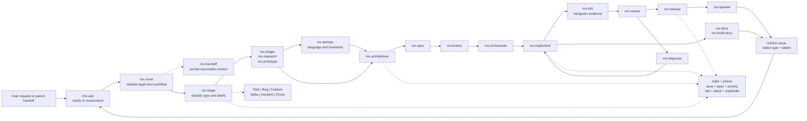

#### MartiX.Platform routing contract

The repository setup profile, not an agent guess, decides whether
`martix-platform` is active. `mx-setup` records the decision and the evidence
used to make it. For an active profile, `mx-route` adds
`stack:martix-platform` to issues whose acceptance criteria touch Platform
packages, `martix.platform.json`, generated-solution topology, Migrator
behavior, reliable events, or Platform quality gates. It preserves
`stack:dotnet` and all applicable area, layer, priority, and risk labels.

| MX workflow | Platform-specific responsibility | Required evidence or handoff |
| --- | --- | --- |
| `mx-setup` | Inspect package references, target framework, `martix.platform.json`, generated-solution manifests, preset/capability/provider choices, and current-versus-target status. | Repository Platform profile record; verified local commands; authority/status map. |
| `mx-architecture` | Apply explicit module ownership, Contracts-only boundaries, compile-time composition, Minimal API transport, and one API/one Migrator topology. | ADR, module/dependency graph, selected profile, rejected alternatives, and current-source citations. |
| `mx-spec` | Make Result/Error behavior, Problem Details, authorization, reliable events, migration, observability, and recovery acceptance criteria explicit. | Feature specification and affected user, technical, data-model, API, architecture, and operations topic IDs. |
| `mx-tickets` | Create vertical slices and specialist Tasks only for the Platform work actually required, such as module composition, Contracts, persistence/migrations, Migrator, quality gates, or operational evidence. | Child issue graph with `stack:martix-platform`, ownership, dependencies, and bounded context packs. |
| `mx-implement` | Load `martix-platform` before generic backend rules when the issue is Platform-routed; keep generated source application-owned and use explicit composition. | Focused tests, manifest/topology checks, migration evidence where relevant, and a deterministic handoff. |
| `mx-review` | Reject service location, reflection scanning, generic repositories, cross-module internals, startup migration/seed side effects, unsupported capability claims, and unverified AOT or provider claims. | Independent review findings, quality-gate output, and current-versus-target classification. |
| `mx-release` | Separate package upgrades from Platform Migrations; run the selected Migrator workflow and verify generated-state, schema, artifact, and operational compatibility. | Immutable release evidence, migration plan/diff, backups or recovery record, smoke checks, and known limitations. |
| `mx-operate` | Use health, telemetry, reliable-event, migration, and recovery signals to diagnose incidents without silently reopening the original delivery issue. | Redacted operational evidence, `Incident`/`Bug` follow-up, and a rollback or forward-fix decision. |

If the repository does not adopt MartiX.Platform, these workflows must not load
the skill merely because the backend is .NET. If current evidence and approved
target material differ, the issue records the distinction and a human decides
whether a Platform Migration or an ordinary application change is intended.

#### MX workflow catalog

| MX workflow | Primary lifecycle action | Native lifecycle intent | Generic skills it may route |
| --- | --- | --- | --- |
| `mx-setup` | Repository and organization preflight | Repository preflight | Repository setup, GitHub CLI, Markdown, PowerShell |
| `mx-ask` | Clarify one missing decision or choose the next legal workflow | Universal lifecycle advisor | Issue tracker, repository context, all metadata-only routers |
| `mx-triage` | Classify type, state, phase, area, priority, and risk | Intake classification | Issue tracker and repository context |
| `mx-route` | Select the smallest safe next workflow | Deterministic routing | All skills, metadata only |
| `mx-handoff` | Persist resumable context and ownership | Handoff management | Context-pack, issue tracker, repository context |
| `mx-shape` | Reduce product and domain uncertainty | Product and domain shaping | Documentation, research, domain modeling |
| `mx-domain` | Capture language, invariants, and domain boundaries | Domain modeling | Domain modeling, documentation, architecture |
| `mx-research` | Produce cited decision evidence | Decision research | Research and documentation |
| `mx-prototype` | Answer runnable or visual uncertainty | Experimentation | Frontend, Fluent UI, API, testing |
| `mx-architecture` | Produce and approve ADRs and boundaries | Architecture decisions | .NET, `martix-platform` when selected, TypeScript, data, security, operations |
| `mx-spec` | Create or update the Feature specification | Specification | Documentation, domain modeling, architecture |
| `mx-tickets` | Create vertical slices, child Tasks, and dependencies | Work decomposition | Issue tracker, context-pack, architecture |
| `mx-orchestrate` | Select the ready frontier and coordinate fan-out/fan-in | Agent orchestration | Git, worktrees, issue tracker, all routed skills |
| `mx-implement` | Implement one ready Task, Bug, or approved single-slice Feature | Bounded implementation | Stack, `martix-platform` when selected, and testing skills selected by labels |
| `mx-tdd` | Drive test-first behavior and preserve red/green evidence | Test-first delivery | `martix-tunit`, frontend test rules, contract and E2E rules |
| `mx-review` | Run standards, spec, security, accessibility, and CI review | Quality review | Review, `martix-platform` when selected, security, Fluent UI, testing |
| `mx-diagnose` | Reproduce and recover from failed checks or incidents | Diagnostics and recovery | Diagnostics, testing, operations |
| `mx-docs` | Update canonical topics and generated outputs | Documentation handoff | Markdown and documentation-as-code |
| `mx-data-docs` | Refresh the current data-model topic and deterministic snapshot | Data-model documentation | Schema, migrations, EF Core, documentation |
| `mx-build-docs` | Build summaries, full documentation, manifest, and freshness evidence | Documentation generation | Markdown, local exporters, documentation-as-code |
| `mx-release` | Prepare, deploy, verify, and record a release | Release delivery | CI/CD, operations, security, observability |
| `mx-operate` | Triage signals, contain incidents, and create follow-up work | Production operations | Diagnostics, observability, rollback runbooks |
| `mx-improve-artifact` | Evaluate and improve a skill, prompt, agent, or guardrail | AI artifact lifecycle | Skill authoring, evals, repository validation |

#### Issue-type and label routing

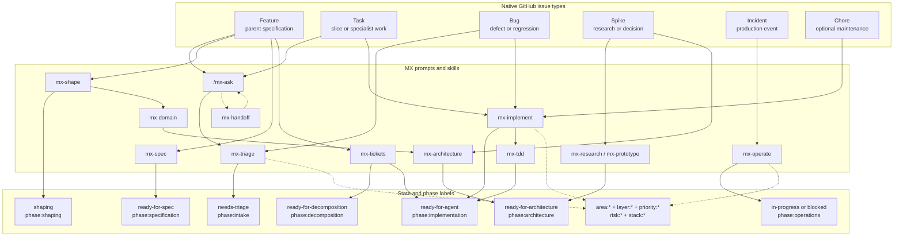

The issue type selects the legal workflow family; the lifecycle state and
`phase:*` labels select the current transition; supplementary labels select
specialist skills and risk gates. Open issues carry exactly one state and one
phase while retaining applicable area, priority, stack, and risk labels.

Every catalog row is a native MX workflow with one contract and one transition
owner. External workflow artifacts are not copied into the repository and do
not remain as an alternate transition system. If one is discovered in a target
repository, setup reports it as an unsupported runtime dependency and the
repository must disable or remove it before lifecycle automation is enabled.

#### Native implementation and automation plan

Implement the native workflow incrementally:

1. **Contract first:** publish the issue-type, label, phase, transition,
   permission, evidence, and eval schemas in `martix-lifecycle`.
2. **Planning lane:** implement and validate `mx-setup`, `mx-ask`,
   `mx-route`, `mx-handoff`, `mx-triage`, `mx-shape`, `mx-domain`,
   `mx-research`, `mx-prototype`, `mx-architecture`, `mx-spec`, and
   `mx-tickets`.
3. **Delivery lane:** implement `mx-orchestrate`, `mx-implement`, `mx-tdd`,
   `mx-review`, `mx-diagnose`, `mx-docs`, `mx-data-docs`, and
   `mx-build-docs`.
4. **Release lane:** implement `mx-release` and `mx-operate` with protected
   environments and explicit rollback behavior.
5. **Runtime policy:** do not install or invoke external lifecycle skill
   collections. Fail setup when an unsupported runtime dependency or duplicate
   transition owner is detected.
6. **Retirement:** remove external mutation-capable workflows after the MX
   evals, repository validation, and a complete example issue pass.

Automation can safely own deterministic mechanics: querying GitHub, validating
labels and dependencies, selecting the ready frontier, creating branches,
running checks, applying transitions, and recording evidence. It must not
silently decide product scope, architecture trade-offs, security exceptions,
or production release approval. Those remain `ready-for-human` gates in the
same `mx-*` state machine.

### 11.6 Central repository configuration

The `mx-*` family must be configurable without editing every skill, prompt,
agent, instruction, or hook. A product repository therefore has one
repository-owned configuration source:

```text
.github/martix/mx.config.json
```

The plugin owns defaults, the JSON Schema, workflow behavior, and deterministic
resolvers. The repository owns only its selected values and local templates.
Individual `mx-*` artifacts contain an `id`, `workflow_ref`, and
`contract_version`; they do not contain private copies of label names, stack
choices, commands, prompt text, or transition rules.

The normative schema is [`mx-config.schema.json`](./mx-config.schema.json), and
the maintainer-facing configuration reference is
[`mx-configuration.md`](../guides/mx-configuration.md). The schema defines the
machine-readable shape and enum values; `mx-setup` remains responsible for
repository-dependent checks that JSON Schema cannot express.

#### Configuration ownership and resolution

Configuration is resolved in this order:

1. Immutable defaults shipped by the installed MX package.
2. One named repository preset, such as `dotnet-react-fluent-ui`,
   `dotnet-vue-fluent-ui`, or `dotnet-react-platform`.
3. `.github/martix/mx.config.json` repository overrides.
4. A non-persistent command-line override for one setup or diagnostic run.
5. Issue and specification data for work-item scope only.

Later layers may make behavior stricter, narrower, or more specific. They must
not disable safety gates, grant credentials, change the transition owner, or
override a human approval requirement. Secrets, tokens, connection strings, and
environment-specific credentials never belong in this file.

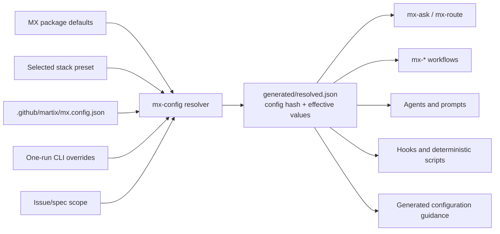

`mx-setup` creates or updates the central file, validates it against the
installed schema, detects repository facts, shows a proposed diff, and writes
the resolved manifest only after the setup gate. Every workflow loads only the
sections it needs and records the resolved configuration hash in its evidence
and continuation object. A changed configuration therefore becomes visible in
review and can be reproduced without loading the whole file into an LLM
context.

#### Example `mx.config.json`

The following is a valid starting point. Values shown here are examples; setup
must detect and verify commands, paths, versions, and package choices rather
than trusting them because they appear in a template.

```json
{
  "$schema": "./mx-config.schema.json",
  "schemaVersion": 1,
  "configVersion": "1.0",
  "preset": "dotnet-react-fluent-ui",
  "repository": {
    "owner": "MartiX",
    "name": "example-product",
    "defaultBranch": "main",
    "autonomy": "human-gated"
  },
  "stack": {
    "backend": {
      "language": "csharp",
      "runtime": "dotnet",
      "targetFramework": "net10.0",
      "architecture": "modular-monolith",
      "sliceStyle": "vertical"
    },
    "frontend": {
      "framework": "react",
      "language": "typescript",
      "ui": "fluent-ui",
      "buildTool": "vite"
    },
    "platform": {
      "enabled": false,
      "manifest": "martix.platform.json"
    }
  },
  "issueTracking": {
    "provider": "github",
    "issueTypes": {
      "source": "github-native",
      "required": ["Task", "Bug", "Feature"],
      "optional": ["Epic", "Spike", "Incident", "Chore"]
    },
    "labels": {
      "phasePrefix": "phase:",
      "areaPrefix": "area:",
      "layerPrefix": "layer:",
      "priorityPrefix": "priority:",
      "riskPrefix": "risk:",
      "stackPrefix": "stack:",
      "defaultPriority": "priority:p2",
      "defaultState": "needs-triage",
      "defaultPhase": "phase:intake"
    }
  },
  "workflow": {
    "questionLimit": 1,
    "defaultModelTier": "medium",
    "maxParallelAgents": 3,
    "invocation": {
      "mx-setup": "user",
      "mx-ask": "user-or-model",
      "mx-route": "model",
      "mx-implement": "model",
      "mx-review": "model",
      "mx-release": "user"
    },
    "structuredOutput": {
      "format": "json",
      "schemaRoot": ".github/martix/generated/schemas"
    },
    "tdd": {
      "required": true,
      "testFirst": "when-practical"
    },
    "domainModeling": {
      "mode": "complexity-gated",
      "requiredFor": ["multiple-invariants", "cross-module-boundary"]
    },
    "humanGates": {
      "product": true,
      "architecture": true,
      "security": true,
      "release": true
    }
  },
  "workflows": {
    "mx-shape": {
      "requireScenarios": true,
      "requireNonGoals": true
    },
    "mx-tickets": {
      "childIssueType": "Task",
      "sliceStyle": "vertical",
      "requireDependencies": true,
      "requireDefinitionOfReady": true
    },
    "mx-implement": {
      "requireFocusedTests": true,
      "requireDocumentationImpact": true,
      "commitAfterChecks": true
    },
    "mx-review": {
      "requiredProfiles": ["standards", "spec", "security", "accessibility"]
    },
    "mx-release": {
      "environment": "staging",
      "rollbackEvidence": "required"
    }
  },
  "naming": {
    "namespace": "ExampleProduct",
    "branch": {
      "feature": "feature/issue-{number}-{slug}",
      "bug": "bugfix/issue-{number}-{slug}",
      "task": "chore/issue-{number}-{slug}"
    },
    "commit": {
      "style": "conventional",
      "template": "{type}({scope}): {summary} (#{issue})",
      "requireIssueReference": true
    },
    "symbols": {
      "module": "PascalCase",
      "feature": "PascalCase",
      "component": "PascalCase",
      "test": "{subject}.tests"
    }
  },
  "commands": {
    "backendBuild": {
      "program": "dotnet",
      "args": ["build", "--nologo"]
    },
    "backendTest": {
      "program": "dotnet",
      "args": ["test", "--nologo"]
    },
    "frontendCheck": {
      "program": "pnpm",
      "args": ["run", "check"]
    },
    "docsCheck": {
      "program": "pwsh",
      "args": ["-File", "scripts/docs/check-docs.ps1"]
    },
    "repositoryValidate": {
      "program": "pwsh",
      "args": ["-File", "scripts/validate-repository.ps1"]
    },
    "issueValidate": {
      "program": "pwsh",
      "args": ["-File", "scripts/martix/validate-issue.ps1"]
    }
  },
  "templates": {
    "root": ".github/martix/templates",
    "promptRoot": ".github/prompts",
    "issueRoot": ".github/ISSUE_TEMPLATE",
    "byWorkflow": {
      "mx-spec": "feature-spec.md",
      "mx-tickets": "vertical-slice.md",
      "mx-handoff": "handoff.md",
      "mx-implement": "implementation.prompt.md",
      "mx-review": "review.prompt.md"
    },
    "promptArguments": {
      "default": ["issue", "workflow", "configHash"],
      "mx-implement": ["issue", "ownedPaths", "acceptanceCriteria", "commands"],
      "mx-review": ["issue", "diff", "fixedPoint", "qualityProfiles"],
      "mx-handoff": ["issue", "checkpoint", "owner", "nextStep"]
    },
    "commit": "commit-message.txt",
    "pullRequest": "pull-request.md",
    "adr": "adr.md"
  },
  "documentation": {
    "topicsRoot": "docs/topics",
    "generatedRoot": "docs/generated",
    "requiredCategories": ["user", "technical", "architecture", "operations"],
    "buildCommand": "docsCheck"
  },
  "quality": {
    "backendTestRunner": "tunit",
    "frontendTestRunner": "vitest",
    "e2eRunner": "playwright",
    "accessibility": "required-for-ui",
    "securityReview": "required",
    "apiCompatibility": "required",
    "docsFreshness": "required"
  },
  "orchestration": {
    "worktreeStrategy": "one-per-task",
    "maxRetries": 1,
    "contextPack": {
      "maxFiles": 30,
      "maxTokens": 12000,
      "include": ["issue", "parent-spec", "decisions", "owned-paths", "checks"],
      "exclude": ["secrets", "unrelated-history", "generated-full-doc"]
    }
  },
  "hooks": {
    "preflightCommand": "issueValidate",
    "completionCommand": "repositoryValidate",
    "timeoutMinutes": {
      "default": 30,
      "mx-implement": 60,
      "mx-review": 30
    }
  },
  "security": {
    "forbiddenPaths": [".env*", "**/*secret*", "**/credentials/**"],
    "allowMerge": false,
    "allowProductionDeploy": false,
    "redactEvidence": true
  }
}
```

Commands are structured as executable plus argument arrays instead of shell
strings. This lets local wrappers validate programs, working directories, and
arguments before execution and avoids asking an LLM to invent command syntax.
Template values use a small documented variable set such as `{issue}`,
`{number}`, `{slug}`, `{scope}`, `{type}`, and `{summary}`. Unknown variables,
absolute paths, secrets, and executable template content are rejected.

#### What belongs in the central configuration

| Area | Configure | Examples |
| --- | --- | --- |
| Repository identity | Stable repository facts and autonomy mode | Owner, name, default branch, human-gated release |
| Stack profile | Technology choices that change routing | React or Vue, Fluent UI, .NET target, test runners, MartiX.Platform |
| Issue model | Native types, optional types, label prefixes, and defaults | `Feature` parent, `Task` slice, `priority:p2` |
| Workflow behavior | Safe defaults and workflow-specific required outputs | TDD, one-question limit, required review profiles |
| Naming | Branches, namespaces, projects, symbols, tests, commits, and PRs | Conventional commits and issue-linked branches |
| Commands | Verified deterministic executables and argument arrays | Build, test, typecheck, docs, repository validation |
| Templates | Paths and variables for prompts, issues, ADRs, handoffs, commits, PRs, and docs | `mx-spec`, `mx-tickets`, `mx-handoff` |
| Invocation and outputs | User/model invocation, structured-output schemas, and permitted prompt arguments | `user-or-model`, JSON result schemas, bounded template variables |
| Hooks and lifecycle | Preflight, completion, timeout, logging, and evidence behavior | Issue validation before writes, repository validation before completion |
| Documentation | Topic roots, generated roots, required categories, and checks | `docs/topics`, freshness, data-model outputs |
| Quality | Required test, security, accessibility, compatibility, and freshness gates | TUnit, Vitest, Playwright, API compatibility |
| Orchestration | Parallelism, retries, worktrees, context limits, and included evidence | Three agents, one retry, 12,000-token context pack |
| Security | Forbidden paths and capabilities | No secrets, no merge, no production deploy |
| Release and operations | Environment profile, approval, rollback, and observation policy | Staging first, human release gate, rollback evidence |

Do not configure product behavior, acceptance criteria, domain invariants, or
issue-specific implementation details here. Those belong in the Feature
specification, ADRs, issue fields, and source code. Do not use configuration to
weaken the lifecycle contract: a repository may require more checks or narrower
permissions, but not silently remove the required state, phase, evidence, or
human gate.

#### How each MX feature consumes configuration

Each feature resolves a narrow view rather than receiving the full JSON file:

| Feature | Configuration view | Example behavior |
| --- | --- | --- |
| `mx-setup` | `repository`, `stack`, `issueTracking`, `commands`, `security` | Detects React/Vue, verifies commands, provisions native issue types and labels, and writes the initial config. |
| `mx-ask` and `mx-route` | `workflow`, `issueTracking`, `workflows.mx-ask`, `workflows.mx-route`, `templates.promptArguments` | Ask at most the configured question limit and return one legal route using the configured defaults and output schema. |
| `mx-shape` and `mx-domain` | `stack`, `workflow.domainModeling`, `workflows.mx-shape`, `templates` | Require scenarios, non-goals, domain language, or invariants according to the selected complexity policy. |
| `mx-architecture` and `mx-spec` | `stack`, `naming`, `templates`, `documentation`, `workflow.humanGates` | Select ADR/spec templates and require the configured documentation and approval sections. |
| `mx-tickets` | `issueTracking`, `naming`, `workflows.mx-tickets`, `orchestration` | Create `Task` children with configured slice naming, dependencies, labels, and Definition of Ready. |
| `mx-orchestrate` | `orchestration`, `commands`, `hooks`, `security` | Limit parallel agents, create the selected worktree shape, and reject unsafe paths or retries. |
| `mx-implement` and `mx-tdd` | `stack`, `commands`, `naming`, `workflows`, `quality`, `templates`, `hooks` | Load React or Vue rules, use configured test commands, generate the commit template, and require focused evidence. |
| `mx-review` | `quality`, `workflow.humanGates`, `security`, `documentation`, `hooks` | Run the configured review profiles and stop at the configured human gate. |
| `mx-docs`, `mx-data-docs`, and `mx-build-docs` | `documentation`, `commands`, `templates` | Update only configured canonical topics and regenerate deterministic outputs. |
| `mx-release` and `mx-operate` | `release`, `quality`, `security`, `commands`, `workflow.humanGates` | Deploy only through the selected environment profile and require rollback and monitoring evidence. |

The resolver emits the effective view, its source paths, and a SHA-256
configuration hash. A workflow must report the hash in its evidence, so a
reviewer can distinguish a result produced under the current configuration
from one produced under an older preset or local override.

#### Configuration change workflow

Configuration is product-repository behavior and is changed like code:

1. Run `mx-setup --configure` or the configured repository setup prompt.
2. Validate JSON syntax, schema, preset compatibility, repository facts,
   commands, paths, issue types, labels, and permissions.
3. Show a bounded configuration diff and the workflows whose effective behavior
   will change.
4. Require the configured human gate for security, architecture, autonomy,
   release, or transition changes.
5. Regenerate the resolved manifest, prompt context views, and configuration
   documentation.
6. Run the example lifecycle, focused evals, and deterministic repository checks.
7. Record the new config hash and continue through `/mx-route`.

Invalid or stale configuration stops the workflow before an LLM receives broad
context. Missing optional values use declared preset defaults; missing
security-sensitive or transition-critical values fail closed and return
`needs-info`, `blocked`, or `ready-for-human` according to the contract.

#### Inspiration applied without a runtime dependency

Research into external workflow skill collections informed useful boundaries:
small user-invoked workflow routers, reusable model-invoked discipline,
explicit handoffs, setup-time repository configuration, per-ticket bounded
context, and separate aggregate review. MartiX reimplements those ideas under
the native `mx-*` namespace and adds a repository configuration contract,
strict GitHub issue transitions, resolved configuration hashes, JSON Schema
validation, and deterministic command execution. External skills are not
installed, invoked, copied, or required at runtime. See the
[dated primary-source research snapshot](../knowledge/matt-pocock/2026-08-09-configurable-lifecycle-artifacts.md).

| Research pattern | Native MX configuration decision |
| --- | --- |
| Compact metadata and progressive disclosure | Keep `SKILL.md` and prompt entrypoints small; configure references and templates by path and load only the selected view. |
| Explicit user/model invocation | Configure `workflow.invocation` instead of inferring invocation from a name. |
| One-time repository setup | Make `mx.config.json` the repository-owned source and generate resolved views for all workflows. |
| Parameterized prompt files | Configure `templates.byWorkflow` and `templates.promptArguments`; reject unknown variables. |
| Structured orchestration and branch isolation | Configure worktree strategy, parallelism, retries, hooks, and bounded context packs; enforce them in scripts. |
| Explicit completion and review gates | Configure commands, quality profiles, timeouts, evidence, and human gates; do not rely on prompt prose alone. |

## 12. Instructions, prompts, and artifact contracts

### 12.1 Instruction layers

The product repository should have these layers:

| Layer | Example location | Content |
| --- | --- | --- |
| Universal | `.github/copilot-instructions.md` | Repository map, non-negotiable safety, commands, source-of-truth rules. |
| Backend | `.github/instructions/backend.instructions.md` | C# and .NET boundaries, DI, API, persistence, async, errors. |
| Frontend | `.github/instructions/frontend.instructions.md` | TypeScript, React/Vue profile, Fluent UI, state, accessibility. |
| Testing | `.github/instructions/testing.instructions.md` | TDD, test naming, isolation, test data, deterministic commands. |
| Security | `.github/instructions/security.instructions.md` | Secrets, authorization, dependency and data handling. |
| Documentation | `.github/instructions/documentation.instructions.md` | ADR, spec, issue, and runbook conventions. |

Keep each file narrow and use `applyTo` globs. If two instruction files overlap,
the result must be safe regardless of load order.

### 12.2 Prompt catalog

Prompts are intentional workflows, not enforcement:

| Prompt | Required input | Expected output | Required continuation |
| --- | --- | --- | --- |
| `mx-setup` | Repo path and setup answers | Setup plan or approved setup changes | `/mx-ask` for unresolved setup decisions; after approval, `/mx-triage` for the first issue |
| `mx-ask` | User request, issue URL, or uncertain handoff | One focused question or one legal next workflow | Answer the question and rerun `/mx-ask`, or invoke the named workflow |
| `mx-triage` | New or changed issue | Type, labels, phase, questions, and validated brief | `/mx-ask` for missing facts; `/mx-shape` or `/mx-implement` when the issue is ready |
| `mx-route` | Validated issue and current contract state | Smallest legal next workflow | Invoke the returned workflow or named human gate |
| `mx-handoff` | Current workflow, issue, evidence, and owner | Resumable context pack and continuation object | Resume the named workflow, or invoke `/mx-ask` with the handoff when context is unclear |
| `mx-shape` | Idea issue or conversation | Questions, scenarios, risks, decisions | `/mx-research`, `/mx-prototype`, `/mx-architecture`, or `/mx-spec` |
| `mx-domain` | Shaped product behavior or domain question | Glossary, invariants, examples, and domain boundaries | `/mx-architecture` when boundaries are affected; otherwise `/mx-spec` or `/mx-ask` |
| `mx-research` | Focused unknown | Research issue or cited findings with source policy | `/mx-shape` to accept findings or `/mx-ask` for an unresolved decision |
| `mx-prototype` | Visual or runnable question | Isolated prototype brief and evidence | `/mx-shape` to record the decision or `/mx-architecture` when a boundary is affected |
| `mx-architecture` | Stable shaping artifacts and architecture question | ADR, boundary decision, or human gate | `/mx-spec` after approval; otherwise `/mx-ask` or the named revision action |
| `mx-spec` | Stable shaping and architecture artifacts | Parent Feature specification | `/mx-tickets` after approval; `/mx-shape` when scope is rejected |
| `mx-tickets` | Approved specification | Slice issues, sub-issues, dependencies, and labels | `/mx-orchestrate` when the graph is ready; `/mx-ask` for ownership or scope decisions |
| `mx-orchestrate` | Validated issue graph and ready frontier | Dispatch/fan-in record and bounded child assignments | `/mx-implement` or `/mx-tdd` for each ready child; `/mx-handoff` when work is paused |
| `mx-implement` | One ready ticket | Code, tests, validation, documentation, and evidence | `/mx-review` on success; `/mx-diagnose` or the recorded unblock action on failure |
| `mx-tdd` | One implementation ticket and test strategy | Red/green test evidence and focused test changes | `/mx-implement` for the smallest production change, then `/mx-review` |
| `mx-docs` | Changed behavior and selected topic IDs | User or technical topic updates with source links | `/mx-build-docs`, then the originating workflow or `/mx-review` |
| `mx-data-docs` | Schema, migrations, and model configuration | Current data-model topic and generated snapshot | `/mx-build-docs`, then `/mx-review` or the migration workflow |
| `mx-review` | Diff, issue, fixed point | Prioritized findings and gate result | `/mx-implement` for fixes; `/mx-release` or the named human gate when clean |
| `mx-build-docs` | Topic manifest and source artifacts | Deterministic summary, full document, manifest, and freshness result | Return to `/mx-docs` for stale sources or the originating workflow when fresh |
| `mx-diagnose` | Failed command or incident | Reproduction, hypothesis, minimal fix | `/mx-implement`, `/mx-operate`, or `/mx-ask` for an unresolved decision |
| `mx-release` | Approved PR and artifact | Release checklist, deployment, verification, and rollback record | `/mx-operate` during monitoring; create or hand off an `Incident` on failure |
| `mx-operate` | Deployment signal or incident | Smoke report, containment, rollback, or follow-up issue | `/mx-diagnose`, a remediation `Bug`/`Task`, or the next monitoring gate |
| `mx-improve-artifact` | Skill, prompt, or agent | Change proposal, evals, and regression report | Human maintainer review, then publish or return to `/mx-ask` for scope clarification |

#### `mx-ask` response behavior

`/mx-ask` is deliberately a small conversational router, not a general-purpose
planning prompt:

- If one fact blocks routing, ask exactly one focused question and set
  `status: awaiting-input`; the next step is to answer it and rerun `/mx-ask`.
- If the request is sufficiently clear, return one recommended workflow,
  required input, owner, and human gate; do not emit a vague list of possible
  actions.
- If a human decision is required, name the decision owner and use
  `status: awaiting-human`; do not silently choose a product, architecture,
  security, or release trade-off.
- If the request is invalid or unsafe, use `status: blocked`, identify the
  remediation issue or unblock action, and stop.

Unprefixed or externally named lifecycle prompts are not part of the native
contract and must not be installed as aliases. Every prompt must state the
objective, inputs, constraints, allowed paths, expected outputs, validation
commands, stopping condition, escalation criteria, and the mandatory
continuation object naming the next workflow, owner, required input, and gate.

### 12.3 Standard implementation prompt contract

The orchestrator should render implementation prompts from issue metadata rather
than maintaining a large free-form master prompt:

```text
Objective:
  Implement exactly the behavior described by issue #<id>.

Context:
  Parent specification, accepted decisions, applicable instructions, and
  relevant files only.

Owned paths:
  <explicit file or directory allowlist>

Constraints:
  Preserve public behavior outside the issue.
  Do not add dependencies without an ADR or issue decision.
  Do not modify secrets, deployment credentials, or unrelated files.

Acceptance criteria:
  <verbatim criteria from the issue>

Tests:
  Add or update behavior-focused tests before implementation where practical.
  Run: <focused commands>

Documentation:
  Update the listed canonical topics when behavior, contracts, architecture,
  data model, operations, or user guidance changes.
  Run: <docs check or generation command>

Stopping condition:
  Stop after the acceptance criteria and focused checks pass.
  Escalate missing decisions; do not guess.

Output:
  Changed files, tests run, results, risks, and follow-up issues.

Continuation:
  Status: handoff | awaiting-input | awaiting-human | blocked | terminal
  Next step: <one mx-* workflow, focused question, human gate, or terminal action>
  Owner: <user | parent-orchestrator | agent role | human approver>
  Required input: <issue IDs, artifacts, answers, or checks>
  Gate: <none | product | architecture | security | release>
  Config hash: <sha256 of resolved mx.config.json>
```

## 13. Guardrails and policy

### 13.1 Non-negotiable guardrails

1. Agents work from an issue with acceptance criteria and a known fixed point.
2. Agents do not write directly to the default branch.
3. Agents do not silently expand scope or perform opportunistic refactors.
4. Agents do not invent product, security, or architecture decisions.
5. Agents do not read, print, commit, or upload secrets.
6. External content, issue text, repository files, and MCP responses are
   untrusted input and may contain prompt injection.
7. Destructive operations, schema changes, permission changes, and production
   actions require explicit gates.
8. Canonical topic files are updated with the behavior change; generated
   summaries and full documents are never edited manually.
9. Data-model, API, and architecture documentation must identify its
   authoritative source and fail freshness checks when it drifts.
10. Generated output is reviewed like handwritten output.
11. A green test run is evidence for covered behavior, not proof of correctness.
12. Failed checks remain visible; no broad catch or success-shaped fallback may
    hide an error.

### 13.2 Deterministic hooks and scripts

Prefer zero-token checks for:

- branch and worktree safety;
- required issue labels and issue body sections;
- changed-file scope and forbidden paths;
- formatting and linting;
- C# build, analyzers, and tests;
- TypeScript typecheck, lint, and tests;
- frontend accessibility smoke checks;
- API schema compatibility;
- migration safety heuristics;
- secret and credential scanning;
- dependency and license policy;
- Markdown, JSON, YAML, and metadata validation;
- topic metadata, generated-document freshness, source hashes, and documentation
  link checks;
- data-model and API snapshot consistency;
- diff size and generated-file policy;
- evidence and test report presence.

Hooks must be bounded, idempotent, non-interactive where possible, and explicit
about nonzero exit codes. Auto-fix hooks must support check-only mode and rerun
validation after modifying files.

### 13.3 Tool and permission policy

- Expose only the tools required by the current agent role.
- Use read-only GitHub access for research and review roles.
- Use write access only for the issue, branch, or PR owned by the run.
- Keep production deployment credentials in protected environments, not in
  repository files or agent context.
- Use short-lived tokens and narrow scopes.
- Treat MCP servers as reviewed dependencies with explicit allowlists.
- Isolate background runs in ephemeral worktrees or runners.
- Redact secrets before storing logs or research evidence.
- Set timeouts, retry limits, and output size limits for every automation step.

## 14. TDD and quality strategy

### 14.1 Test-first vertical slices

For each slice:

1. Translate acceptance criteria into behavior examples.
2. Identify the smallest public seam.
3. Write a failing test or executable specification.
4. Implement the smallest change.
5. Refactor without changing behavior.
6. Run focused checks, then the broader suite required by the risk.
7. Record evidence in the issue or PR.

Do not test implementation details merely to increase coverage. If a behavior
cannot be tested without excessive mocking, use architecture and design skills
to improve the seam before adding brittle tests.

### 14.2 Test portfolio

| Layer | Purpose | Typical owner |
| --- | --- | --- |
| Domain or pure unit | Invariants and deterministic policies | Backend agent |
| Application | Use-case orchestration and authorization | Backend/test agent |
| Persistence integration | Mapping, queries, transactions, migrations | Backend/test agent |
| API/contract | Request, response, validation, compatibility | Contract/test agent |
| Frontend unit/component | User behavior, state transitions, rendering | Frontend/test agent |
| Accessibility | Keyboard, focus, semantics, contrast, screen-reader signals | Accessibility agent |
| End-to-end | Critical user journeys across the deployed shape | Test/release agent |
| Security | Authorization, input boundaries, dependency and secret checks | Security agent |
| Performance | Explicit budgets and high-risk paths | Performance/release agent |
| Smoke and health | Deployment verification and rollback confidence | Release/operations agent |

The exact runner is a repository setup decision. The .NET profile may use TUnit
or another approved runner; the TypeScript profile may use the repository's
chosen unit and browser test runners. The process cares about evidence and
repeatability, not a single vendor tool.

### 14.3 Definition of Ready

A ticket is `ready-for-agent` only when:

- the outcome and non-goals are explicit;
- acceptance criteria are testable;
- the owner area and layer are labeled;
- dependencies and blockers are linked;
- architecture decisions are closed or attached;
- owned paths and generated outputs are known;
- documentation impact is classified and canonical topic IDs are listed;
- local and CI validation commands are named;
- security, privacy, accessibility, and operational impacts are considered;
- the required human decisions are complete.

### 14.4 Definition of Done

A slice is done only when:

- all acceptance criteria pass;
- backend and frontend behavior is implemented where applicable;
- tests cover normal, failure, authorization, and important edge paths;
- API and generated contracts are compatible;
- accessibility expectations are verified;
- logs, metrics, audit events, and errors are adequate for the risk;
- migrations and rollout/rollback behavior are reviewed;
- canonical user, technical, architecture, data-model, API, or operational
  topics are updated when affected;
- deterministic documentation generation and freshness checks pass;
- focused and required full checks pass;
- standards and spec reviews have no unresolved blocking findings;
- the issue, sub-issues, PR, and evidence are synchronized.

### 14.5 MartiX.Platform quality gates

When `stack:martix-platform` is present, the selected Platform profile adds
these gates to the normal .NET, contract, security, and release checks:

| Gate | Required check |
| --- | --- |
| Manifest and support status | `martix.platform.json`, package versions, preset, capability/provider combinations, and Supported/Experimental/Deferred status are valid and explicit. |
| Generated topology | The API, Migrator, module projects, Contracts surfaces, dependency graph, and consolidated test shape match the selected profile; cycles and accidental optional infrastructure fail the gate. |
| Composition and ownership | Module registration is explicit and compile-time visible; no service locator, reflection scanning, interface-per-class wrapper, generic repository, cross-module implementation access, or shared business dumping ground is introduced. |
| Transport and errors | Minimal API behavior, authorization, validation, typed Result/Error contracts, Problem Details mapping, and contract compatibility are tested. |
| Migration lifecycle | The current profile's `validate`, `script`, and `apply` behavior is separately tested where available; API startup does not migrate or seed; runtime and migration connection settings are distinct. |
| Generated-source safety | A Platform Migration shows the candidate diff, stops on ambiguity, preserves manifest/playbook/backups/evidence, and never blindly reapplies a template over application-owned source. |
| Events and operations | Reliable-event delivery, idempotency, observability, failure behavior, recovery, health, and telemetry are covered by evidence for the selected capability. |
| AOT and provider claims | Native AOT, trimming, performance, and provider support are claimed only for the exact verified profile; unverified or target-only claims fail closed. |

The gate result is recorded in the issue or PR evidence and is an input to
`mx-release`; a green build alone is not evidence that Platform support or a
generated-solution migration is safe.

## 15. Review and CI pipeline

Use independent review perspectives. The implementer should not be the only
agent deciding that its own work is correct.

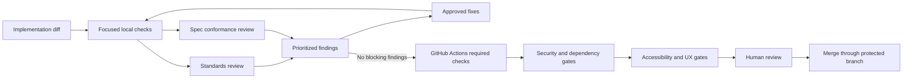

### 15.1 Review perspectives

| Review | Question | When |
| --- | --- | --- |
| Standards | Does the change follow repository and technology rules? | Every implementation |
| Specification | Does the behavior match the approved outcome and non-goals? | Every spec-backed change |
| Architecture | Does it preserve module boundaries and decisions? | Boundary, data, or pattern changes |
| Security | Can an attacker misuse this change or its dependencies? | Risk labels, auth, data, external input, release |
| Accessibility | Can users complete the flow with assistive technology and keyboard? | Every UI change |
| Operations | Can it be observed, deployed, rolled back, and supported? | Data, infrastructure, release, or high-risk changes |

Review agents report findings; they do not automatically fix every observation.
The orchestrator or human decides whether a finding is in scope and creates a
follow-up issue when it is not.

### 15.2 Required CI checks

The names are examples; the setup profile chooses the exact commands:

- repository contract and changed-file policy;
- backend restore, format check, build, analyzers, and tests;
- frontend install, format/lint, typecheck, and tests;
- canonical topic metadata and generated-document freshness;
- current data-model and API snapshot consistency;
- API or schema compatibility;
- accessibility smoke checks;
- secret, dependency, and license scans;
- container or package build if applicable;
- migration validation;
- end-to-end tests for the selected release tier;
- artifact provenance and SBOM if required;
- deployment preview and smoke checks where configured.

## 16. Deployment and operations

Deployment is provider-neutral at the process level. A deployment profile maps
the contract to a target platform without changing the quality gates.

### 16.1 Release flow

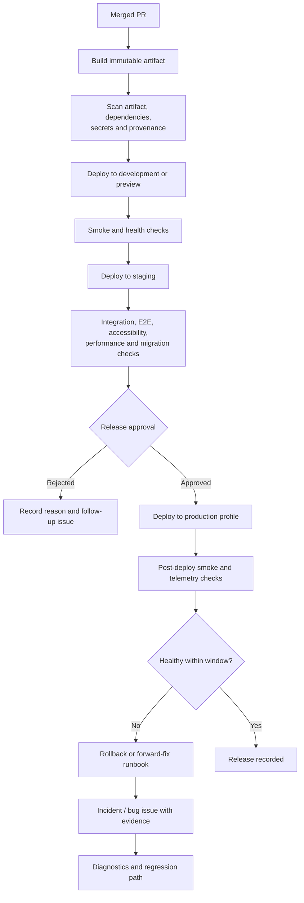

### 16.2 Release guardrails

- Build once and promote the same immutable artifact through environments.
- Keep environment configuration outside source code and out of agent prompts.
- Use expand-and-contract migrations for changes that require compatibility.
- Run migrations with an explicit owner and rollback or forward-fix plan.
- Require protected environment approval for production by default.
- Verify health, critical journeys, logs, metrics, and traces after deployment.
- Keep rollback automation tested and reversible.
- For a MartiX.Platform profile, distinguish a package upgrade from a Platform
  Migration; validate the manifest and generated state, show the migration
  diff, run the explicit Migrator workflow, and preserve immutable evidence.
- Do not promise rollback for irreversible data changes. Record recovery,
  backup, forward-fix, and operator actions instead.
- Create a redacted incident or bug issue when a release fails.
- Never close the parent specification before the intended release outcome is
  verified, unless the team explicitly defines merge as completion.

### 16.3 Operations feedback loop

Production telemetry is not a substitute for acceptance tests. It is evidence
for new work:

1. Detect a signal through monitoring, user feedback, or support.
2. Redact and preserve the minimum evidence.
3. Triage as an incident, bug, or improvement.
4. Reproduce in a safe environment.
5. Add a regression test before or with the fix.
6. Review whether an architecture, observability, or runbook gap also needs a
   follow-up issue.

## 17. Automation event matrix

The event detector should be deterministic wherever possible. The agent is
invoked only after the event has been validated.

| Event | Deterministic trigger | Label mutation | Agent response | Human gate |
| --- | --- | --- | --- | --- |
| New issue without lifecycle label | GitHub issue webhook | `+needs-triage +phase:intake` | Queue triage | Triage outcome |
| Issue or diff touches selected MartiX.Platform profile | Package/manifest/path detector and repository profile | Preserve state; add `+stack:martix-platform`, and add verified `+risk:data-migration` or `+risk:breaking-change` when applicable | Load `martix-platform` through the routed MX workflow | Architecture, migration, or release approval according to the affected phase |
| Reporter responds to `needs-info` | New issue comment | `-needs-info +needs-triage`, preserve stored phase | Re-queue triage | Product clarification if still ambiguous |
| Triage routes to shaping | Triage result and required fields | `-needs-triage +shaping`, `phase:intake -> phase:shaping` | Run shaping/wayfinding | Product scope decisions |
| Shaping identifies architecture work | Shaping result and risk rules | `-shaping +ready-for-architecture`, `phase:shaping -> phase:architecture`, `+risk:architecture` | Run architect | Architecture approval |
| Spec labeled `ready-for-spec` | Label transition | `-ready-for-spec +in-progress`, preserve `phase:specification` | Run spec-author | Specification approval |
| Approved spec with no slice graph | Parent label and child query | `ready-for-human -> ready-for-decomposition`, then `in-progress/phase:decomposition` | Run ticket-planner | Ticket graph approval |
| Child created with closed blockers | Issue dependency and ownership query | Child `+ready-for-agent +phase:implementation` | Dispatch when assigned | None for low-risk implementation; escalation for decisions |
| Child created with an open blocker | Issue dependency and ownership query | Child `+blocked +phase:implementation`, record previous state | Do not dispatch | Dependency or ownership decision |
| Agent branch has a complete diff | Git, tests, docs, and evidence checks | `-in-progress +in-review`, `phase:implementation -> phase:review` | Run focused validation and review | None before PR; human before merge |
| PR opened or updated | Pull request webhook | Keep `in-review`; failed checks return `in-progress` | Run CI, standards, spec, security, accessibility checks | Human review and branch protection |
| PR approved and merged | Merge event | `-ready-for-human +ready-for-release`, `phase:review -> phase:release` | Build/promote immutable artifact | Release approval |
| Deployment starts | Release workflow preflight | `-ready-for-release +deploying` | Deploy approved artifact | Protected environment gate |
| Deployment succeeds | Exit code and health endpoint | `-deploying +verifying-release` | Run smoke, migration, E2E, and accessibility checks | Release policy |
| Release verification passes | Required checks and observation policy | `-verifying-release +monitoring` | Observe telemetry and critical journeys | Observation completion |
| Release verification or deployment fails | Exit code or health signal | `deploying/verifying-release -> blocked`; create `Incident` | Diagnose, rollback, or forward-fix | Production rollback policy |
| Observation window passes | Scheduled health and support check | `-monitoring +released` or `+resolved` for incidents | Close with evidence | Human or policy close |
| Repeated hotspot churn | Scheduled static report | Preserve current state; add applicable `+risk:architecture` | Propose architecture scan | Human selects refactor |
| Skill or prompt changed | Artifact diff | Use artifact issue lifecycle; add `+area:docs` and `+phase:documentation` for docs work | Run routing, quality, safety, and portability evals | Maintainer promotion decision |

## 18. AI artifact lifecycle

The delivery process itself is software and needs a lifecycle:

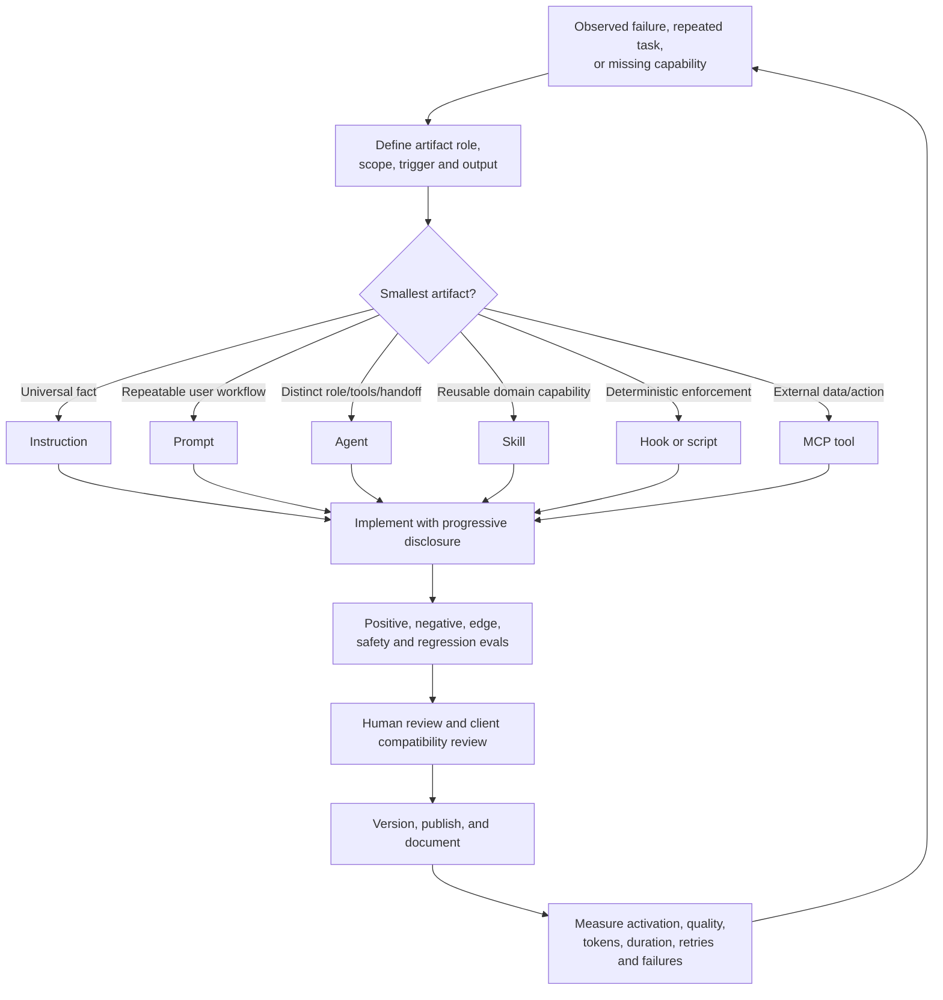

### 18.1 Artifact promotion gates

Before promoting an artifact:

- its role is not duplicated by a narrower existing artifact;
- its trigger has positive and near-miss cases;
- its expected output is testable;
- its safety boundary is explicit;
- its tool list follows least privilege;
- its client loading behavior is documented;
- its main router is concise and references are progressive;
- deterministic repetition is implemented as a script or hook where appropriate;
- its evals record model tier, token budget, parallel safety, and escalation;
- repository validation and focused Markdown/metadata checks pass.

## 19. Observability and evaluation

Every orchestrated run should record, without secrets:

- repository and commit;
- parent, slice, and sub-issue IDs;
- agent role and selected skill;
- prompt and instruction versions;
- model tier and reasoning setting;
- tools and MCP servers exposed;
- files read and changed, subject to privacy policy;
- tests, checks, and exit codes;
- review findings and resolutions;
- retries, duration, token or credit metrics when available;
- resulting commit, PR, deployment, or escalation;
- failure classification.

Quality and safety floors take priority over token or time savings. Evaluate
skills and agents with:

- positive activation cases;
- negative and near-miss activation cases;
- expected-output assertions;
- known failure regressions;
- human review for architecture, security, and UX quality;
- repeated runs to measure variance;
- a held-out set before changing descriptions or prompts;
- client-specific tests for Copilot CLI and GitHub Actions integrations.

## 20. Anti-patterns

| Anti-pattern | Failure mode | Replacement |
| --- | --- | --- |
| One autonomous super-agent | Large context, unclear ownership, hard-to-review changes | Main coordinator plus bounded specialists |
| Automatic full waterfall for every change | Waste and duplicated artifacts | Choose the smallest safe lifecycle |
| Vague issue sent to implementation | Agents invent requirements | Triage and shaping first |
| One issue per technical layer with no vertical outcome | Integration occurs too late | One vertical slice with specialized sub-issues |
| Parallel agents editing the same generated file | Conflicts and nondeterministic output | Serialize ownership or use an integration agent |
| DDD everywhere | Ceremony hides simple behavior | Use complexity signals and explicit ADRs |
| Microservices before boundaries are proven | Distributed failure and operational cost | Modular monolith first |
| Instructions used as security controls | Prompt injection or model drift bypasses them | Hooks, CI, permissions, and approvals |
| Auto-fixing every review finding | Scope creep and unverified changes | Prioritize, decide, then implement separately |
| Agent deploys directly to production | Unsafe credentials and irreversible actions | Protected environments and human release gate |
| Storing all context in `CONTEXT.md` | Token-heavy, stale glossary | Context for language, ADRs for rationale, issues for work |
| Copying external skills without evaluation | Client mismatch and hidden behavior changes | Pin, adapt, evaluate, and document |
| Claiming success after a partial command | Silent failure and false green status | Propagate errors and require evidence |

## 21. Implementation roadmap for this architecture

### P0 - Establish the contract

- Approve this lifecycle and the open decisions.
- Create the consumer-repository setup skill.
- Add the organization issue-type preflight for `Task`, `Bug`, and `Feature`;
  optionally provision approved `Epic`, `Spike`, `Incident`, and `Chore` types.
- Define the label vocabulary and idempotent provisioning.
- Define version 1 of `.github/martix/mx.config.json`, its JSON Schema, the
  resolved workflow registry, transition matrix, and issue validator.
- Define the optional MartiX.Platform setup profile, authority/status map, and
  derived `stack:martix-platform` routing rule.
- Implement `validate-issue.ps1` and `transition-issue.ps1` as the only
  automation write path for lifecycle labels and evidence comments.
- Create issue forms and a minimal repository instruction layer.
- Define baseline build, test, lint, security, and branch-protection checks.
- Create a small eval set for setup, triage, spec, ticketing, implementation,
  review, and release handoff.

### P1 - Build the planning and implementation loop

- Implement shaping, research, prototype, specification, and ticket-planning
  prompts and agents.
- Add vertical-slice and sub-issue templates.
- Implement the main orchestrator's frontier query and context-pack builder.
- Add backend, contract, frontend, and test agent profiles.
- Publish `skills/martix-lifecycle` and compose it in the
  `plugins/martix-ai-lifecycle` bundle with `mx-*` workflow references.
- Register `martix-platform` as the Platform-specific backend profile and add
  positive, negative, current-versus-target, migration, and near-miss routing
  evals.
- Add isolated branch/worktree handling and idempotent issue updates.
- Add per-slice standards and spec review.

### P1 - Make quality deterministic

- Add hooks for scope, branch, formatting, secret, metadata, and evidence
  checks.
- Add GitHub Actions required checks for backend, frontend, contracts,
  accessibility, security, and tests.
- Add aggregate PR review and unresolved-finding detection.
- Add migration and generated-code policy checks.
- Add Platform manifest, generated-topology, explicit-composition, Migrator,
  reliable-event, and support-claim quality gates when that profile is selected.

### P2 - Automate delivery and operations

- Add provider-neutral deployment profile interfaces.
- Add preview/staging promotion and smoke checks.
- Add protected production environments and rollback runbooks.
- Add release telemetry and incident-to-issue automation.

### P2 - Measure and improve

- Record run metadata and failure categories.
- Compare skill versions with routing, quality, safety, and efficiency evals.
- Remove duplicated or eagerly loaded context.
- Promote only changes that clear quality and safety floors.

## 22. Open decisions before implementation

The following should become setup answers or decision issues before building the
automation:

| Decision | Why it matters |
| --- | --- |
| Product repository layout and module naming | Determines file-scoped instructions and path ownership. |
| Organization issue types | Determines whether `Epic`, `Spike`, `Incident`, or `Chore` should be added beyond `Task`, `Bug`, and `Feature`. |
| Database and migration technology | Determines integration tests, rollback, and deployment checks. |
| MartiX.Platform adoption and support status | Determines whether `martix-platform` is loaded, which manifest/preset/provider evidence is authoritative, and when `stack:martix-platform` is derived. |
| Authentication and authorization provider | Determines secrets, threat model, and security agent scope. |
| Default package managers and test runners | Determines deterministic commands and CI cache strategy. |
| GitHub Actions runner trust model | Determines whether background agents can write issues, branches, and PRs. |
| Maximum autonomous change size | Determines when the orchestrator must stop and request a human. |
| Production approval policy | Determines environment protection and release-agent permissions. |
| Required compliance and data residency | Determines logging, evidence retention, and deployment profiles. |
| E2E and accessibility baseline | Determines browser tooling, test duration, and release gates. |
| Skill distribution targets | Determines whether artifacts target Copilot CLI only or additional clients. |
| MX configuration preset and override policy | Determines which defaults are selected, which repository values may override them, and which changes require human approval. |
| JSON Schema and resolved-manifest location | Determines editor validation, generated-file ownership, and CI freshness checks. |
| Prompt/template variable allowlist | Determines how much issue and repository context can enter generated prompts without token or injection surprises. |

No implementation agent should resolve these by assumption when they affect
security, cost, data, architecture, or release risk.

## 23. Related repository guidance

- [Execution and routing](../guides/execution-and-routing.md)
- [Parallel worktree guidance](../guides/parallel-worktree-guidance.md)
- [Custom AI artifact rules](../policy/custom-ai-artifact-rules.md)
- [AI-assisted development knowledge](../knowledge/ai/best-practices/knowledge.md)
- [Non-runtime workflow research map](../knowledge/matt-pocock/matt-pocock-skills-kompletni-mapa.md)
- [Non-runtime label research](../knowledge/matt-pocock/matt-pocock-skills-github-labels.md)
- [Configurable lifecycle artifact research](../knowledge/matt-pocock/2026-08-09-configurable-lifecycle-artifacts.md)
- [MartiX Platform skill](../../skills/martix-platform/SKILL.md)
- [Repository knowledge](../knowledge/repository/knowledge.md)
