# Matt Pocock skills: GitHub label inventory

This research snapshot inventories every `SKILL.md` in
[`mattpocock/skills`](https://github.com/mattpocock/skills) and maps explicit
GitHub-label conventions to the skills that define or apply them.

**Snapshot:** `main` at
[`84fdeffd12f2ee307994d1eb6feb48173b6e0502`](https://github.com/mattpocock/skills/commit/84fdeffd12f2ee307994d1eb6feb48173b6e0502)  
**Research date:** 2026-08-08

## Findings

The snapshot contains **35 skills**: 18 stable Engineering, 7 stable
Productivity, 4 Misc, and 6 beta In-progress. The 25 stable
Engineering/Productivity skills are the ones listed by the
[Claude plugin manifest](https://github.com/mattpocock/skills/blob/84fdeffd12f2ee307994d1eb6feb48173b6e0502/.claude-plugin/plugin.json#L21-L46).
The complete count is reproducible with
[`scripts/list-skills.sh`](https://github.com/mattpocock/skills/blob/84fdeffd12f2ee307994d1eb6feb48173b6e0502/scripts/list-skills.sh#L1-L8).

The explicit label vocabulary has 12 canonical/operational literals:

- Category labels: `bug`, `enhancement`.
- Triage states: `needs-triage`, `needs-info`, `ready-for-agent`,
  `ready-for-human`, `wontfix`.
- Wayfinder labels: `wayfinder:map`, `wayfinder:research`,
  `wayfinder:prototype`, `wayfinder:grilling`, `wayfinder:task`.

The current
[repository labels API](https://api.github.com/repos/mattpocock/skills/labels?per_page=100)
contains the two category labels and five triage-state labels, but none of the
five `wayfinder:*` labels. `bug:triage` is only an example override in the
setup flow, not an upstream default.

## Skill-to-label matrix

`None` means no explicit GitHub label literal or label operation was found in
the skill's source package. It does not prevent a downstream workflow from
invoking a label-bearing skill.

| Category | Skill | Explicit labels |
| --- | --- | --- |
| Engineering | `ask-matt` | None |
| Engineering | `code-review` | None |
| Engineering | `codebase-design` | None |
| Engineering | `diagnosing-bugs` | None |
| Engineering | `domain-modeling` | None |
| Engineering | `grill-with-docs` | None |
| Engineering | `implement` | None |
| Engineering | `improve-codebase-architecture` | None |
| Engineering | `prototype` | None |
| Engineering | `research` | None |
| Engineering | `resolving-merge-conflicts` | None |
| Engineering | `setup-matt-pocock-skills` | Triage defaults; adapter |
| Engineering | `tdd` | None |
| Engineering | `to-spec` | `ready-for-agent` |
| Engineering | `to-tickets` | `ready-for-agent` |
| Engineering | `triage` | `bug`, `enhancement`, all five triage-state labels |
| Engineering | `wayfinder` | Map label plus four type labels |
| Engineering | `wizard` | None |
| Productivity | `grill-me` | None |
| Productivity | `grilling` | None |
| Productivity | `handoff` | None |
| Productivity | `teach` | None |
| Productivity | `to-questionnaire` | None |
| Productivity | `wait-what` | None |
| Productivity | `writing-for-agents` | None |
| Misc | `git-guardrails-claude-code` | None |
| Misc | `migrate-to-shoehorn` | None |
| Misc | `scaffold-exercises` | None |
| Misc | `setup-pre-commit` | None |
| In-progress | `claude-handoff` | None |
| In-progress | `loop-me` | None |
| In-progress | `setup-ts-deep-modules` | None |
| In-progress | `writing-beats` | None |
| In-progress | `writing-fragments` | None |
| In-progress | `writing-shape` | None |

## Evidence

- `triage` defines `bug` and `enhancement` as category roles and the five
  triage-state roles in
  [`skills/engineering/triage/SKILL.md`](https://github.com/mattpocock/skills/blob/84fdeffd12f2ee307994d1eb6feb48173b6e0502/skills/engineering/triage/SKILL.md#L26-L45).
- `setup-matt-pocock-skills` names the five configurable defaults in
  [`SKILL.md`](https://github.com/mattpocock/skills/blob/84fdeffd12f2ee307994d1eb6feb48173b6e0502/skills/engineering/setup-matt-pocock-skills/SKILL.md#L51-L58)
  and repeats them in
  [`triage-labels.md`](https://github.com/mattpocock/skills/blob/84fdeffd12f2ee307994d1eb6feb48173b6e0502/skills/engineering/setup-matt-pocock-skills/triage-labels.md#L3-L13).
- `to-spec` applies `ready-for-agent`
  ([source](https://github.com/mattpocock/skills/blob/84fdeffd12f2ee307994d1eb6feb48173b6e0502/skills/engineering/to-spec/SKILL.md#L11-L20)).
- `to-tickets` applies `ready-for-agent` for real trackers
  ([source](https://github.com/mattpocock/skills/blob/84fdeffd12f2ee307994d1eb6feb48173b6e0502/skills/engineering/to-tickets/SKILL.md#L58-L78)).
- `wayfinder` defines the map and child-ticket labels
  ([source](https://github.com/mattpocock/skills/blob/84fdeffd12f2ee307994d1eb6feb48173b6e0502/skills/engineering/wayfinder/SKILL.md#L19-L25),
  [ticket types](https://github.com/mattpocock/skills/blob/84fdeffd12f2ee307994d1eb6feb48173b6e0502/skills/engineering/wayfinder/SKILL.md#L55-L70)).
- The GitHub tracker adapter provides the concrete Wayfinder label commands
  ([source](https://github.com/mattpocock/skills/blob/84fdeffd12f2ee307994d1eb6feb48173b6e0502/skills/engineering/setup-matt-pocock-skills/issue-tracker-github.md#L38-L41)).

## Mermaid diagram

```mermaid
flowchart LR
  subgraph Eng["Stable Engineering"]
    e_ask["ask-matt"]
    e_review["code-review"]
    e_design["codebase-design"]
    e_bug["diagnosing-bugs"]
    e_domain["domain-modeling"]
    e_grilldocs["grill-with-docs"]
    e_impl["implement"]
    e_arch["improve-codebase-architecture"]
    e_proto["prototype"]
    e_research["research"]
    e_merge["resolving-merge-conflicts"]
    e_setup["setup-matt-pocock-skills"]
    e_tdd["tdd"]
    e_spec["to-spec"]
    e_tickets["to-tickets"]
    e_triage["triage"]
    e_wayfinder["wayfinder"]
    e_wizard["wizard"]
  end

  subgraph Prod["Stable Productivity"]
    p_grillme["grill-me"]
    p_grilling["grilling"]
    p_handoff["handoff"]
    p_teach["teach"]
    p_questionnaire["to-questionnaire"]
    p_wait["wait-what"]
    p_writing["writing-for-agents"]
  end

  subgraph Misc["Misc / not promoted"]
    m_guard["git-guardrails-claude-code"]
    m_shoehorn["migrate-to-shoehorn"]
    m_exercises["scaffold-exercises"]
    m_precommit["setup-pre-commit"]
  end

  subgraph Beta["In-progress / beta"]
    b_handoff["claude-handoff"]
    b_loop["loop-me"]
    b_modules["setup-ts-deep-modules"]
    b_beats["writing-beats"]
    b_fragments["writing-fragments"]
    b_shape["writing-shape"]
  end

  subgraph Labels["Labels"]
    l_none["No direct label"]
    l_bug["bug"]
    l_enhancement["enhancement"]
    l_nt["needs-triage"]
    l_ni["needs-info"]
    l_agent["ready-for-agent"]
    l_human["ready-for-human"]
    l_wontfix["wontfix"]
    l_map["wayfinder:map"]
    l_research["wayfinder:research"]
    l_proto["wayfinder:prototype"]
    l_grilling["wayfinder:grilling"]
    l_task["wayfinder:task"]
  end

  e_setup --> l_nt
  e_setup --> l_ni
  e_setup --> l_agent
  e_setup --> l_human
  e_setup --> l_wontfix
  e_setup -. adapter docs .-> l_map
  e_setup -. adapter docs .-> l_research
  e_setup -. adapter docs .-> l_proto
  e_setup -. adapter docs .-> l_grilling
  e_setup -. adapter docs .-> l_task
  e_triage --> l_bug
  e_triage --> l_enhancement
  e_triage --> l_nt
  e_triage --> l_ni
  e_triage --> l_agent
  e_triage --> l_human
  e_triage --> l_wontfix
  e_spec --> l_agent
  e_tickets --> l_agent
  e_wayfinder --> l_map
  e_wayfinder --> l_research
  e_wayfinder --> l_proto
  e_wayfinder --> l_grilling
  e_wayfinder --> l_task

  e_ask --> l_none
  e_review --> l_none
  e_design --> l_none
  e_bug --> l_none
  e_domain --> l_none
  e_grilldocs --> l_none
  e_impl --> l_none
  e_arch --> l_none
  e_proto --> l_none
  e_research --> l_none
  e_merge --> l_none
  e_tdd --> l_none
  e_wizard --> l_none
  p_grillme --> l_none
  p_grilling --> l_none
  p_handoff --> l_none
  p_teach --> l_none
  p_questionnaire --> l_none
  p_wait --> l_none
  p_writing --> l_none
  m_guard --> l_none
  m_shoehorn --> l_none
  m_exercises --> l_none
  m_precommit --> l_none
  b_handoff --> l_none
  b_loop --> l_none
  b_modules --> l_none
  b_beats --> l_none
  b_fragments --> l_none
  b_shape --> l_none
```

## Limitations

The report is pinned to the current `main` commit. The repository label API is
live state and can change. Triage labels can be renamed in a consuming
repository, and the `wayfinder:*` labels must be provisioned before use.
Transitive routing is not counted as direct label usage: for example,
`ask-matt` routes to `triage` but does not apply a label itself.
