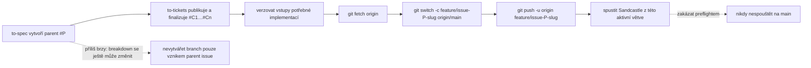
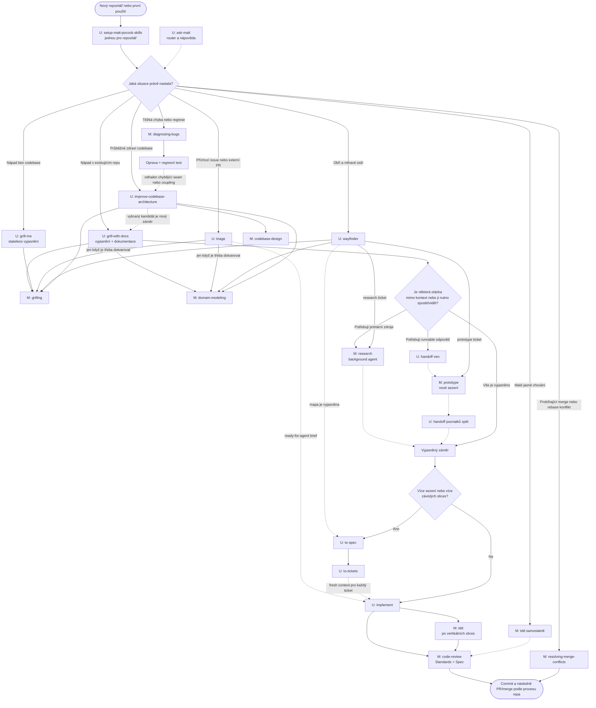
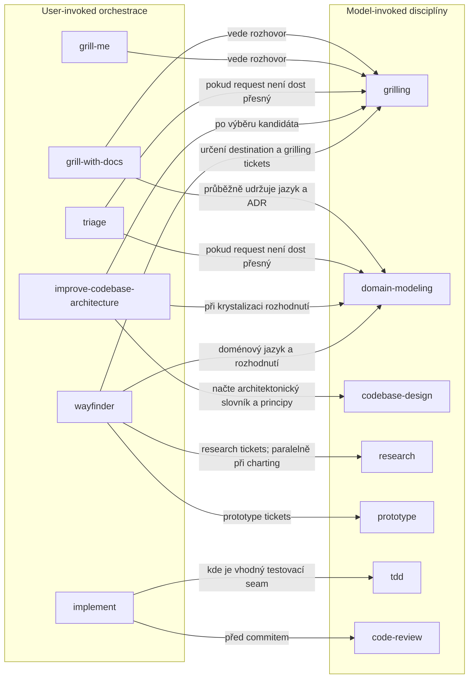
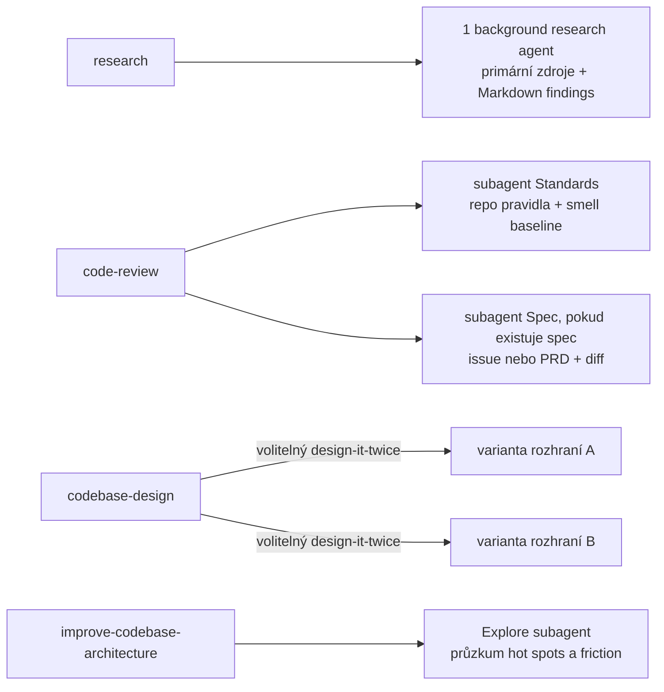
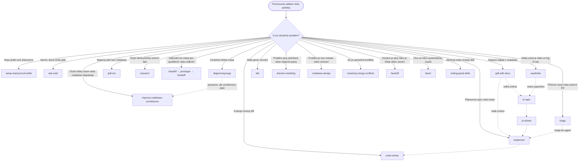
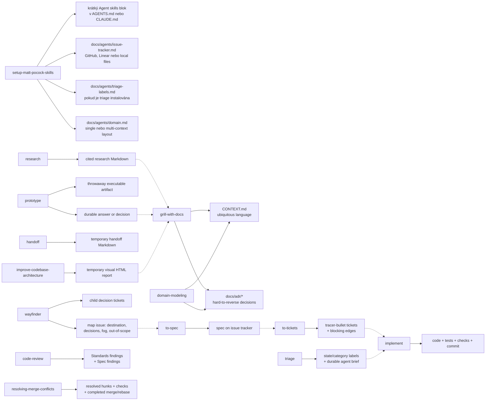
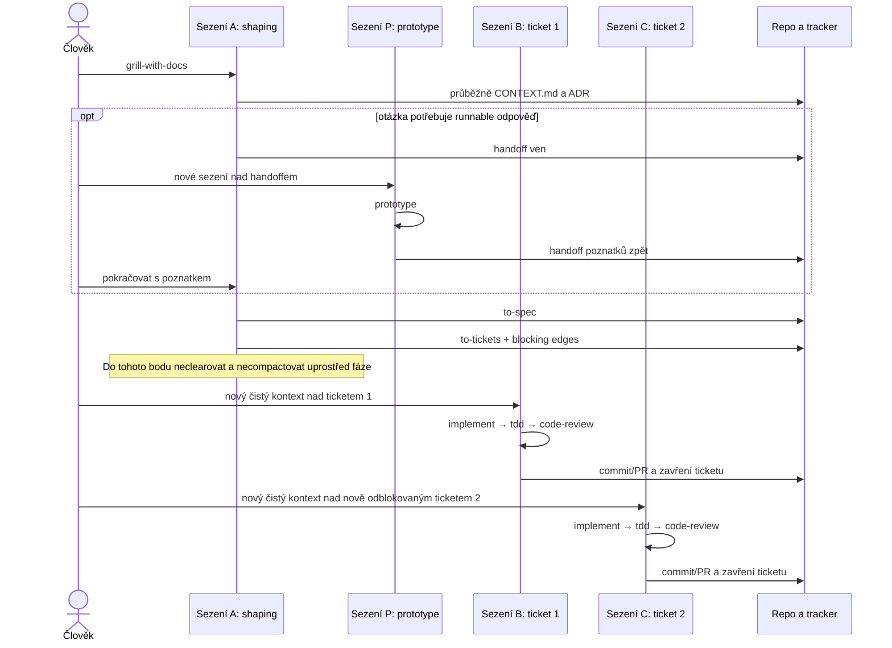
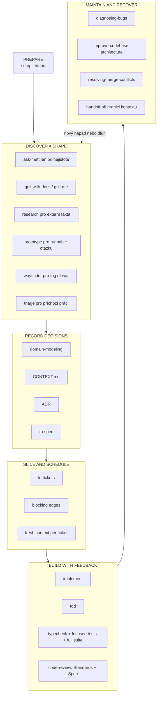

# Matt Pocock Skills: kompletní mapa vztahů, spouštění a doporučených toků

## Praktický provozní manuál s Mermaid schématy

**Stav k:** 18. červenci 2026  
**Analyzovaná sada:** `mattpocock/skills` `v1.1.0` a aktuální větev `main`  
**Rozsah hlavní mapy:** 22 aktuálně publikovaných Engineering a Productivity skills — 13 user-invoked a 9 model-invoked  
**Účel:** rozhodnout, kterou skill spustit, co spustí uvnitř, jaký artefakt vznikne a co má následovat

> [!IMPORTANT]
> „Automaticky spouštěná skill“ zde neznamená událost na pozadí ani hook sledující repozitář. Znamená buď (a) výslovný krok uvnitř jiné skill, nebo (b) model-invoked skill, kterou může agent vybrat podle popisu aktuálního úkolu. Git commit, nový issue ani selhání testu samy o sobě nic nespustí, pokud tuto událost nepřekládá agentní hostitel, hook, CI nebo vlastní orchestrace.

> [!NOTE]
> Upstream README má aktuálně 22 položek, zatímco [AI Hero katalog](https://www.aihero.dev/skills) zobrazuje 21 a zatím vynechává novější `resolving-merge-conflicts`. Také lokálně nainstalovaný snapshot může být starší: například současný upstream `wayfinder` při chartingu automaticky zakládá paralelní `research` subagenty pro vytvořené research tickets. Mapa níže je proto **upstream-complete**, nikoli pouhý popis jednoho lokálního snapshotu.

## Stručný provozní verdikt

Pro většinu práce používejte jako výchozí páteř:

```text
setup jednou → grill-with-docs → [research/prototype podle nejistoty]
             → to-spec → to-tickets → nový kontext pro každý ticket
             → implement → tdd → code-review → commit/PR
```

Při použití Sandcastle se opakované per-ticket `implement` sessions nahradí orchestration runem, ale shaping a finální aggregate gate zůstávají Mattovy:

```text
grill-with-docs → to-spec(parent) → to-tickets(children)
→ integration branch z origin/main → Sandcastle fan-out/fan-in
→ Draft PR do main s Closes #parent
→ fresh code-review origin/main → fix/test/CI/human review
→ GitHub merge do main → parent se automaticky zavře
```

Ne každá změna potřebuje celou páteř:

- malý a jasný zásah může jít z `grill-with-docs` rovnou do `implement`;
- konkrétní chování lze vytvořit přímo přes `tdd`;
- příchozí cizí issue nejdřív prochází `triage`;
- těžká chyba začíná `diagnosing-bugs`;
- příliš velké a nejasné úsilí začíná `wayfinder`;
- architektonická údržba začíná `improve-codebase-architecture`;
- probíhající konflikt merge/rebase patří do `resolving-merge-conflicts`.

Nejdůležitější pravidlo sady je zachovat hranice rolí. `wayfinder` vyrábí rozhodnutí, ne implementaci. `to-tickets` vyrábí agent-ready tickets, které se už znovu netřídí přes `triage`. `prototype` vyrábí poznatek, nikoli produkční kód. `code-review` posuzuje hotový diff proti standardům a zadání; nenahrazuje testy.

## Hlavní tisknutelná mapa: idea → Matt Skills → Sandcastle → PR → `main`

Toto je doporučený **jeden integrační tok pro jednu parent specification**. Diagram počítá s GitHub Issues, Sandcastle `parallel-planner-with-review` nebo obdobně nakonfigurovanou orchestrací a s jedinou integrační větví pro všechny child tickets daného parent issue. Pro tisk je nejvhodnější export Mermaid do SVG/PDF v orientaci na šířku.

```mermaid
flowchart LR
    subgraph SHAPE["1 — SHAPE: člověk + Matt Skills"]
        direction TB
        IDEA([Feature nebo app idea])
        SETUP["setup-matt-pocock-skills<br/>jen jednou pro repo"]
        GRILL["grill-with-docs<br/>grilling + domain-modeling"]
        UNCERTAIN{Co ještě není známo?}
        RESEARCH["research<br/>primární zdroje"]
        PROTOTYPE["handoff → prototype → handoff<br/>runnable nebo vizuální otázka"]
        SHAPED[Vyjasněný a zdokumentovaný záměr]

        IDEA -.->|první použití| SETUP
        IDEA --> GRILL
        SETUP -.-> GRILL
        GRILL --> UNCERTAIN
        UNCERTAIN -->|externí fakta| RESEARCH
        UNCERTAIN -->|nutno spustit nebo vidět| PROTOTYPE
        UNCERTAIN -->|nic zásadního| SHAPED
        RESEARCH --> SHAPED
        PROTOTYPE --> SHAPED
    end

    subgraph PLAN["2 — PLAN: Matt Skills + issue tracker"]
        direction TB
        SPEC["to-spec<br/>parent spec issue #P zůstává OPEN"]
        TICKETS["to-tickets<br/>child issues #C1…#Cn"]
        GRAPH["schválené tracer bullets<br/>acceptance criteria + blocking edges<br/>ready-for-agent"]
        INPUTS["všechny vstupy workerů verzované<br/>CONTEXT.md, ADR, standards,<br/>planning docs a Sandcastle config"]

        SPEC --> TICKETS --> GRAPH --> INPUTS
    end

    subgraph INTEGRATION["3 — CREATE INTEGRATION TARGET: člověk + Git"]
        direction TB
        FETCH["git fetch origin"]
        BRANCH["vytvořit právě jednu integrační větev<br/>feature/issue-P-slug z origin/main"]
        PUSH0["push -u origin integrační-větev"]
        PREFLIGHT{Preflight před Sandcastle}
        SAFE["aktivní větev = integrační<br/>nikdy main<br/>tracked worktree clean<br/>správný parent a ticket filter"]

        FETCH --> BRANCH --> PUSH0 --> PREFLIGHT --> SAFE
    end

    subgraph EXECUTE["4 — EXECUTE: Sandcastle nahrazuje opakované /implement sessions"]
        direction TB
        FRONTIER["planner vybere jen frontier child tickets<br/>všechny blockers hotové"]
        FANOUT["oddělené větve<br/>sandcastle/issue-C1 … sandcastle/issue-Cn"]
        WORKERS["paralelní implementační agenti<br/>testy + typecheck"]
        LOCALREVIEW["per-ticket Sandcastle reviewer<br/>lokální kontrola jednotlivých branches"]
        MERGER["merge agent sloučí hotové ticket branches<br/>do AKTIVNÍ integrační větve"]
        CHILDREN["ověření integračního stavu<br/>+ uzavření nebo označení child tickets<br/>dle tracker policy"]
        MORE{Zbývá odblokovaný child ticket?}

        FRONTIER --> FANOUT --> WORKERS --> LOCALREVIEW --> MERGER --> CHILDREN --> MORE
        MORE -->|ano| FRONTIER
    end

    subgraph RELEASE["5 — AGGREGATE REVIEW A DELIVERY: Matt + GitHub"]
        direction TB
        PUSH1["push integrační větve"]
        DRAFT["Draft PR: integrační větev → main<br/>PR body obsahuje Closes #P<br/>shrnutí dokončených child tickets"]
        AGGREVIEW["fresh task na integrační větvi<br/>code-review origin/main<br/>Standards + parent Spec"]
        FINDINGS{Review findings?}
        FIX["opravit → commit → push<br/>typecheck + test"]
        CI["PR CI + required checks"]
        CIFAIL{CI nebo review selhaly?}
        REPAIR["gh-fix-ci / gh-address-comments<br/>nebo ruční oprava"]
        HUMAN["human review<br/>vyřešené conversations<br/>PR Ready for review"]
        MERGE["merge PR přes GitHub do default branch main"]
        CLOSE["GitHub automaticky zavře parent #P<br/>kvůli Closes #P"]
        POST["post-merge/release workflow, pokud je nakonfigurován<br/>ověřit closure + smazat integrační větev"]

        PUSH1 --> DRAFT --> AGGREVIEW --> FINDINGS
        FINDINGS -->|ano| FIX --> AGGREVIEW
        FINDINGS -->|ne| CI --> CIFAIL
        CIFAIL -->|ano| REPAIR --> CI
        CIFAIL -->|ne| HUMAN --> MERGE --> CLOSE --> POST
    end

    SHAPED --> SPEC
    INPUTS --> FETCH
    SAFE --> FRONTIER
    MORE -->|ne; Sandcastle role končí| PUSH1
```



### Kritické kontrolní body hlavního diagramu

1. **Integrační větev nevytváří automaticky ani `to-spec`, ani `to-tickets`.** Vytvořte ji explicitně po schválení a publikování child tickets, bezprostředně před prvním Sandcastle během. V té chvíli už je znám parent issue, finální implementační frontier i přesný scope větve.
2. **Výchozím bodem je čerstvý remote-tracking ref default branch, v tomto diagramu `origin/main`, ne libovolný lokální `main`.** Před vytvořením větve i před agregátním review proveďte `git fetch origin`. Pokud se default branch jmenuje jinak, použijte `origin/<default-branch>`. Lokální `main` může být stale nebo mohl být omylem posunut dřívějším `merge-to-head` během.
3. **Sandcastle musí startovat s integrační větví aktivní.** Aktuální upstream definuje `TARGET_BRANCH` jako hostitelskou aktivní větev v okamžiku `run()` a parallel planner merger slučuje dokončené branches do „current branch“. Spuštění na `main` proto může přesunout integrační výsledek právě do lokálního `main`; nejde o bezpečný feature workflow. Viz [Sandcastle branch strategies a built-in prompt arguments](https://github.com/mattpocock/sandcastle#how-it-works).
4. **Per-ticket Sandcastle review není finální Matt review.** Sandcastle reviewer vidí jednu ticket branch; agregátní `code-review origin/main` vidí celý výsledný diff parent feature a odděleně kontroluje repo Standards a parent Spec. [`code-review`](https://github.com/mattpocock/skills/blob/main/skills/engineering/code-review/SKILL.md) používá three-dot diff proti merge-base a přijímá branch jako fixed point.
5. **Parent spec issue zůstává otevřený až do merge integračního PR.** `to-tickets` výslovně říká parent issue nezavírat ani nemodifikovat. Do PR mířícího na default branch vložte `Closes #P`; GitHub jej automaticky zavře až při merge do default branch. Closing keyword je na PR cíleném do jiné než default branch ignorován. Viz [GitHub: linking a pull request to an issue](https://docs.github.com/en/issues/tracking-your-work-with-issues/using-issues/linking-a-pull-request-to-an-issue).
6. **Po úplném Sandcastle fan-in jej znovu nespouštějte jen kvůli delivery.** Jakmile jsou child branches sloučené, tickets dokončené a integrační větev pushnutá, další práce patří aggregate review, opravám, CI a PR review. Nový Sandcastle run je oprávněný jen pro nový/vrácený agent-ready child ticket nebo recovery neúspěšného runu.
7. **Untracked soubory nejsou součástí feature PR.** `.sandcastle/`, research Markdowny ani jiné lokální vstupy se do PR nedostanou, dokud nejsou explicitně přidány a commitnuty. Sandcastle infrastrukturu držte raději v samostatném reviewovaném PR, pokud není záměrnou součástí parent specu.
8. **Integrační větev určuje kam; ticket query určuje co.** Výchozí GitHub Issues scaffold Sandcastle vybírá open issues s globálním labelem Sandcastle, ne automaticky pouze children jednoho parentu. Před runem proto použijte parent-specific label, explicitní allowlist child IDs nebo jiný spolehlivý parent filter. Jinak může správně checkoutnutá integration branch pohltit tickets jiné feature. Viz [Sandcastle `InitService.ts`](https://github.com/mattpocock/sandcastle/blob/main/src/InitService.ts).

### Přesný okamžik vytvoření integrační větve



Referenční PowerShell postup:

```powershell
git fetch origin
git switch -c feature/issue-52-planner-flow origin/main
git push -u origin feature/issue-52-planner-flow
pnpm sandcastle
```

Před `pnpm sandcastle` ověřte, že plánovací artefakty a konfigurace potřebné workery jsou dosažitelné z integrační větve, tracked worktree je čistý a Sandcastle query vybírá pouze children daného parentu. Doporučený budoucí preflight v `.sandcastle/main.mts` má odmítnout `main`, detached HEAD a nečekanou integrační větev, zkontrolovat čistý tracked worktree a vypsat `SOURCE_BRANCH`, `TARGET_BRANCH`, parent issue a ticket filter.

## 1. Jak číst mapy

| Zápis | Význam |
|---|---|
| `A --> B` | Skill A má B ve svém předepsaném procesu a výslovně ji používá nebo deleguje. |
| `A -.-> B` | Doporučené pokračování, handoff nebo návrat do hlavního toku; B se nespustí bez nové volby/invokace. |
| **U** | User-invoked: orchestrace je dosažitelná jen výslovným spuštěním uživatelem. |
| **M** | Model-invoked: uživatel ji může spustit přímo a agent ji může zvolit automaticky, když popis situace odpovídá. |
| **HITL** | Vyžaduje živou účast člověka; agent nesmí odpovědi člověka simulovat. |
| **AFK** | Lze bezpečněji delegovat bez průběžného dialogu, pokud má agent potřebné zdroje a oprávnění. |

Autor sady rozděluje skills podle toho, **kdo je smí vyvolat**. User-invoked skills orchestrují proces; model-invoked skills nesou znovupoužitelnou disciplínu. User-invoked skill smí uvnitř použít model-invoked skill, ale nemá automaticky spouštět jinou user-invoked skill. Proto například `ask-matt` doporučí `to-spec`, ale sám ji neprovede. Toto rozdělení je explicitně popsáno v [hlavním README](https://github.com/mattpocock/skills#reference).

## 2. Mapa celého životního cyklu

Toto je nejpraktičtější pohled: odkud vstoupit, jaké jsou odbočky a kde se proudy znovu spojí.



### Jak mapu interpretovat

1. `setup-matt-pocock-skills` je předpoklad engineering toku, nikoli krok každé feature.
2. `grill-with-docs` je výchozí shaping pro změnu v existujícím repozitáři. `grill-me` je jeho stateless obdoba mimo codebase.
3. `research` a `prototype` jsou odbočky pro různé typy nejistoty: první odpovídá čtením důvěryhodných zdrojů, druhý levným spustitelným experimentem.
4. `to-spec` a `to-tickets` se vyplatí, když práce přesáhne jedno sezení nebo potřebuje explicitní graf závislostí.
5. `implement` má uvnitř používat `tdd`, průběžné kontroly a nakonec `code-review` ještě před commitem.

## 3. Přesný graf skutečných invokací

Následující graf záměrně neukazuje běžné „co dál“. Plná šipka znamená vazbu popsanou přímo v textu zdrojové skill. Díky tomu odlišuje skutečnou kompozici od doporučeného workflow.



### Vnitřní delegace, které nejsou další skills



Tyto subagenty nelze zaměňovat za položky katalogu. Například `Standards` a `Spec` jsou dvě izolované role uvnitř `code-review`, nikoli samostatně instalované skills. Smyslem izolace je zabránit tomu, aby znalost z jednoho pohledu zkreslila druhý.

## 4. Co je automatické, podmíněné a pouze doporučené

| Zdrojová skill | Navázaná skill | Síla vazby | Kdy nastane |
|---|---|---|---|
| `grill-with-docs` | `grilling` | Výslovná, vždy | Každé spuštění je grilling session. |
| `grill-with-docs` | `domain-modeling` | Výslovná, průběžná | Při zpřesňování pojmů, glossary a hard-to-reverse rozhodnutí. |
| `grill-me` | `grilling` | Výslovná, vždy | Každé spuštění je stateless grilling session. |
| `triage` | `grilling` | Výslovná, podmíněná | Jen pokud příchozí request potřebuje dotvarovat. |
| `triage` | `domain-modeling` | Výslovná, podmíněná | Současně s grillingem, pokud se zpřesňuje jazyk a rozhodnutí. |
| `improve-codebase-architecture` | `codebase-design` | Výslovná | Pro společný slovník hlubokých modulů a případně „design it twice“. |
| `improve-codebase-architecture` | `grilling` | Výslovná, podmíněná | Až člověk vybere kandidáta z reportu. |
| `improve-codebase-architecture` | `domain-modeling` | Výslovná, průběžná | Když návrh zpřesní pojem nebo vyvolá ADR. |
| `implement` | `tdd` | Výslovná, „where possible“ | Na předem dohodnutých testovatelných seams; ne mechanicky pro každý řádek. |
| `implement` | `code-review` | Výslovná, vždy před dokončením | Po implementaci, před commitem. |
| `wayfinder` | `grilling` | Výslovná | Při pojmenování destination, charting a grilling ticketu. |
| `wayfinder` | `domain-modeling` | Výslovná | Spolu s grillingem a při rozhodnutích o pojmech. |
| `wayfinder` | `research` | Výslovná, podle typu ticketu | Research tickets; při vytvoření mapy se mají spustit paralelně. |
| `wayfinder` | `prototype` | Výslovná, podle typu ticketu | Prototype ticket, když odpověď vyžaduje konkrétní artifact nebo runnable experiment. |
| `diagnosing-bugs` | `improve-codebase-architecture` | Doporučený následný handoff | Teprve po opravě, pokud příčinou byla absence seam, hidden coupling nebo tangled callers. |
| `research` | `grill-with-docs` | Doporučený návrat | Findings informují shaping; výzkum sám nenahrazuje rozhodnutí. |
| `prototype` | `handoff` | Doporučená session orchestrace | Handoff ven před experimentem a handoff poznatků zpět; `prototype` sama user-invoked handoff spustit nemá. |
| `wayfinder` | `to-spec` | Doporučený hlavní výstup | Když mapa odhalí cestu k velkému cíli. Přímý `implement` jen pokud se ukáže, že práce je opravdu malá. |
| `to-tickets` | `implement` | Doporučený následný tok | Každý neblokovaný ticket v novém čistém kontextu. |
| `triage` | `implement` | Doporučený následný tok | Až po vzniku `ready-for-agent` briefu. |
| `improve-codebase-architecture` | `grill-with-docs` | Doporučený nový cyklus | Vybraný refactoring candidate je nový nápad, který se má nejprve vytvarovat. |

## 5. Rozhodovací strom podle události



### Události vhodné pro hooks nebo automatizaci

Mattovy skills samy neposkytují obecný event bus. Následující tabulka je doporučená orchestrace nad sadou, ne tvrzení o vestavěné automatice.

| Detekovatelná událost | Deterministická detekce bez LLM | Doporučená reakce | Má se spustit bez člověka? |
|---|---|---|---|
| První použití v repu, chybí tracker/doc config | Kontrola přítomnosti setup artefaktů | Nabídnout `setup-matt-pocock-skills` | Ne; setup obsahuje volby trackeru, labels a umístění docs. |
| Nový issue bez stavového labelu | Webhook issue trackeru | Zařadit do fronty pro `triage` | Automaticky lze pouze označit `needs-triage`; rozhodnutí o výsledném stavu má mít maintainer gate. |
| Reporter odpověděl na `needs-info` | Webhook na nový komentář | Vrátit do `needs-triage` nebo upozornit na pokračování `triage` | Ano pro notifikaci/stav podle týmové politiky; ne pro domyšlení odpovědi. |
| Ticket je `ready-for-agent` a všechny blockers jsou zavřené | Query trackeru | Vytvořit izolovaný run pro `implement` | Ano pouze v důvěryhodném sandboxu, s omezenými secrets a CI/PR gate. |
| Test nebo reprodukční příkaz selhává u hlášeného bug | Exit code procesu | Nabídnout `diagnosing-bugs` | Lze automaticky zahájit sběr důkazů; změna kódu má projít běžnými gates. |
| `git status` hlásí unmerged paths během merge/rebase | Git stav | `resolving-merge-conflicts` | Ano v izolované větvi, ale skill sama vyžaduje studium intentu a dokončení operace. |
| Implementace vytvořila diff proti určenému base | `git diff --quiet` a známý merge-base | Spustit `code-review` | Ano; je to ideální post-task kontrola, ne náhrada CI. |
| Context budget překročil interní práh | Telemetrie hostitele | Nabídnout `handoff`; na hranici fáze případně built-in compact | Ano pro upozornění nebo generování draftu, nikoli pro nečekané ukončení sezení. |
| Opakované změny ve stejných hot spots | Git log a churn metriky | Naplánovat `improve-codebase-architecture` | Automatizovat lze kandidátní report; výběr refaktoringu má zůstat HITL. |
| Změna názvu doménového konceptu bez aktualizace glossary | Statická kontrola je jen heuristika | Upozornit na `domain-modeling` | Spíše warning; význam pojmu vyžaduje lidské rozhodnutí. |
| Neověřený externí API fakt blokuje rozhodnutí | Výslovná metadata ticketu nebo agentní klasifikace | Vytvořit `research` ticket/subagent | Ano, pokud jsou zdroje veřejné a zápis findings je izolovaný. |
| Každých několik dní nebo po velké feature | Scheduler | Nabídnout architecture scan | Ano pro read-only scan; ne pro automatickou masivní refaktorizaci. |

Prakticky: hooks mají dělat levnou detekci, formátování, lint, testy, ochrany a předávání stavu. LLM má nastoupit až tam, kde je nutné porozumět záměru, nejednoznačnosti, doméně nebo trade-offům.

## 6. Artefakty a předávání stavu



### Source of truth podle fáze

| Fáze | Primární source of truth | Co do něj nepatří |
|---|---|---|
| Doménový jazyk | `CONTEXT.md` | Dlouhé procedurální návody a dočasné diskuse. |
| Architektonické rozhodnutí | ADR | Každá malá implementační volba; ADR jen pro rozhodnutí, jejichž důvod bude v budoucnu nezřejmý. |
| Rozhodování ve velké mlze | Wayfinder map + child decision tickets | Produkční slices a implementační checklisty. |
| Schválený záměr | Spec issue | Duplicitní živý plán na více místech. |
| Provedení | Tracer-bullet tickets s blocking edges | Opakované discovery otázky již uzavřené ve spec. |
| Externí příchozí práce | Triage stav + agent brief | Triage tickets vytvořené vlastním `to-tickets`; ty jsou už agent-ready. |
| Implementace | Git diff, testy a commit/PR | Rozhodnutí existující jen v chatu. |
| Překročení kontextu | Handoff Markdown | Trvalá projektová dokumentace; handoff je most, ne nový kanonický spec. |

## 7. Hranice kontextů a správné pořadí sezení



Pravidla kontextové hygieny z [`ask-matt`](https://github.com/mattpocock/skills/blob/main/skills/engineering/ask-matt/SKILL.md):

1. Držte `grill-with-docs → to-spec → to-tickets` v jednom nepřerušeném kontextu, protože každý krok syntetizuje předchozí uvažování.
2. Pokud se shaping blíží „smart zone“, proveďte `handoff` do nového sezení; netlačte model do degradovaného dlouhého kontextu.
3. Každý `implement` ticket začínejte v čerstvém kontextu a načtěte jen ticket, relevantní repo instrukce, dotčené zdroje, glossary a ADR.
4. Built-in compact používejte mezi fázemi, když chcete pokračovat ve stejném vlákně. `handoff` použijte, když chcete skutečně nové sezení nebo paralelní odbočku.
5. Wayfinder řeší nanejvýš jeden nerešeršní decision ticket na jedno sezení. Research tickets jsou výjimka a mohou běžet paralelně.

## 8. Kompletní katalog 22 hlavních skills

### 8.1 Engineering: user-invoked orchestrace

| Skill | Kdy ji explicitně spustit | Co používá uvnitř | Výstup a správné pokračování |
|---|---|---|---|
| [`ask-matt`](https://github.com/mattpocock/skills/blob/main/skills/engineering/ask-matt/SKILL.md) | Když si nepamatujete katalog nebo nevíte, která cesta odpovídá situaci. | Žádnou další skill nespouští; je router a doporučuje tok. | Vybraný vstupní bod. Nepoužívat jako povinný krok každého runu. |
| [`grill-with-docs`](https://github.com/mattpocock/skills/blob/main/skills/engineering/grill-with-docs/SKILL.md) | Před téměř každou netriviální změnou v existující codebase. | `grilling` + `domain-modeling`. | Vyjasněný záměr, aktualizovaný `CONTEXT.md` a případné ADR; potom `to-spec` nebo přímo `implement`. |
| [`triage`](https://github.com/mattpocock/skills/blob/main/skills/engineering/triage/SKILL.md) | Pro cizí/raw bug reports, feature requests a podle configu externí PR. | Podmíněně `grilling` + `domain-modeling`. | Jedna category role, jedna state role, ověření tvrzení a případný agent brief; `ready-for-agent` přechází do `implement`. |
| [`improve-codebase-architecture`](https://github.com/mattpocock/skills/blob/main/skills/engineering/improve-codebase-architecture/SKILL.md) | Průběžně, po velké změně, při opakovaném friction nebo po bug post-mortem bez dobrého seam. | `codebase-design`, po výběru `grilling`, průběžně `domain-modeling`; Explore subagent. | Dočasný vizuální HTML report; vybraný kandidát se stane nápadem pro `grill-with-docs`. |
| [`setup-matt-pocock-skills`](https://github.com/mattpocock/skills/blob/main/skills/engineering/setup-matt-pocock-skills/SKILL.md) | Jednou pro repozitář před engineering flow; znovu jen při migraci trackeru/configu. | Neorchestruje engineering skills; vytváří jejich předpoklady. | Tracker contract, labels a doc layout. |
| [`to-spec`](https://github.com/mattpocock/skills/blob/main/skills/engineering/to-spec/SKILL.md) | Když je diskuse dostatečně vytvarovaná a má se stát trvalým buildable zadáním. | Žádnou; syntetizuje dosavadní kontext, nemá znovu interviewovat. | Spec publikovaný do trackeru; následuje `to-tickets`. |
| [`to-tickets`](https://github.com/mattpocock/skills/blob/main/skills/engineering/to-tickets/SKILL.md) | Když spec/plán přesahuje jeden rozumný implementační krok. | Žádnou další skill automaticky; navrhuje blockers-first tok. | Tracer-bullet tickets a blocking edges; každý frontier ticket do samostatného `implement` sezení. |
| [`implement`](https://github.com/mattpocock/skills/blob/main/skills/engineering/implement/SKILL.md) | Pro připravený spec, agent-ready issue nebo jeden ticket. | `tdd` kde je vhodný seam; vždy závěrečný `code-review`. | Implementovaný a zkontrolovaný diff, testy, commit na aktuální branch. |
| [`wayfinder`](https://github.com/mattpocock/skills/blob/main/skills/engineering/wayfinder/SKILL.md) | Pouze pro obří práci, jejíž cesta k destination se nevejde do jednoho sezení a je ve fog of war. | `grilling`, `domain-modeling`; podle ticketu `research`, `prototype`; research subagents. | Mapa rozhodnutí a vyjasněná cesta; obvykle handoff do `to-spec`, ne přímá stavba. |

### 8.2 Engineering: model-invoked disciplíny

| Skill | Typický trigger | Automatická/explicitní vazba | Výstup a hranice |
|---|---|---|---|
| [`prototype`](https://github.com/mattpocock/skills/blob/main/skills/engineering/prototype/SKILL.md) | Návrhovou otázku nelze levně vyřešit diskusí; je třeba vidět UI nebo spustit logiku/stav. | Volá ji `wayfinder` pro prototype ticket; jinak ji může zvolit model nebo uživatel. | Throwaway program/varianty + poznatek. Kód se má zahodit nebo vědomě přepsat, ne propašovat do produkce. |
| [`diagnosing-bugs`](https://github.com/mattpocock/skills/blob/main/skills/engineering/diagnosing-bugs/SKILL.md) | Tvrdá chyba, flake, performance regression, nejasná příčina. | Po opravě může doporučit `improve-codebase-architecture`. | Reproduce → minimise → hypothesise → instrument → fix → regression test. Nejdřív tight feedback loop, teprve potom teorie. |
| [`research`](https://github.com/mattpocock/skills/blob/main/skills/engineering/research/SKILL.md) | Rozhodnutí blokuje dokumentace, API fakt, paper nebo jiný primární zdroj. | `wayfinder` ji spouští pro research tickets; sama deleguje background agentovi. | Citovaný Markdown findings v repu; vstup do shaping, ne náhrada product decision. |
| [`tdd`](https://github.com/mattpocock/skills/blob/main/skills/engineering/tdd/SKILL.md) | Stavba konkrétního chování nebo oprava chyby test-first. | Používá ji `implement`; lze spustit samostatně. | Malé red-green-refactor vertikální slices. Testovat přes veřejný seam a chování, ne implementační detaily. |
| [`domain-modeling`](https://github.com/mattpocock/skills/blob/main/skills/engineering/domain-modeling/SKILL.md) | Fuzzy/overloaded term, nekonzistentní jazyk, důležité rozhodnutí nebo edge-case, který mění model. | Používají ji `grill-with-docs`, `triage`, `improve-codebase-architecture`, `wayfinder`. | Ubiquitous language v `CONTEXT.md`, scénáře a ADR. Má být aktivní disciplína, ne jednorázové generování glossary. |
| [`codebase-design`](https://github.com/mattpocock/skills/blob/main/skills/engineering/codebase-design/SKILL.md) | Potřeba navrhnout deep module, interface a seam nebo porovnat radikálně odlišná rozhraní. | Výslovně ji používá `improve-codebase-architecture`; její slovník používá také `tdd`. | Návrh s vysokou depth/leverage/locality; volitelně dvě paralelní varianty interface. |
| [`code-review`](https://github.com/mattpocock/skills/blob/main/skills/engineering/code-review/SKILL.md) | Existuje diff proti známému fixed point a je známo zadání nebo alespoň repo standardy. | Povinný závěr `implement`; spouští izolovaný Standards subagent a při dostupném specu také Spec subagent. | Sloučené, prioritizované findings. Review není implementace opravy, pokud o ni uživatel zvlášť nepožádá. |
| [`resolving-merge-conflicts`](https://github.com/mattpocock/skills/blob/main/skills/engineering/resolving-merge-conflicts/SKILL.md) | Git je právě uprostřed merge/rebase a existují konfliktní hunks. | Žádné další katalogové skills. | Dohledá primární intent obou stran, vyřeší každý hunk, spustí checks a merge/rebase dokončí; nemá operaci abortovat ani vymýšlet nové chování. |

### 8.3 Productivity skills

| Skill | Invokace | Kdy ji použít | Vazby a výstup |
|---|---|---|---|
| [`grill-me`](https://github.com/mattpocock/skills/blob/main/skills/productivity/grill-me/SKILL.md) | **U** | Plán nebo design bez codebase, případně když nechcete stav zapisovat do repo docs. | Spustí `grilling`; nezapisuje `CONTEXT.md`. |
| [`handoff`](https://github.com/mattpocock/skills/blob/main/skills/productivity/handoff/SKILL.md) | **U** | Kontext se plní, chcete nové sezení, jiný agent nebo dočasnou prototype větev. | Vytvoří kompaktní Markdown pro pokračování v novém sezení. Nezaměňovat s compact ve stejném vlákně. |
| [`teach`](https://github.com/mattpocock/skills/blob/main/skills/productivity/teach/SKILL.md) | **U** | Chcete systematické učení konceptu napříč sezeními v aktuálním workspace. | Stateful výukový prostor, diagnostika znalostí, lekce a cvičení; mimo delivery pipeline. |
| [`writing-great-skills`](https://github.com/mattpocock/skills/blob/main/skills/productivity/writing-great-skills/SKILL.md) | **U** | Píšete nebo revidujete vlastní skills a potřebujete konzistentní slovník a zásady. | Referenční disciplína pro authoring; mimo feature pipeline. |
| [`grilling`](https://github.com/mattpocock/skills/blob/main/skills/productivity/grilling/SKILL.md) | **M** | Plán, design nebo rozhodnutí má neprozkoumané větve. | Reusable one-question-at-a-time loop; používají ji `grill-me`, `grill-with-docs`, `triage`, `wayfinder` a architecture flow. |

## 9. Recepty pro nejčastější situace

### 9.1 Malá, dobře pochopená feature

```text
grill-with-docs (krátce, jen otevřené volby)
→ implement
  → tdd po malých vertikálních slices
  → code-review
→ commit/PR
```

`to-spec` a `to-tickets` vynechte, pokud by byly dražší než samotná změna a není potřeba handoff, auditní stopa ani paralelní práce.

### 9.2 Střední nebo velká feature

```text
grill-with-docs
→ případně research
→ případně handoff → prototype → handoff zpět
→ to-spec
→ to-tickets
→ [fresh context] implement ticket A → tdd → code-review
→ [fresh context] implement nově odblokovaný ticket B → tdd → code-review
→ ...
```

Ticket má být tracer bullet: malý end-to-end slice, který sám prokazuje hodnotu nebo snižuje riziko. Graf blocking edges má řídit pořadí, nikoli pořadové číslo v názvu.

### 9.3 Greenfield nebo gigantická feature ve fog of war

```text
setup
→ wayfinder: pojmenovat destination
→ vytvořit mapu a první decision tickets
→ research tickets paralelně přes research subagenty
→ po jednom sezení řešit grilling/prototype/task tickets
→ až je cesta jasná: to-spec
→ to-tickets
→ fresh-context implement runs
```

`wayfinder` nepoužívejte jen proto, že feature je „velká“. Je určen pro situaci, kdy ještě ani nelze přesně vyjmenovat všechna rozhodnutí. Pokud lze práci popsat jedním specem, je wayfinder zbytečná režie.

### 9.4 Příchozí bug report nebo feature request

```text
triage
→ načíst issue/komentáře/diff a repo kontext
→ ověřit tvrzení a hledat existující implementaci či dřívější odmítnutí
→ podle potřeby grilling + domain-modeling
→ needs-info | ready-for-human | wontfix | ready-for-agent
→ ready-for-agent: nový kontext → implement
```

Výstup `to-tickets` nikdy neposílejte do `triage`: jde o tickets, které jste sami vytvořili z již schváleného specu a jsou už agent-ready.

### 9.5 Těžká chyba, flake nebo performance regression

```text
diagnosing-bugs
→ vytvořit jediný reprodukční příkaz, který je červený právě pro tuto chybu
→ minimalizovat
→ hypotézy řadit a instrumentovat
→ nejmenší oprava
→ regression test
→ až potom post-mortem
→ chybí-li seam: improve-codebase-architecture
```

Architecture refactoring před reprodukcí chyby často zničí důkazy a rozšíří scope. Nejprve opravit, potom s lepšími informacemi navrhovat hlubší změnu.

### 9.6 Průběžná architektonická údržba

```text
improve-codebase-architecture
→ codebase-design vocabulary + scan hot spots
→ visual report s kandidáty
→ člověk vybere kandidáta
→ grilling + domain-modeling
→ případně design-it-twice
→ kandidát jako nový nápad do grill-with-docs
→ spec/tickets/implement podle velikosti
```

Scan lze dělat pravidelně, ale implementaci výsledků neautomatizujte bez výběru člověkem. Architektonické „zlepšení“ bez očekávané budoucí změny je často YAGNI.

### 9.7 Konflikt merge nebo rebase

```text
git potvrzuje in-progress merge/rebase + unmerged paths
→ resolving-merge-conflicts
→ pro každý hunk dohledat intent v commits, PR a issues
→ zachovat oba intenty, pokud jsou kompatibilní
→ jinak zvolit intent odpovídající cíli merge a popsat trade-off
→ typecheck/tests/format
→ stage a dokončit merge/rebase
```

Tato skill výslovně říká „always resolve; never `--abort`“. Spouštějte ji tedy až ve chvíli, kdy je skutečně cílem probíhající operaci dokončit, ne když teprve posuzujete, zda se merge má provést.

### 9.8 Výzkum před rozhodnutím

```text
research question s přesným scope
→ background agent čte primární zdroje
→ cited Markdown findings
→ grill-with-docs nad findings
→ rozhodnutí, CONTEXT.md/ADR/spec podle dopadu
```

Výzkum má oddělit fakta, inference a doporučení. Nemá sám rozhodnout product trade-off, který patří člověku.

### 9.9 Plný kontext nebo potřeba paralelní odbočky

```text
handoff
→ nový thread/session s odkazem na handoff soubor
→ pokračování práce
```

Pro prototype odbočku udělejte handoff ven i zpět. Pro čistě sekvenční přechod mezi dokončenými fázemi lze místo toho použít built-in compact, pokud chcete zůstat ve stejném vlákně.

## 10. Anti-patterny a pojistky

| Anti-pattern | Proč je chybný | Správná náhrada |
|---|---|---|
| Automaticky spustit všechny skills v „kompletní pipeline“ | Sada je komponovatelná, ne povinný waterfall. Zbytečně pálí kontext a vytváří duplicitní artefakty. | Vyberte nejkratší tok, který ošetří skutečnou nejistotu a riziko. |
| Považovat model-invoked za background trigger | Skill description pouze dovoluje agentovi disciplínu vybrat v aktivním runu. | Pro skutečné události vytvořte hook/webhook/CI orchestration. |
| Nechat user-invoked skill automaticky řetězit další user-invoked skills | Porušuje zamýšlené kontrolní body sady. | Před další orchestrací vraťte rozhodnutí uživateli; uvnitř komponujte model-invoked disciplíny. |
| `triage` nad tickets z `to-tickets` | Znovu otevírá již uzavřený shaping a plýtvá kontextem. | Jděte rovnou do `implement` podle blockers. |
| `wayfinder` pro dobře definovanou feature | Vytváří drahou mapu tam, kde už je cesta viditelná. | `grill-with-docs → to-spec/to-tickets` nebo přímo `implement`. |
| Implementovat destination uvnitř wayfinder mapy | Decision tickets přestanou být mapou a vznikne směs plánování a delivery. | Mapu uzavřete a předejte do `to-spec`; výjimku uveďte explicitně v Notes. |
| Pokračovat v shaping po výrazné degradaci dlouhého kontextu | Spec a tickets mohou ztratit rozhodovací logiku. | Udělejte `handoff` a pokračujte v novém sezení se souhrnem. |
| Compact uprostřed grillu nebo ticketu | Shrnutí může ztratit otevřené větve a přesné důkazy. | Compact jen na hranici fáze; jinak handoff nebo dokončení fáze. |
| Použít prototype jako první produkční implementaci | Prototype optimalizuje rychlost učení, ne kvalitu, bezpečnost a maintainability. | Zachovejte rozhodnutí, experiment zahoďte a implementujte ze specu přes TDD. |
| Refaktorovat architekturu před opravou bug | Rozšiřuje scope a maže diagnostické důkazy. | Nejdřív `diagnosing-bugs`, oprava a regression test; potom architecture handoff. |
| Spustit `tdd` bez použitelného seam | Vede k testům implementation detailů nebo k rozsáhlému mockování. | Nejprve navrhnout seam přes `codebase-design`, případně architecture flow. |
| `code-review` bez fixed point nebo bez původního zadání | Není jasné, co je diff a co znamená „správně“. | Určete merge-base/commit a issue/spec; chybí-li spec, jasně omezte review jen na Standards. |
| Automaticky opravovat každé review finding | Review je diagnostika; ne každé pozorování je správné nebo ve scope. | Prioritizovat, ověřit a až pak zvlášť implementovat schválené opravy. |
| Ukládat vše do `CONTEXT.md` | Glossary se nafoukne a přestane šetřit tokeny. | `CONTEXT.md` pro doménový jazyk, ADR pro důvody, tickets pro práci, repo instructions pro pravidla. |
| Používat `research` místo rozhodnutí | Primární zdroje neznají vaše priority a akceptovatelný trade-off. | Findings vrátit do `grill-with-docs` a rozhodnout HITL. |

## 11. Doporučená provozní konfigurace

### Minimální sada pro běžný repozitář

Nainstalujte všech 22 hlavních skills, ale v každém runu načítejte jen relevantní skill. Jako pracovní menu stačí mít viditelné tyto vstupy:

```text
setup-matt-pocock-skills  jednou
ask-matt                  jen při nejistotě
grill-with-docs           běžná netriviální změna
triage                    cizí příchozí práce
diagnosing-bugs           těžká chyba
wayfinder                 obří fog-of-war úsilí
improve-codebase-architecture  upkeep
implement                 agent-ready práce
handoff                   hranice kontextu
```

Ostatní model-invoked disciplíny se mají načíst progresivně až podle potřeby nebo prostřednictvím nadřazené orchestrace.

### Doporučená pravidla pro vlastní orchestrátor

1. **Katalogová metadata:** evidujte `invocation = user|model`, `mode = HITL|AFK|mixed`, preconditions, expected artifacts a allowed child skills.
2. **Guard proti zakázanému chainu:** user-invoked skill nesmí sama bez kontrolního bodu spustit další user-invoked skill.
3. **Artifact gates:** `implement` přijme jen konkrétní ticket/spec; `to-tickets` jen dostatečně stabilní spec; `code-review` jen známý fixed point.
4. **Context packs:** pro implementaci ticketu poskládejte jen ticket, blocker decisions, relevantní glossary/ADR/instructions a dotčené soubory.
5. **Deterministické kontroly mimo LLM:** formátování, typecheck, test selection, full test suite, git status, diff statistics, secret scanning a policy checks patří do scriptů/hooks/CI.
6. **Human gates:** shaping decisions, triage state, výběr architecture candidate, prototype acceptance a merge významných změn ponechte člověku.
7. **Sandbox:** AFK `research`, jednotlivé `implement` runs a automatické review izolujte; zapisujte logs a přesné source/target commits.
8. **Idempotence:** hook má bezpečně poznat, že už proběhl. Nevytvářejte nový research dokument nebo triage komentář při každém opakovaném eventu.
9. **Observabilita:** u každého runu zaznamenejte zvolenou skill, její trigger, vstupní artefakty, child skills, model, token/cost metriky, checks a výsledný commit/issue změnu.

## 12. Vedlejší skills mimo hlavní mapu

Repozitář obsahuje i další adresáře, ale README je neuvádí v hlavním Engineering/Productivity katalogu a Claude plugin je záměrně nepromuje jako běžný operační tok. Zacházejte s nimi jako se standalone nebo special-purpose nástroji:

| Skupina | Aktuálně viditelné položky | Doporučení |
|---|---|---|
| Misc | `git-guardrails-claude-code`, `migrate-to-shoehorn`, `scaffold-exercises`, `setup-pre-commit` | Používat jen při přesné shodě situace. `setup-pre-commit` je repo bootstrap utility, ne součást idea-to-ship flow. |
| Personal | `edit-article`, `obsidian-vault` | Osobní content/knowledge workflows; nemíchat do engineering lifecycle mapy. |
| Deprecated / in-progress | Historické či rozpracované položky v odpovídajících složkách | Neopírat automatizaci o ně bez explicitního připnutí verze a revize obsahu. |

Aktuální adresářová struktura je dostupná v [Engineering](https://github.com/mattpocock/skills/tree/main/skills/engineering), [Productivity](https://github.com/mattpocock/skills/tree/main/skills/productivity), [Misc](https://github.com/mattpocock/skills/tree/main/skills/misc) a [Personal](https://github.com/mattpocock/skills/tree/main/skills/personal).

## 13. Jednostránková provozní mapa



## 14. Závěrečné doporučení

Pro dlouhodobý vývoj chápejte Matt Pocock Skills jako **síť malých kontrolovaných postupů**, nikoli jako jeden autonomní super-workflow. Největší hodnotu má tato dělba:

- user-invoked skills rozhodují o fázi a zachovávají lidskou kontrolu;
- model-invoked skills dodávají odbornou disciplínu přesně v místě potřeby;
- issue tracker, Git, `CONTEXT.md` a ADR nesou stav mezi sezeními;
- hooks, scripty a CI detekují události a provádějí levné deterministické kontroly;
- nový kontext pro každý implementační ticket omezuje kontaminaci a tokenové náklady;
- `handoff` zachraňuje důležitý kontext, když je nutné změnit sezení;
- `research` a `prototype` snižují různé typy nejistoty ještě před drahou produkční implementací;
- `tdd`, `code-review`, `diagnosing-bugs` a architecture upkeep uzavírají feedback loop po celý život codebase.

Pokud si nejste jistí cestou, použijte `ask-matt`. Pokud cestu znáte, router vynechte a spusťte přímo nejmenší odpovídající skill. Právě toto selektivní použití je podstatou sady.

## Primární zdroje

- [Matt Pocock Skills — README, instalace, filosofie, invokační model a aktuální katalog](https://github.com/mattpocock/skills)
- [Ask Matt — autoritativní router a hlavní flow](https://github.com/mattpocock/skills/blob/main/skills/engineering/ask-matt/SKILL.md)
- [AI Hero Skills Catalog — first-party katalog a seskupení](https://www.aihero.dev/skills)
- [Engineering skills — aktuální zdrojová struktura](https://github.com/mattpocock/skills/tree/main/skills/engineering)
- [Productivity skills — aktuální zdrojová struktura](https://github.com/mattpocock/skills/tree/main/skills/productivity)
- [Setup Matt Pocock Skills](https://github.com/mattpocock/skills/blob/main/skills/engineering/setup-matt-pocock-skills/SKILL.md)
- [Grill With Docs](https://github.com/mattpocock/skills/blob/main/skills/engineering/grill-with-docs/SKILL.md)
- [Triage](https://github.com/mattpocock/skills/blob/main/skills/engineering/triage/SKILL.md)
- [Improve Codebase Architecture](https://github.com/mattpocock/skills/blob/main/skills/engineering/improve-codebase-architecture/SKILL.md)
- [Wayfinder](https://github.com/mattpocock/skills/blob/main/skills/engineering/wayfinder/SKILL.md)
- [Implement](https://github.com/mattpocock/skills/blob/main/skills/engineering/implement/SKILL.md)
- [Code Review](https://github.com/mattpocock/skills/blob/main/skills/engineering/code-review/SKILL.md)
- [Diagnosing Bugs](https://github.com/mattpocock/skills/blob/main/skills/engineering/diagnosing-bugs/SKILL.md)
- [Resolving Merge Conflicts](https://github.com/mattpocock/skills/blob/main/skills/engineering/resolving-merge-conflicts/SKILL.md)
- [Sandcastle — current README and branch strategies](https://github.com/mattpocock/sandcastle#how-it-works)
- [Sandcastle — current parallel planner with per-ticket review](https://github.com/mattpocock/sandcastle/blob/main/src/templates/parallel-planner-with-review/main.mts)
- [Sandcastle — current merge prompt](https://github.com/mattpocock/sandcastle/blob/main/src/templates/parallel-planner-with-review/merge-prompt.md)
- [GitHub — creating a Draft pull request](https://docs.github.com/en/pull-requests/collaborating-with-pull-requests/proposing-changes-to-your-work-with-pull-requests/creating-a-pull-request)
- [GitHub — closing parent issue from a PR to the default branch](https://docs.github.com/en/issues/tracking-your-work-with-issues/using-issues/linking-a-pull-request-to-an-issue)
- [GitHub — protected branches and required status checks](https://docs.github.com/en/repositories/configuring-branches-and-merges-in-your-repository/managing-protected-branches/about-protected-branches)

### Stav a omezení analýzy

Repozitář se aktivně mění. Hlavní katalog má proto přednost před staršími články, cached katalogy a lokálně nainstalovanými kopiemi. AI Hero je first-party vysvětlující vrstva, ale pro přesný aktuální seznam a invokační metadata je kanonický zdroj GitHub `main`/připnutý release. Při automatizaci doporučuji připnout konkrétní release nebo commit a při upgradu znovu vygenerovat tento graf z front matter a explicitních odkazů v `SKILL.md`.
