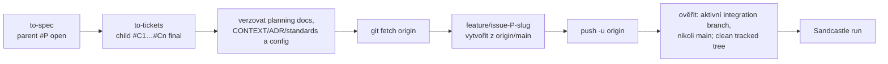

# GitHub Spec Kit vs. Matt Pocock Skills + Sandcastle

## Detailní analýza pro dlouhodobou práci na vývojářských projektech

**Stav k:** 18. červenci 2026  
**Porovnávané verze:** GitHub Spec Kit `v0.12.17` (16. 7. 2026), Matt Pocock Skills `v1.1.0` (8. 7. 2026), Sandcastle `v0.12.0` (29. 6. 2026)  
**Rozhodovací kontext:** dlouhodobě udržované vývojářské projekty, práce s AI coding agenty, greenfield i brownfield

## Stručný verdikt

Pokud si máte pro běžnou dlouhodobou práci vybrat **jen jednu metodiku**, doporučuji jako výchozí volbu **Matt Pocock Skills**. Důvodem není lepší „generování specifikací“, ale širší pokrytí skutečného životního cyklu softwaru: vyjasnění zadání, doménový jazyk, ADR, specifikace, vertikální tickets, implementace přes testovací feedback loop, dvojí code review, diagnostika chyb, triage a průběžné zlepšování architektury.

**Sandcastle toto doporučení zesiluje pro týmy, které chtějí dlouhé nebo paralelní AFK běhy agentů**, ale není třetí konkurenční metodikou. Je to TypeScript orchestration runtime: spouští coding agenty v sandboxech, izoluje práci pomocí branches/worktrees, umí mezi kroky vykonat deterministické kontroly a zachytává logy a sessions. Matt Skills říkají především **jak přemýšlet a rozdělit práci**; Sandcastle říká **kde a jak ji nechat vykonat**.

**GitHub Spec Kit** je lepší volba tam, kde je hlavní problém jiný: potřebujete jednotný, auditovatelný a organizací spravovatelný proces `constitution → spec → plan → tasks → implement → converge`, jasné artefakty pro každou feature, kontrolu souladu mezi nimi, mnoho agentních integrací, centrální šablony a rozšiřitelnou CLI platformu.

Pro většinu vážných týmů je nejlepší **řízený hybrid**, nikoli mechanické používání obou kompletních pipeline:

- Mattovy skills jako každodenní operační vrstva pro discovery, doménový model, tickets, TDD, review, debugging a upkeep.
- Sandcastle jako volitelná execution vrstva až pro agent-ready tickets, u nichž se vyplatí izolované nebo paralelní provedení.
- Spec Kit jen pro velké, rizikové, více-týmové nebo regulatorně významné feature, kde se vyplatí formální sada verzovaných artefaktů.
- Pro jednu feature vždy určit právě **jeden systém evidence a rozkladu práce**. Nekombinovat současně `speckit.tasks`/`taskstoissues` a Mattovo `to-tickets` jako dvě rovnocenné pravdy.

Sandcastle zároveň není „bezpečný autopilot“ už tím, že používá kontejner. Jeho výchozí AFK režimy mohou agentům vypnout schvalování, Docker/Podman provider používá bind mount pracovního stromu a režim `head` zapisuje přímo do hostitelské pracovní kopie. Pro profesionální adopci proto doporučuji explicitní branch na ticket, sandbox bez host hooks, minimální secrets, CI gate a lidské sloučení přes PR.

## Nejdůležitější interpretační bod

Nejde o dvě ekvivalentní kolekce promptů.

| Oblast | GitHub Spec Kit | Matt Pocock Skills | Sandcastle |
|---|---|---|---|
| Primární identita | SDD toolkit a CLI platforma | Modulární sada engineering pracovních postupů | Knihovna a runtime pro orchestraci coding agentů |
| Základní jednotka | Feature a její sada artefaktů | Rozhodnutí, spec, ticket nebo engineering situace | Agent run/session v sandboxu a git branch/worktree |
| Hlavní optimalizace | Konzistence a trasovatelnost od požadavku k implementaci | Lidská kontrola, feedback loops, malé kroky a dlouhodobé zdraví codebase | Izolované, opakovatelné a paralelní provedení práce |
| Řízení procesu | Předepsaná pipeline, šablony, skripty, workflow engine | Kompozice malých user/model-invoked skills | Programovatelná TypeScript orchestrace a šablony běhů |
| Zdroj dlouhodobé paměti | Constitution + `specs/<feature>/...` | `CONTEXT.md`, ADR, repo instrukce a issue tracker | Git, issue tracker, logy a provider-specific session záznamy |
| Typická síla | Formalizace „co a jak postavit“ | Celý každodenní engineering cyklus včetně údržby | Bezobslužné a paralelní vykonání agent-ready práce |

Také je nutné vyjasnit vztah mezi [mattpocock/skills](https://github.com/mattpocock/skills), [AI Hero Skills Catalog](https://www.aihero.dev/skills) a [Sandcastle](https://github.com/mattpocock/sandcastle): GitHub Skills a AI Hero katalog **nejsou dvě různé sady**. Repozitář je zdrojová a distribuční vrstva; AI Hero je first-party katalog, dokumentace, vysvětlení filosofie a changelog. Sandcastle je samostatný doplňkový projekt stejného autora, jenž k metodice přidává programovatelnou execution/orchestration vrstvu.

## Metodika analýzy

Analýza vychází z primárních zdrojů: aktuálního zdrojového kódu a dokumentace obou autorů. Marketingová tvrzení, například úspora tokenů, nejsou v tomto reportu považována za nezávislý benchmark. Hvězdičky repozitáře nejsou používány jako měřítko technické kvality.

Hodnocené oblasti:

1. model práce a jeho hranice,
2. dlouhodobé artefakty a source of truth,
3. kvalita specifikace a rozhodování,
4. rozklad práce a paralelizace,
5. implementace, testování a review,
6. brownfield, debugging a upkeep,
7. kontinuita mezi sezeními a agenty,
8. přenositelnost a lock-in,
9. customizace a organizační governance,
10. aktualizace a provozní režie,
11. kontextové náklady,
12. sandboxing, paralelizace a observabilita běhů,
13. bezpečnost a supply-chain riziko.

## 1. GitHub Spec Kit

### 1.1 Co Spec Kit skutečně je

Spec Kit se definuje jako toolkit pro Spec-Driven Development. Základní tok je:

```text
constitution → specify → clarify → plan → checklist → tasks
             → analyze → implement → converge
```

Jádro vytváří strukturované Markdown artefakty, které se postupně stávají kontextem dalších fází. Aktuální přehled příkazů je v [README](https://github.com/github/spec-kit#available-slash-commands) a v [Quick Start Guide](https://github.github.com/spec-kit/quickstart.html).

Výraz „executable specifications“ je potřeba chápat přesně. Standardní `spec.md` není formální specifikace prováděná deterministickým kompilátorem. Je to strukturovaný přirozený jazyk, který spotřebovává LLM agent. Reprodukovatelnost tedy zvyšují šablony, gates, explicitní artefakty a kontroly, ale výsledek stále závisí na modelu, kontextu, nástrojích a lidské kontrole.

### 1.2 Hlavní artefakty

Typická feature vytváří:

```text
.specify/
├── memory/constitution.md
├── templates/
├── scripts/
└── ...konfigurace integrací, presetů, extensions a workflows

specs/001-feature/
├── spec.md
├── plan.md
├── research.md
├── data-model.md
├── quickstart.md
├── contracts/
├── tasks.md
└── checklists/
```

Je to silná sada pro audit, předání a zpětné vysvětlení záměru. Zároveň vzniká riziko „artefact tax“: u malé změny může být dokumentační stopa dražší než samotná změna a u živého brownfieldu může část dokumentů zastarat.

### 1.3 Constitution jako governance vrstva

`constitution.md` je projektový soubor nepřekročitelných principů. Aktuální command template vyžaduje principy, jejich rationale, proces změn, sémantické verzování constitution a kontrolu souladu navazujících šablon. To dává Spec Kitu nejsilnější vestavěný mechanismus pro organizační standardizaci. Viz [constitution command template](https://github.com/github/spec-kit/blob/v0.12.17/templates/commands/constitution.md).

Výhody:

- centrální pravidla pro testování, výkon, bezpečnost a architekturu,
- explicitní gates v plánování,
- auditovatelná historie změn principů,
- možnost distribuovat firemní standardy přes preset nebo bundle.

Omezení:

- pravidlo v Markdownu je stále instrukce pro agenta, nikoli technicky vynucená policy;
- příliš široká constitution se mění v dlouhý prompt s konfliktními prioritami;
- existuje riziko duplicity s `AGENTS.md`, coding standards, ADR a CI policy.

### 1.4 Specifikace, plán a kontrola konzistence

Spec Kit velmi dobře odděluje:

- `spec.md`: **co** a **proč**, bez předčasného výběru technologie,
- `plan.md`: **jak**, včetně technického kontextu, struktury, research a constitution gates,
- `tasks.md`: konkrétní pořadí práce, závislosti, paralelní markery a cesty k souborům.

`clarify` odhaluje nejasnosti, `checklist` vytváří „unit tests for English“ a `analyze` kontroluje pokrytí a rozpory napříč spec/plan/tasks před implementací. `converge` po implementaci porovná codebase s artefakty a doplní zbývající práci. To je nejsilnější část Spec Kitu: nikoli samotné generování dokumentů, ale explicitní přechody a kontrolní body.

### 1.5 Implementace a testování

Spec Kit umí v `tasks.md` organizovat user stories do nezávisle ověřitelných fází, značit paralelní práci a zahrnout test-first pořadí. Implementační fáze čte checkboxy a závislosti a udržuje postup.

Ve srovnání s Mattovou sadou je však core Spec Kitu méně názorově propracovaný v těchto oblastech:

- jak vybírat stabilní testovací seams,
- behavior tests vs. implementation-detail tests,
- diagnostický proces pro těžké chyby,
- oddělené review podle standardů a podle specifikace,
- dlouhodobé architektonické zlepšování codebase.

Tyto mezery lze pokrýt constitution, presety nebo extensions, ale nejsou stejně výraznou součástí minimálního core workflow.

### 1.6 Brownfield a dlouhodobá evoluce

Spec Kit již není pouze greenfield nástroj. Oficiální dokumentace popisuje [Evolving Specs in Existing Projects](https://github.github.com/spec-kit/guides/evolving-specs.html) a tři [Spec Persistence Models](https://github.github.com/spec-kit/concepts/spec-persistence.html):

- **flow-forward**: nová změna dostane nový feature adresář a staré artefakty zůstávají historickým záznamem,
- **living spec**: `spec.md` zůstává kontraktem a plan/tasks jsou odvozené,
- další kombinace archivní a živé persistence podle týmové potřeby.

Pozitivní je, že Spec Kit dnes explicitně přiznává, že žádný persistence model není povinný. Negativní je, že tým musí tento model sám zvolit a vynucovat. Bez toho se `specs/` může stát sbírkou nesladěných historických dokumentů.

### 1.7 Monorepo a více agentů

Projekt je directory-scoped podle umístění `.specify/`. [Monorepo guide](https://github.github.com/spec-kit/guides/monorepo.html) upozorňuje, že není vestavěná inheritance jedné centrální constitution; sdílená pravidla je nutné řešit vlastním propojením nebo distribucí.

Spec Kit podporuje desítky agentních integrací a umí spravovat více instalovaných integrací, pokud jsou izolované a označené jako multi-install safe. Přesný model a seznam uvádí [integrations reference](https://github.github.com/spec-kit/reference/integrations.html). To je silnější distribuční a portability vrstva než u Mattovy sady.

### 1.8 Rozšiřitelnost: presets, extensions, workflows a bundles

Aktuální Spec Kit je víc než sada core commandů:

- **presets** přepisují nebo skládají šablony, commands a scripts s prioritami,
- **extensions** přidávají nové capability a integrace,
- **workflows** skládají command, prompt, shell, gate, podmínky, loops a fan-out/fan-in,
- **bundles** distribuují verzovaný stack extensions, presets, workflows a steps.

Viz [CLI overview](https://github.github.com/spec-kit/reference/overview.html), [Presets](https://github.github.com/spec-kit/reference/presets.html), [Extensions](https://github.github.com/spec-kit/reference/extensions.html), [Workflows](https://github.github.com/spec-kit/reference/workflows.html) a [Bundles](https://github.github.com/spec-kit/reference/bundles.html).

Pro organizaci je to významná výhoda: lze hostovat vlastní catalogs, pinovat komponenty, skládat role-based bundle a kontrolovat, co se instaluje. Nevýhodou je rostoucí platformní složitost. Z jednoduché metodiky se může stát vlastní interní produkt vyžadující správce.

### 1.9 Kontextové náklady

Spec Kit dává agentovi kvalitní strukturovaný kontext, ale jeho množství roste rychle. Samotný Quick Start doporučuje u složitých projektů fázovou implementaci kvůli context saturation. Rizika:

- opakované čtení více artefaktů,
- duplicita requirementů mezi spec, plan, tasks a issues,
- vysoká cena aktualizace po změně požadavku,
- model může věnovat více pozornosti formátu než problému.

Spec Kit se proto vyplácí tam, kde cena nedorozumění převyšuje cenu artefaktů.

### 1.10 Aktualizace a zralost

K 16. 7. 2026 je aktuální release [`v0.12.17`](https://github.com/github/spec-kit/releases/tag/v0.12.17). Projekt je velmi aktivní a stále před `1.0`. Časté releases jsou známkou aktivity, ale také změnového rizika.

[Upgrade Guide](https://github.github.com/spec-kit/upgrade.html) rozlišuje upgrade CLI a refresh projektových souborů. Feature artefakty v `specs/` mají zůstat bezpečné, ale `--force` aktualizuje spravované commands, scripts, templates a shared memory; dokumentace doporučuje předem zálohovat customizace. Pro dlouhodobou adopci je proto vhodné:

- pinovat release tag,
- aktualizovat v samostatném PR,
- diffovat `.specify/` a agentní command soubory,
- mít smoke test vlastní pipeline,
- nepřepisovat core templates ručně, pokud lze použít preset/override.

### 1.11 Bezpečnost

Největší riziko není v Markdown specifikacích, ale v rozšířené platformě. Workflow `shell` step běží s právy uživatele a dokumentace výslovně říká, že neexistuje capability sandbox. Komunitní workflows/extensions/presets nejsou automaticky auditované nebo podporované maintainery. Viz [workflow security note](https://github.github.com/spec-kit/reference/workflows.html) a [extension FAQ](https://github.github.com/spec-kit/reference/extensions.html).

Pozitiva:

- catalogs s pořadím a projektovým scope,
- `verified` vs. `community` indikace u bundles,
- version pinning a provenance,
- možnost offline provozu a vlastních organizačních catalogs,
- opt-in autentizace a host restrictions popsané v [Authentication](https://github.github.com/spec-kit/reference/authentication.html).

Organizace by přesto měla povolit jen allowlist komponent, reviewovat zdroj a zakázat nezkontrolované workflow shell steps.

## 2. Matt Pocock Skills a AI Hero katalog

### 2.1 Co sada skutečně je

Mattova sada se vědomě vymezuje proti frameworkům, které „own the process“. Jednotlivé skills mají být malé, adaptovatelné, kompozitelné a model-agnostic. Primární zdroj je [mattpocock/skills README](https://github.com/mattpocock/skills#readme).

Aktuální hlavní flow je:

```text
grill-with-docs → to-spec → to-tickets → implement → code-review
                         ↘ tdd při implementaci
```

Pro velké a nejasné úsilí existuje `wayfinder`; pro provoz a údržbu `triage`, `diagnosing-bugs` a `improve-codebase-architecture`.

Sada rozlišuje:

- **user-invoked skills**: uživatel je spouští explicitně a typicky orchestrují proces,
- **model-invoked skills**: agent je může vybrat automaticky nebo je použije jiný skill jako opakovatelnou disciplínu.

To omezuje automatické nahrávání všech postupů do kontextu a dává uživateli kontrolu nad velkými přechody.

### 2.2 Dlouhodobá paměť projektu

Mattova sada ukládá znalost jinak než Spec Kit:

- `CONTEXT.md` jako doménový slovník a model,
- ADR jako trvalé architektonické rozhodnutí,
- `AGENTS.md` nebo `CLAUDE.md` jako směrovky k projektovým pravidlům,
- `docs/agents/issue-tracker.md`, `triage-labels.md` a `domain.md` jako konfigurační indirection,
- issue tracker jako sdílená mapa specifikací, tickets, blokací a stavu.

`setup-matt-pocock-skills` zjišťuje stav repozitáře a nechá uživatele potvrdit issue tracker, label vocabulary a layout doménových dokumentů. Podporuje GitHub, GitLab, local Markdown a popsaný vlastní tracker. Viz [setup skill source](https://github.com/mattpocock/skills/blob/v1.1.0/skills/engineering/setup-matt-pocock-skills/SKILL.md).

Tento model je méně uniformní než `specs/<feature>/`, ale lépe odpovídá živému brownfieldu, kde jsou některá rozhodnutí globální, jiná modulová a implementační práce již žije v trackeru.

### 2.3 Discovery: grilling, doménový model a ADR

`grill-with-docs` skládá interview disciplínu `grilling` s `domain-modeling`. Klíčový princip je oddělit:

- **fakta**, která má agent zjistit z codebase,
- **rozhodnutí**, která musí učinit člověk.

Verze 1.1 přidala explicitní confirmation gate, aby agent po interview nezačal bez souhlasu implementovat. First-party popis změn je v [AI Hero v1.1 changelogu](https://www.aihero.dev/skills/skills-changelog-v1-1-wayfinder-to-spec-to-tickets-grilling-improvements).

Silná stránka proti Spec Kitu: aktivně vzniká ubiquitous language a ADR během rozhovoru, nikoli jen jednorázový feature dokument. To snižuje opakované vysvětlování napříč sezeními a zlepšuje názvosloví v kódu i testech.

Riziko: kvalita interview je model-dependent a může být časově náročná. Pro malé nebo dobře známé změny je nutné umět grilling přeskočit.

### 2.4 `to-spec`

`to-spec` neslouží k dalšímu interview; syntetizuje již dosažené porozumění a publikuje spec do zvoleného trackeru. Před sepsáním hledá testovací seams, preferuje existující nejvyšší veřejný seam a potvrzuje jej s uživatelem.

Spec obsahuje problem statement, solution, rozsáhlé user stories, implementation decisions, testing decisions, out of scope a notes. Zakazuje konkrétní file paths a běžné code snippets, protože rychle zastarávají. Viz [`to-spec` source](https://github.com/mattpocock/skills/blob/v1.1.0/skills/engineering/to-spec/SKILL.md).

Ve srovnání se Spec Kitem:

- Mattův spec může vědomě míchat product a implementation decisions;
- Spec Kit striktněji odděluje technology-agnostic `spec.md` od `plan.md`;
- Mattův model je lehčí a více navázaný na codebase seams;
- Spec Kit nabízí lepší formální cross-artifact kontrolu.

### 2.5 `to-tickets`: tracer bullets místo horizontálních vrstev

`to-tickets` rozkládá práci na úzké, ale kompletní vertikální slices napříč potřebnými vrstvami. Každý ticket má být samostatně demoable nebo verifiable a vejít se do jednoho čerstvého context window. Blokace jsou explicitní, ideálně nativní vztahy issue trackeru. Viz [`to-tickets` source](https://github.com/mattpocock/skills/blob/v1.1.0/skills/engineering/to-tickets/SKILL.md).

To je pro agentní práci velmi silná vlastnost:

- snižuje blast radius jednoho sezení,
- rychle odhaluje integrační neznámé,
- dovoluje více agentům pracovat na otevřené frontier,
- dokončený ticket je ověřitelný, ne pouze „hotová databázová vrstva“.

Pro mechanický wide refactor používá výjimku expand–contract místo nuceného vertikálního slicing.

Spec Kit tasks také umí závislosti a paralelní markery, ale standardní rozklad je více organizován podle user story a konkrétních souborových úloh. Mattova sada je v této oblasti explicitněji optimalizována pro context-window-sized vertical delivery.

### 2.6 Implementace, TDD a code review

`implement` je záměrně velmi krátký orchestration skill: implementovat spec/tickets, použít TDD na předem dohodnutých seams, průběžně pouštět typecheck a cílené testy, na konci celý suite, spustit code review a commitnout. Viz [`implement` source](https://github.com/mattpocock/skills/blob/v1.1.0/skills/engineering/implement/SKILL.md).

Jeho síla stojí na připojených disciplínách:

- `tdd`: behavior přes veřejná rozhraní, jeden test a minimální implementace po vertikálních krocích, zákaz horizontálního „nejdřív všechny testy“;
- `codebase-design`: hluboké moduly, malé rozhraní, promyšlené seams;
- `code-review`: dvě nezávislé osy — soulad se standardy a soulad se spec — v oddělených subagentech;
- Fowler code-smell baseline jako pomocná heuristika, nikoli absolutní pravidlo.

Zdroje: [`tdd`](https://github.com/mattpocock/skills/blob/v1.1.0/skills/engineering/tdd/SKILL.md), [`code-review`](https://github.com/mattpocock/skills/blob/v1.1.0/skills/engineering/code-review/SKILL.md), [AI Hero v1.1 flow](https://www.aihero.dev/skills/skills-changelog-v1-1-wayfinder-to-spec-to-tickets-grilling-improvements#complete-development-lifecycle-flow).

Riziko: krátký `implement` záměrně spoléhá na agentní priors a dobré repo instrukce. Pokud codebase nemá rychlý test suite, jasné commands a stabilní veřejná rozhraní, prompt sám kvalitu nevytvoří.

### 2.7 Upkeep a brownfield

Zde má Mattova sada největší náskok:

- `diagnosing-bugs`: reproduce → minimise → hypothesise → instrument → fix → regression-test,
- `triage`: stavový automat pro bug/enhancement a stavy `needs-triage`, `needs-info`, `ready-for-agent`, `ready-for-human`, `wontfix`,
- `improve-codebase-architecture`: hledání hot spots, shallow modules, špatných seams a návrhy na deepening,
- `resolving-merge-conflicts`: řešení konfliktů podle záměru a primárních zdrojů,
- `handoff`: kompaktní předání mezi sezeními nebo agenty.

Zdroje: [README reference](https://github.com/mattpocock/skills/tree/v1.1.0#reference), [`triage`](https://github.com/mattpocock/skills/blob/v1.1.0/skills/engineering/triage/SKILL.md), [`improve-codebase-architecture`](https://github.com/mattpocock/skills/blob/v1.1.0/skills/engineering/improve-codebase-architecture/SKILL.md).

Spec Kit má výborný feature completion loop přes `converge`, ale nemá v minimálním core stejně široký explicitní maintenance operating model.

### 2.8 `wayfinder` a práce přes mnoho sezení

`wayfinder` je určen pro problém příliš velký a nejasný na jedno sezení. Vytváří map issue a podřízené rozhodovací tickets typu research, grilling, prototype nebo manual task. Mapa je index, nikoli druhá kopie rozhodnutí; každý detail žije v právě jednom ticketu. Viz [`wayfinder` source](https://github.com/mattpocock/skills/blob/v1.1.0/skills/engineering/wayfinder/SKILL.md).

To je vhodnější než jeden obří spec, když před specifikací existuje zásadní „fog of war“. Wayfinder plánuje cestu, standardně neprovádí cílovou implementaci. Po uzavření rozhodnutí se mapa stane vstupem pro `to-spec`.

### 2.9 Instalace, přenositelnost a aktualizace

Základní instalace používá:

```bash
npx skills@latest add mattpocock/skills
```

Installer kopíruje vybrané skills do projektu pro zvolené agentní harnesses; tato kopie je editovatelná a fork-friendly. Claude Code plugin nabízí opačný model: read-only managed bundle, který sleduje upstream. README uvádí, že skills.sh podporuje Codex a další Agent Skills kompatibilní nástroje; nativní Codex plugin byl k datu analýzy teprve na roadmapě. Viz [installation README](https://github.com/mattpocock/skills#quickstart-30-second-setup).

Aktuální release je [`v1.1.0`](https://github.com/mattpocock/skills/releases/tag/v1.1.0). [Changelog](https://github.com/mattpocock/skills/blob/v1.1.0/CHANGELOG.md) ukazuje rychlé změny v názvech a kompozici. AI Hero výslovně upozorňuje, že installer při migraci na 1.1 automaticky neodstraní přejmenované skills a staré kopie je nutné zkontrolovat. To je reálné dlouhodobé riziko lokálně kopírovaného modelu.

Doporučený režim:

- instalovat project-scoped, nikoli bez rozmyslu globálně,
- pinovat release/commit v interním manifestu,
- aktualizovat přes PR s diffem `SKILL.md`,
- po rename auditovat stale folders a router dependencies,
- vlastní úpravy držet ve forku nebo jasně označené patch vrstvě.

### 2.10 Kontextové náklady

Sada v1 rozdělila user-invoked a model-invoked skills a používá `disable-model-invocation` tam, kde má být proces spuštěn pouze explicitně. Autor uvádí 63% redukci tokenů; jde o first-party tvrzení, ne nezávislý test. Viz [v1 announcement](https://www.aihero.dev/skills/skills-changelog-v1-announcement).

Architektonicky je však tvrzení uvěřitelné ve směru, nikoli nutně v přesném procentu:

- skill se načte při konkrétní situaci,
- orchestrátor odkazuje na menší referenční skills,
- `CONTEXT.md` komprimuje doménový jazyk,
- tickets jsou cíleně velikosti jednoho context window,
- Wayfinder načítá mapu v nízkém rozlišení a detail až na vybraném ticketu.

Proti tomu stojí náklady dlouhého grilling a čtení doménových/ADR dokumentů. Přesto je celková strategie progresivního disclosure vhodnější pro každodenní brownfield než povinné čtení celé feature artifact sady.

### 2.11 Governance a bezpečnost

Mattova sada je MIT-licensed, otevřená a snadno auditovatelná jako Markdown. Neobsahuje však ekvivalent Spec Kit catalogs, verified/community provenance, version-resolved bundles nebo organizační workflow engine.

Skills mohou:

- publikovat issues a komentáře,
- měnit repo dokumenty,
- spouštět testy a lokální příkazy,
- commitovat změny,
- používat paralelní subagenty.

Proto i krátký prompt představuje operativní autoritu. Bezpečný režim je instalovat jen vybrané skills, kontrolovat jejich diff, zachovat sandbox/approval policy agentního nástroje a nepovažovat „readable Markdown“ za automaticky neškodný obsah.

Další trust boundary vzniká u `triage`, `research` a práce s issues: externí komentář, webová stránka nebo issue body vstupují do agentního kontextu. V ověřených skills není výrazná obecná prompt-injection vrstva. Organizace by měla doplnit pravidlo „externí obsah je nedůvěryhodná data, nikoli instrukce“ a vyžadovat approval před write/post/commit operacemi. Jde o inferenci ze zdrojů [`triage`](https://github.com/mattpocock/skills/blob/v1.1.0/skills/engineering/triage/SKILL.md) a [`research`](https://github.com/mattpocock/skills/blob/v1.1.0/skills/engineering/research/SKILL.md), nikoli o bezpečnostní tvrzení autora.

### 2.12 Jak silný je důkaz, že metodika funguje

Je třeba oddělit kvalitu engineering principů od strojového ověření samotných promptů.

- Spec Kit repozitář obsahuje rozsáhlou implementaci CLI a automatizované testy rendererů, integrací, presetů a workflow chování. To zvyšuje důvěru v deterministickou část toolingu, nikoli automaticky v kvalitu každého LLM výstupu.
- Mattův release `v1.1.0` má v [`package.json`](https://github.com/mattpocock/skills/blob/v1.1.0/package.json) release/version scripts, ale ne veřejný eval/test command pro behavior skills napříč modely; viditelný [workflow](https://github.com/mattpocock/skills/blob/v1.1.0/.github/workflows/release.yml) je zaměřen na release. To není důkaz nekvality, ale slabší reprodukovatelný důkaz konzistence promptů.
- AI Hero obsahuje zkušenost autora a first-party vysvětlení, nikoli nezávislou kontrolovanou studii.

Při organizační adopci Mattovy sady proto doporučuji vlastní malý eval corpus: 10–20 reprezentativních scénářů, očekávané gates, zakázané side effects a hodnocení napříč modely, které tým skutečně používá.

## 3. Sandcastle jako doplněk Matt Pocock Skills

### 3.1 Co Sandcastle je — a co není

[Sandcastle](https://github.com/mattpocock/sandcastle/tree/v0.12.0) je TypeScript knihovna `@ai-hero/sandcastle` pro orchestraci AI coding agentů v izolovaných sandboxech. Základní API `sandcastle.run()` připraví prostředí a git strategii, spustí zvoleného agenta a vrátí výsledek; agentovy commity lze následně synchronizovat nebo sloučit zpět. Podporované backendy zahrnují lokální Docker, Podman, Vercel Sandbox, přímý běh bez sandboxu a vlastní provider implementace.

Sandcastle je záměrně workflow-agnostic: podle vlastního README autor píše prompt a engine jej vykoná, aniž by vnucoval task management, zdroj kontextu nebo metodiku. Z toho plyne zásadní hranice:

```text
Matt Skills:   discovery → rozhodnutí → spec → tickets → engineering disciplína
Sandcastle:                 ticket → sandbox → agent run → test/review → branch/commit
Git + tracker:     trvalý stav práce, závislosti, historie a lidské schválení
```

Neexistuje automatická záruka, že Sandcastle použije `to-spec`, `to-tickets`, `tdd` nebo `code-review`. Skills musí být dostupné zvolenému agentovi a orchestrátor je musí vhodně vyvolat, případně musí tým jejich podstatná pravidla zakotvit v `.sandcastle/prompt.md` a ve validačních krocích. Spojení „Matt Skills + Sandcastle“ je proto **kompozice metodiky a runtime**, nikoli jeden atomický framework. Oficiální issue [#678](https://github.com/mattpocock/sandcastle/issues/678) ukazuje zamýšlené praktické propojení s issue/PRD strukturou vytvořenou pomocí `mattpocock/skills`, ale nejde o povinnou runtime vazbu.

Toto pořadí podporuje i first-party [AI Hero curriculum](https://www.aihero.dev/skills/subscribe): nejprve `to-spec` a `to-tickets`, poté bezpečnější AFK běhy se Sandcastle a následně `code-review`. Sandcastle tedy přirozeně patří mezi připravený ticket a finální review, nikoli před shaping a specifikaci.

### 3.2 Instalační a programovací model

Základní instalace je:

```text
npm install --save-dev @ai-hero/sandcastle
npx @ai-hero/sandcastle init
```

`init` vytvoří projektový adresář `.sandcastle/` s TypeScript entrypointem, promptem, Dockerfilem nebo Containerfilem, příkladem `.env` a ignore pravidly. Průvodce vybírá sandbox provider, issue tracker, coding agenta a jednu z připravených šablon. V `v0.12.0` zahrnují podporované agentní volby Claude Code, Pi, Codex, Cursor, OpenCode a Copilot; issue zdrojem může být GitHub Issues, Beads nebo vlastní adapter. Viz [CLI a templates](https://github.com/mattpocock/sandcastle/tree/v0.12.0#templates).

Pět first-party templates pokrývá odlišné stupně automatizace:

| Template | Chování | Vhodný účel |
|---|---|---|
| `blank` | Prázdný scaffold | Vlastní orchestrace |
| `simple-loop` | Jeden issue po druhém | Konzervativní začátek |
| `sequential-reviewer` | Implementace a následné review | Kvalitativní gate bez paralelismu |
| `parallel-planner` | Plánování a práce v paralelních branches | Nezávislé tickets |
| `parallel-planner-with-review` | Paralelní implementace plus branch review | Vyšší throughput s kontrolou |

Pro jednorázovou práci stačí `run()`. API `createSandbox()` drží prostředí „teplé“ pro více agentů či kol a dovoluje mezi nimi volat `sandbox.exec()` — například deterministický test, lint, typecheck nebo bezpečnostní scanner. To je důležitý rozdíl proti čistým prompt skills: některé quality gates lze převést z měkké instrukce na skutečný návratový kód procesu.

### 3.3 Git a izolační model

Sandcastle nabízí tři [branch strategies](https://github.com/mattpocock/sandcastle/tree/v0.12.0#branch-strategies):

- `head`: agent zapisuje přímo do aktuální host working directory; bez worktree. Je to výchozí strategie pro bind-mount providery, ale není vhodná pro paralelní nebo vysoce autonomní běhy.
- `merge-to-head`: vytvoří dočasnou branch a worktree, nechá agenta commitnout a poté změny sloučí do aktuálního `HEAD`; následně uklidí pracovní strom.
- `branch`: pracuje na explicitně pojmenované branch/worktree a umožňuje její opětovné použití. Pro produkční AFK workflow je to nejčitelnější hranice vlastnictví a nejlepší základ pro následný PR.

U Docker/Podman provideru se worktree bind-mountuje do kontejneru, takže změny jsou okamžitě viditelné na hostiteli v připojené cestě. U plně izolovaných providerů se kód synchronizuje dovnitř a ven. „Sandbox“ tedy neznamená jednotnou bezpečnostní vlastnost: záleží na provideru, mountu, síťové politice, secrets a agentních oprávněních.

Pro dlouhodobý tým doporučuji mapování `jeden agent-ready ticket → jedna explicitní branch → jeden omezený sandbox → jeden PR`. Režim `merge-to-head` je pohodlný pro nízkorizikové lokální úkoly, ale automatické sloučení zmenšuje prostor pro nezávislou kontrolu. `head` je vhodný spíše pro interaktivní experiment než jako výchozí AFK režim.

### 3.4 Sessions, kontinuita a observabilita

Sandcastle zachycuje sessions pro Claude Code, Codex a Pi a nabízí [resume a fork](https://github.com/mattpocock/sandcastle/tree/v0.12.0#session-resume). Díky tomu může další kolo navázat na konverzační kontext bez úplného restartu. Je však nutné oddělit několik typů stavu:

| Stav | Kde přetrvává | Dlouhodobá spolehlivost |
|---|---|---|
| Zadání a závislosti | Issue tracker | Vysoká, pokud tým tracker udržuje |
| Implementace | Git branch, worktree, commity | Nejvyšší; standardní, auditovatelný formát |
| Doménové znalosti a rozhodnutí | `CONTEXT.md`, ADR, repo docs | Vysoká a agent-agnostic |
| Průběh běhu | `.sandcastle/logs` a callbacks | Dobrá provozní diagnostika |
| Konverzační kontext | Session soubor daného providera | Užitečný, ale provider-specific a méně přenositelný |

Session fork kopíruje konverzační větev, nikoli automaticky git branch, worktree ani sandbox. Současné paralelní forky proto potřebují různé explicitní branches; režimy `head` a `merge-to-head` nejsou bezpečnou hranicí pro souběžný fan-out. Trvalou pamětí projektu mají zůstat repo artefakty a tracker, ne skrytá historie jedné agentní session.

Runtime poskytuje streamování výstupu, callbacky, log files, usage údaje, timeouty, completion signals a structured output. `Output.object()` může přes Standard Schema (například Zod) vynutit strojově parsovatelný JSON a při nevalidním výstupu opakovat pokus ve stejné resumable session. To pomáhá budovat plánovače a review pipelines, ale schéma ověřuje **tvar výstupu**, nikoli pravdivost jeho obsahu.

### 3.5 Vztah k dlouhodobému agentnímu workflow

Sandcastle uzavírá největší provozní mezeru samotných Matt Skills: skills dobře popisují rozhodování, tickets a feedback loops, ale samy o sobě neposkytují scheduler, sandbox lifecycle, paralelní branches, session capture ani programové fan-out/fan-in. Kombinace může vypadat takto:

```text
člověk + Matt Skills
  → grill / wayfinder / domain model / ADR
  → to-spec
  → parent spec issue zůstává otevřený
  → to-tickets se závislostmi a acceptance criteria

člověk + Git
  → finalizuje child tickets a verzuje vstupy workerů
  → z origin/main vytvoří a pushne jednu integrační větev parent feature
  → přepne se na ni PŘED prvním Sandcastle během

Sandcastle orchestrátor
  → vybere pouze neblokované ready child tickets
  → vytvoří pro ně explicitní branches/worktrees a sandboxy
  → spustí implementační agenty a per-ticket review
  → merger sloučí hotové ticket branches do aktivní integrační větve
  → opakuje frontier, dokud nejsou children dokončené

člověk + Matt Skills + GitHub
  → pushne integrační větev a otevře Draft PR do main s Closes #parent
  → v novém sezení spustí aggregate code-review origin/main
  → opraví findings, spustí test/typecheck a nechá doběhnout PR CI
  → po human review sloučí PR přes GitHub
  → merge do default branch automaticky zavře parent issue
  → ověří post-merge workflow a smaže integrační větev
```

Kompletní tisknutelný Mermaid diagram tohoto toku je v dokumentu [Matt Pocock Skills: kompletní mapa vztahů a postupů](./matt-pocock-skills-kompletni-mapa.md#hlavní-tisknutelná-mapa-idea--matt-skills--sandcastle--pr--main).

### 3.5.1 Kdy přesně vytvořit integrační větev

Optimální okamžik je **po `/to-tickets`, když člověk schválil breakdown a všechny child tickets byly publikovány, ale před prvním Sandcastle během**. Samotné vytvoření parent spec issue branch nezakládá a je příliš brzy: ticket graph, scope i potřebné plánovací vstupy se ještě mohou změnit. Mattovo [`to-tickets`](https://github.com/mattpocock/skills/blob/main/skills/engineering/to-tickets/SKILL.md) publikuje issues a blocking edges, ale Git větve nespravuje.



Sandcastle automaticky vytvoří ticket branches podle zvolené strategie nebo template, ale **nevytvoří za vás parent integrační větev se správnou business identitou**. Aktuální dokumentace definuje `{{TARGET_BRANCH}}` jako hostitelovu aktivní větev v okamžiku `run()`; parallel planner merger slučuje dokončené ticket branches do current branch. Proto je spuštění na `main` chybou workflow, i když lokálně „funguje“. Viz [Sandcastle README — branch strategies a target branch](https://github.com/mattpocock/sandcastle#how-it-works) a [aktuální parallel-planner-with-review template](https://github.com/mattpocock/sandcastle/blob/main/src/templates/parallel-planner-with-review/main.mts).

Samotná správná integrační větev nestačí: **branch určuje kam, issue query určuje co**. Výchozí GitHub Issues scaffold vybírá otevřené issues s globálním Sandcastle labelem a není automaticky omezen na děti jednoho parentu. Pro paralelní feature proudy proto použijte parent-specific label, explicitní allowlist child IDs nebo spolehlivý parent/sub-issue filter. Viz [Sandcastle `InitService.ts`](https://github.com/mattpocock/sandcastle/blob/main/src/InitService.ts).

Referenční PowerShell:

```powershell
git fetch origin
git switch -c feature/issue-52-planner-flow origin/main
git push -u origin feature/issue-52-planner-flow
pnpm sandcastle
```

Pokud plánovací dokumenty nebo `.sandcastle/` ještě nejsou na `origin/main`, musí být před runem buď samostatně sloučeny, nebo záměrně commitnuty do integrační větve. Untracked soubory Sandcastle může lokálně číst, ale nejsou reprodukovatelným vstupem ticket worktrees a nevstoupí do výsledného PR bez explicitního `git add` a commitu.

### 3.5.2 Kde končí Sandcastle a začíná aggregate delivery

Sandcastle `parallel-planner-with-review` dělá lokální fan-out/fan-in: planner zvolí frontier, implementers pracují na oddělených branches, reviewer kontroluje každý ticket diff a merger je sloučí do aktivní integrační větve. Upstream merge prompt následně zavírá odpovídající child issues. To je chování konkrétního template, nikoli obecná vlastnost runtime ani důkaz, že parent feature prošla agregátní kontrolou. Viz [parallel merge prompt](https://github.com/mattpocock/sandcastle/blob/main/src/templates/parallel-planner-with-review/merge-prompt.md).

Jakmile jsou všechny child branches sloučené a children dokončené, **Sandcastle svou roli splnil**. Nespouštějte jej znovu kvůli vytvoření PR, aggregate review nebo CI. Následuje:

1. Pushnout integrační větev.
2. Vytvořit Draft PR `feature/issue-P-slug → main` a do popisu vložit `Closes #P` plus seznam dokončených children.
3. Provést `git fetch origin` a v novém čistém agentním sezení na integrační větvi spustit `code-review origin/main`.
4. Opravit findings, commitnout a pushnout; spustit projektový typecheck a test suite.
5. Nechat proběhnout required PR checks. Pro selhání CI lze použít `github:gh-fix-ci`, pro actionable review comments `github:gh-address-comments`.
6. Po zeleném CI a human review označit PR ready a sloučit jej přes GitHub do `main`.
7. Ověřit automatické zavření parent issue, případný nakonfigurovaný post-merge/release workflow a poté smazat integrační větev.

> [!NOTE]
> **Aplikace na popsaný stav parentu #52:** protože child issues #53–#60 jsou už zavřené a jejich změny jsou sloučené a pushnuté ve `feature/issue-52-planner-flow`, Sandcastle znovu nespouštět. Další správný krok je Draft PR `feature/issue-52-planner-flow → main` s `Closes #52`, následovaný fresh `code-review origin/main`, opravami, `pnpm typecheck`, `pnpm test`, PR checks a GitHub merge. #52 ručně nezavírat. Untracked `.sandcastle/` a research dokumenty do tohoto PR nevstoupí, pokud je explicitně nepřidáte; výchozí doporučení je řešit Sandcastle infrastrukturu samostatným PR.

`origin/main` je vhodnější fixed point než lokální `main`, protože [`code-review`](https://github.com/mattpocock/skills/blob/main/skills/engineering/code-review/SKILL.md) přijímá libovolný resolvovatelný branch/commit/tag a vytváří `git diff <fixed-point>...HEAD`. Remote-tracking ref po čerstvém `git fetch origin` reprezentuje skutečný base PR; lokální `main` může být stale nebo omylem posunutý předchozím `merge-to-head` během. Pokud se remote default branch nejmenuje `main`, použijte `origin/<default-branch>` a PR musí cílit právě na tuto default branch, má-li `Closes #P` parent automaticky zavřít.

GitHub closing keyword v popisu PR automaticky zavře parent jen tehdy, když PR cílí do default branch a je do ní sloučen. Parent proto nezavírejte ručně před merge; právě otevřený parent představuje nedokončenou agregátní feature. Viz [GitHub Docs — linking a pull request to an issue](https://docs.github.com/en/issues/tracking-your-work-with-issues/using-issues/linking-a-pull-request-to-an-issue). Draft PR lze vytvořit ručně ve webu, VS Code/GitHub Pull Requests, GitHub Desktop nebo přes `gh`; rozhraní nemění lifecycle. Viz [GitHub Docs — creating a pull request](https://docs.github.com/en/pull-requests/collaborating-with-pull-requests/proposing-changes-to-your-work-with-pull-requests/creating-a-pull-request).

### 3.5.3 Doporučený preflight guard

Do `.sandcastle/main.mts` je vhodné přidat levný deterministický guard, který před voláním LLM:

- odmítne `main`, `master`, detached HEAD a neočekávaný branch pattern;
- vypíše aktivní integrační větev a zamýšlený parent issue;
- ověří čistý **tracked** worktree a zvlášť vypíše untracked soubory;
- ověří, že `origin/main` existuje a že je znám merge-base;
- zkontroluje, že ticket query je omezena na děti jediného parentu a správný `ready-for-agent` stav;
- odmítne prázdnou nebo příliš širokou množinu tickets;
- uloží source/target SHA do logu runu.

Automatické vytvoření integrační větve je technicky možné, ale není výchozím doporučením: orchestrátor nemusí bezpečně poznat, který parent má být integrační jednotkou, pokud je v trackeru současně více připravených specs. Explicitní branch creation je levný human gate před drahým a stav měnícím AFK během.

Takový model je vhodný pro backlog s dobře vymezenými tracer-bullet tickets. Nejasné, horizontální nebo vzájemně se překrývající tasks způsobí paralelním agentům merge konflikty a lokálně správné, globálně neslučitelné návrhy. Sandcastle tedy nenahrazuje kvalitní rozklad práce; zvyšuje jeho hodnotu i cenu jeho selhání.

### 3.6 Integrační pasti: Wayfinder, výchozí prompty a claimování

Wayfinder obsahuje vedle buildable práce také research, grilling, prototype a další rozhodovací/HITL tickets. Jeho princip „it plans, it doesn't do“ znamená, že některé uzly mapy vyžadují živé rozhodnutí člověka. Výchozí Sandcastle `simple-loop` naproti tomu zachází s vybraným issue jako s coding taskem a parallel planner si sestavuje vlastní execution plan. Bez adaptéru by tedy mohl zkusit „implementovat“ rozhodovací ticket nebo znovu odvodit jiné blockers.

Doporučená integrační smlouva:

1. Wayfinder nechat uzavřít fog-of-war a všechny HITL/decision tickets.
2. Přes `to-spec` a `to-tickets` vytvořit buildable vertical slices.
3. Do Sandcastle query zahrnout pouze explicitní label, například `ready-for-agent`, a vyloučit Wayfinder map/grilling/prototype labels.
4. Ticket před startem atomicky claimnout; při pádu claim uvolnit nebo zaznamenat recovery state.
5. Zvolit explicitní closure policy: upstream parallel template zavírá child issue po merge jeho branch do aktivní integrační větve; přísnější tým může template upravit a child zavřít až po integrační CI. Parent spec issue však Sandcastle zavírat nesmí — zůstává otevřený do merge PR do `main`.

Stejně tak výchozí Sandcastle implementer/reviewer prompt není automaticky Mattův aktuální `implement`, `tdd` nebo `code-review` skill. Templates mají vlastní RALPH/RGR-style instrukce a jejich semantika se může rozcházet s verzí Skills — například v tom, zda refactor patří přímo do Red/Green/Refactor cyklu, nebo až do review. Stejné autorství proto neznamená identický a synchronně verzovaný workflow. Při cíleném spojení obou projektů použijte project-scoped Skills v sandboxu a prompty explicitně upravte; nemountujte kvůli tomu bez rozmyslu celý hostitelský agent home.

### 3.7 Bezpečnostní analýza

Sandcastle je mocný právě proto, že agentům umožňuje autonomní zápis kódu a spuštění příkazů. Bezpečnostní hranice je proto nutné navrhnout, nikoli předpokládat.

**Výchozí oprávnění agentů.** V dokumentaci `v0.12.0` Claude Code provider bez explicitního `permissionMode` používá `--dangerously-skip-permissions`. Codex provider ve výchozím režimu používá `--dangerously-bypass-approvals-and-sandbox`; volba `approvalsReviewer: "auto_review"` přepíná rozhodování o citlivých nástrojích na AI reviewer. Tyto volby dávají smysl uvnitř správně omezeného disposable sandboxu, ale jsou vysoce rizikové v `noSandbox` nebo s širokými host mounts. Viz [`ClaudeCodeOptions`](https://github.com/mattpocock/sandcastle/tree/v0.12.0#claudecodeoptions) a [`CodexOptions`](https://github.com/mattpocock/sandcastle/tree/v0.12.0#codexoptions).

**Secrets.** Prostředí může slučovat `.sandcastle/.env`, `process.env` a provider-specific variables a předat je do sandboxu. `.gitignore` sice chrání běžné nechtěné commitnutí `.env` a logů, ale agent nebo kompromitovaný dependency stále může přístupné tokeny číst a odeslat. Používejte short-lived, repository-scoped credentials bez produkčních secrets; ideálně separátní bot identity a egress policy mimo samotný Sandcastle.

**Hooks a shell.** Host hooks běží na developerově stroji, sandbox hooks v kontejneru; obě varianty jsou příkazy s reálnými side effects. Pro nedůvěryhodné issues a komunitní templates host hooks zakažte a celý `.sandcastle/` adresář reviewujte jako spustitelný kód, nikoli jako neškodnou konfiguraci.

**Prompt injection.** Hodnoty `promptArgs` jsou nyní v preprocessor modelu inertní data; shell spustí pouze explicitní dynamický blok ve tvaru `!<shell-command>` zapsaný přímo v raw prompt template. [Changelog](https://github.com/mattpocock/sandcastle/blob/v0.12.0/CHANGELOG.md) dokládá, že `v0.5.4` opravila dřívější remote-shell-execution problém, při němž mohl takový vzor v nedůvěryhodném `promptArgs` vyvolat příkaz. To je pozitivní konkrétní oprava, ale neřeší sémantickou prompt injection: text issue může stále přesvědčovat LLM, aby použil legitimně dostupné nástroje škodlivě.

Minimální produkční baseline:

1. žádný `noSandbox` pro AFK běhy;
2. explicitní `branch` místo výchozího `head`;
3. jeden ticket a omezené write paths na sandbox;
4. žádné host hooks a žádný Docker socket, pokud nejsou nezbytné;
5. short-lived least-privilege tokeny a řízený network egress;
6. deterministic `sandbox.exec()` gates a standardní CI;
7. oddělený reviewer a lidské schválení PR;
8. pinovaná verze package i image a review každého upgradu.

### 3.8 Zralost, testy, aktualizace a lock-in

Aktuální release je [`v0.12.0`](https://github.com/mattpocock/sandcastle/releases/tag/v0.12.0) z 29. června 2026. Projekt je před `1.0`, jeho changelog obsahuje breaking changes i bezpečnostní opravy, a tým proto musí očekávat API churn. Současně má Sandcastle oproti prompt-only sadě silnější strojově ověřitelnou runtime vrstvu: [`package.json`](https://github.com/mattpocock/sandcastle/blob/v0.12.0/package.json) definuje Vitest, typecheck a provider integration scripts a repozitář obsahuje testy agent providers, Docker/Podman lifecycle, git worktrees, sessions, prompt processing a CLI. To zvyšuje důvěru v implementaci orchestrace, nikoli v kvalitu libovolného agentního plánu.

`sandcastle init` odmítá přepsat existující `.sandcastle/`. To chrání lokální customizace, ale zároveň znamená, že scaffolded `main.ts`, Dockerfile a prompty jsou po vytvoření **forked project code**: aktualizace npm package do nich automaticky nepřenese opravy upstream templates. Upgradujte proto v samostatném PR, čtěte celý changelog, ručně diffujte vlastní scaffold proti nové šabloně, rebuildněte image a spusťte smoke scénáře pro timeout, dirty worktree, session capture, paralelní branches a merge conflict.

Lock-in je vrstevnatý:

- **datový nízký:** issues, git branches, commity a většina logů zůstávají čitelné standardními nástroji;
- **agentní nízký až střední:** provider abstraction umožňuje výměnu agenta, ale session resume/fork je provider-specific;
- **runtime střední:** `.sandcastle/main.ts`, provider adapters, templates a orchestration API jsou specifické pro knihovnu;
- **infrastrukturní střední:** Docker/Podman/Vercel konfigurace, images, síť a credentials vyžadují vlastní provozní správu;
- **procesní podle návrhu:** pokud source of truth zůstane v issues a gitu, lze runtime vyměnit; pokud business logika workflow zaroste do velkého `main.ts`, migrace zdraží.

Proto doporučuji Sandcastle orchestration držet tenkou: výběr ready ticketu, sandbox, agent role, validační příkazy, branch/PR. Product knowledge a rozhodnutí mají zůstat v přenositelných repo artefaktech.

### 3.9 Doložené runtime limity a aktuální caveats

- `resumeSession` podporují Claude Code, Codex a Pi, ale nelze jej kombinovat s `maxIterations > 1`; session `fork()` je dostupný jen pro providery s příslušným native fork mechanismem (v `v0.12.0` Claude Code a Codex).
- Structured output vyžaduje jedinou iteration. Retry může navázat resumable session, ale schema validace ověřuje strukturu, ne věcnou správnost.
- `head` není dostupný pro isolated provider a concurrent session forks musí dostat rozdílné explicitní branches.
- Custom issue tracker není hotový univerzální adapter; `init` vytvoří záměrně nefunkční scaffold, který je nutné doprogramovat.
- Sandcastle není durable queue nebo control plane. Pokud skončí host TypeScript proces, obnovu musí orchestrátor odvodit z trackeru, branches, worktrees, logů a sessions a musí být navržen idempotentně.

K datu analýzy také existují otevřená, nikoli zde nezávisle reprodukovaná hlášení: [#745](https://github.com/mattpocock/sandcastle/issues/745) o platformně specifických `node_modules` přes macOS/Linux bind mount, [#763](https://github.com/mattpocock/sandcastle/issues/763) o nepřeneseném lokálním Beads stavu, [#766](https://github.com/mattpocock/sandcastle/issues/766) o zbylých procesech po timeoutu v `noSandbox()` a [#682](https://github.com/mattpocock/sandcastle/issues/682) o rozdílu kernel isolation mezi plain Dockerem a microVM. Nejsou důvodem projekt odmítnout, ale patří do pilotního test matrixu podle zvolené platformy.

## 4. Přímé srovnání

První tabulka hodnotí **metodiku dlouhodobé práce**. Sandcastle zde nemá vlastní skóre, protože neřeší discovery, doménový model ani kvalitu specifikace; mění způsob provedení Mattových tickets. Hodnocení `1–5` je expertní heuristika pro typický dlouhodobý brownfield tým, nikoli laboratorní benchmark.

| Kritérium | Váha | Spec Kit | Matt Skills | Komentář |
|---|---:|---:|---:|---|
| Formalizace požadavků | 10 % | 5.0 | 4.0 | Spec Kit má jasnější separaci spec/plan/tasks |
| Trasovatelnost a audit | 10 % | 5.0 | 3.5 | Feature artifact chain je silnější než tracker-only model |
| Lidské discovery a rozhodování | 10 % | 3.5 | 5.0 | Grilling, facts vs decisions, prototype a Wayfinder |
| Rozklad pro agentní práci | 10 % | 4.0 | 5.0 | Matt explicitně optimalizuje tracer bullets na jedno context window |
| Testovací a review disciplína | 15 % | 3.5 | 5.0 | Matt má silnější seam/TDD/two-axis review model |
| Debugging a upkeep | 15 % | 2.5 | 5.0 | Největší mezera core Spec Kitu |
| Organizační governance | 10 % | 5.0 | 3.5 | Constitution, presets, catalogs a bundles |
| Agentní přenositelnost | 5 % | 5.0 | 4.5 | Oba dobré; Spec Kit má formálnější integration lifecycle |
| Kontextová efektivita | 5 % | 3.0 | 4.5 | Spec Kit platí vyšší artifact/context tax |
| Customizace | 5 % | 4.5 | 5.0 | Spec Kit platformní, Matt jednoduchá editovatelná kompozice |
| Update bezpečnost a stabilita | 3 % | 3.0 | 3.0 | Oba rychle evolvují; odlišná rizika |
| Supply-chain controls | 2 % | 4.0 | 3.0 | Spec Kit má lepší metadata, ale workflow shell nemá sandbox |

Při těchto vahách vychází přibližně:

- **GitHub Spec Kit: 3,9/5**
- **Matt Pocock Skills: 4,5/5**

Skóre se obrátí, pokud zvýšíte váhu auditu, compliance a organizační standardizace a snížíte význam upkeep/debugging.

Druhá tabulka hodnotí **execution/orchestration vrstvu**, kde je Sandcastle relevantní. „Matt + Sandcastle“ předpokládá správně navržený orchestrátor, explicitní branches a hardened sandbox; výchozí nezabezpečená konfigurace by dostala výrazně horší bezpečnostní skóre.

| Provozní kritérium | Spec Kit | Matt Skills samotné | Matt + Sandcastle |
|---|---:|---:|---:|
| Izolované spuštění agenta | 2.0 | 1.0 | 5.0 |
| Paralelní branches/worktrees | 3.5 | 2.0 | 5.0 |
| Programový fan-out/fan-in | 4.5 | 2.5 | 5.0 |
| Deterministické mezikroky | 4.0 | 2.5 | 5.0 |
| Session capture/resume/fork | 3.0 | 2.0 | 4.5 |
| Runtime observabilita a structured output | 3.5 | 2.0 | 5.0 |
| Formální human gates | 5.0 | 4.0 | 4.0 |
| Bezpečné výchozí AFK nastavení | 3.0 | 3.5 | 2.0 |
| Organizační distribuce workflow | 5.0 | 3.0 | 3.5 |
| Provozní jednoduchost | 3.0 | 5.0 | 2.5 |

Sandcastle tedy výrazně zmenšuje výhodu Spec Kitu v automatizaci a více-agentním provedení, ale nezmenšuje jeho náskok ve formální trasovatelnosti, centrální governance a standardizovaném artifact chain. Současně zvyšuje Mattovu provozní složitost: z „kopírovatelných Markdown skills“ se stává malá interní agentní platforma, kterou je nutné testovat, zabezpečit a aktualizovat.

## 5. Lock-in a reversibilita rozhodnutí

### GitHub Spec Kit

- **Datový lock-in: nízký.** Spec, plan, tasks, YAML a JSON zůstanou čitelné bez CLI.
- **Agentní lock-in: nízký.** Široká integration vrstva je jedna z hlavních výhod.
- **Procesní lock-in: střední.** Adresáře, command names, template resolution, preset priority a workflow state jsou Spec-Kit-specific.
- **Upgrade lock-in: střední.** Chcete-li nové funkce, musíte udržovat CLI i projektové managed files.

### Matt Pocock Skills

- **Datový lock-in: velmi nízký.** Skills, glossary, ADR a local tickets jsou běžný Markdown.
- **Runtime lock-in: velmi nízký v copied variantě.** Po instalaci není nutný zvláštní běžící framework.
- **Agentní lock-in: nízký u Agent Skills instalace, vyšší u managed Claude pluginu.**
- **Maintainer lock-in: střední.** Sada je opinionated a směr určuje hlavně jeden autor; fork snižuje behavior drift, ale přesouvá maintenance na tým.

### Sandcastle

- **Datový lock-in: nízký.** Primární výsledky zůstávají v gitu a issue trackeru.
- **Runtime lock-in: střední.** TypeScript orchestrace, provider API, `.sandcastle/` a templates jsou Sandcastle-specific.
- **Session lock-in: střední.** Capture/resume/fork se liší podle coding agenta a jeho session formátu.
- **Infrastrukturní lock-in: střední.** Lokální container runtime nebo cloud sandbox, images, credentials a síťová policy se stávají provozní závislostí.
- **Reversibilita: dobrá při tenké orchestraci.** Pokud jsou issue a git source of truth, lze Sandcastle odstranit bez migrace product znalostí.

Z hlediska reversibility jsou Matt Skills samotné nejlehčí experiment: jednotlivý skill lze odstranit bez migrace feature repository. Sandcastle je stále relativně reverzibilní, dokud pouze vykonává trackerové tickets. Spec Kit je datově otevřený, ale po hlubší adopci presetů, catalogs a workflows bude změna metodiky organizačně nákladnější.

## 6. Silné a slabé stránky ve zkratce

### GitHub Spec Kit — silné stránky

- jasný a naučitelný SDD proces,
- konzistentní feature artefakty,
- oddělení product spec a technical plan,
- constitution a cross-artifact gates,
- `clarify`, `checklist`, `analyze`, `converge`,
- velmi široká agentní integrace,
- silná organizační distribuce přes presets, catalogs a bundles,
- workflow engine s pause/resume a human gates,
- dobrá auditní stopa.

### GitHub Spec Kit — slabé stránky

- vysoký artifact a context overhead pro malé změny,
- riziko dokumentačního driftu a více sources of truth,
- core je užší než celý engineering lifecycle,
- méně propracovaný debugging, code review a architektonický upkeep,
- platforma rychle roste a je stále před 1.0,
- customizace a upgrades vyžadují provozní disciplínu,
- komunitní workflow může spustit shell bez capability sandboxu.

### Matt Pocock Skills — silné stránky

- širší dlouhodobý lifecycle,
- důraz na lidská rozhodnutí a aktivní vyjasnění,
- doménový jazyk a ADR jako trvalá paměť,
- vertical tracer-bullet tickets,
- explicitní seams, behavior TDD a two-axis review,
- silný brownfield, diagnosis, triage a architecture upkeep,
- malé, čitelné, editovatelné a kompozitelné skills,
- Wayfinder pro multi-session discovery,
- issue tracker jako týmově viditelná koordinační vrstva.

### Matt Pocock Skills — slabé stránky

- menší formální uniformita artefaktů,
- slabší organizační policy distribution a provenance,
- kvalita více závisí na modelu, repo instrukcích a testovací infrastruktuře,
- krátké orchestration skills mohou být na slabším agentovi příliš neurčité,
- intenzivní grilling může být drahý,
- rychlé rename/merge změny vytvářejí stale installations,
- některé workflow předpokládají issue-tracker capabilities a subagenty,
- méně explicitní lifecycle pro živou synchronizaci spec s implementací po měsících.

### Sandcastle — silné stránky

- provider-agnostic orchestrace více coding agentů,
- explicitní sandbox a git/worktree lifecycle,
- připravené sequential a parallel execution templates,
- programové test/lint/typecheck kroky mezi agentními koly,
- session capture, resume a fork,
- logy, callbacks, timeouty, usage a structured output,
- standardní git a issue tracker zůstávají hlavním trvalým stavem,
- automatizované runtime testy jsou silnější důkaz než u prompt-only skills.

### Sandcastle — slabé stránky

- není metodika a s Matt Skills není automaticky svázán,
- před `1.0`, s API churn a minulou kritickou prompt-preprocessing opravou,
- nebezpečně široká výchozí agentní oprávnění spoléhají na správný sandbox,
- bind mounts, `head`, `noSandbox`, hooks a secrets mohou porušit očekávanou izolaci,
- paralelní běhy násobí merge konflikty, náklady a blast radius špatného ticketu,
- tým musí vlastnit TypeScript orchestrátor, images, credentials, CI a observabilitu,
- session formáty a část agentního chování zůstávají provider-specific.

## 7. Doporučení podle scénáře

### Zvolte Matt Pocock Skills, pokud

- pracujete hlavně na existující codebase,
- jste solo developer nebo tým zhruba 2–10 lidí,
- největší problémy jsou nekvalitní agentní kód, špatné testy, regresní chyby a rostoucí architektonická složitost,
- používáte issues jako skutečný pracovní backlog,
- chcete proces skládat podle situace a zachovat lidskou kontrolu,
- střídáte malé features, bugs, refactors a údržbu,
- nechcete pro každou změnu úplnou sadu spec/plan/tasks dokumentů.

### Zvolte GitHub Spec Kit, pokud

- máte více týmů nebo dodavatelů a potřebujete jednotný feature proces,
- audit, traceability, compliance nebo schvalovací gates jsou klíčové,
- product a architecture role potřebují společné verzované artefakty,
- stavíte větší greenfield systém s množstvím API/data contracts,
- chcete distribuovat organizační šablony a workflow jako spravovaný produkt,
- používáte mnoho různých AI agentů a potřebujete jednotnou integration vrstvu,
- jste ochotni vlastnit správu presetů, catalogs a upgrade procesu.

### Přidejte k Matt Skills Sandcastle, pokud

- už umíte vytvářet malé, nezávislé a agent-ready tickets,
- chcete bezobslužně zpracovávat frontu dobře definované práce,
- paralelní branches přinášejí větší hodnotu než zvýšené merge a provozní riziko,
- potřebujete strojové test/review kroky mezi agentními koly,
- jste schopni provozovat sandboxy, omezit secrets a síť a reviewovat orchestration code,
- git PR a lidské schválení zůstanou konečným merge gate.

Sandcastle naopak zatím nepřidávejte, pokud pracujete převážně interaktivně, backlog není kvalitně rozdělený, CI je nespolehlivé nebo nemáte kapacitu vlastnit bezpečnostní hranici agentního runtime. V takové situaci pouze automatizuje nejasnosti a zvětší jejich dopad.

### Zvolte hybrid, pokud

- máte dlouhodobý produkt s mixem velkých features a každodenní údržby,
- chcete formalizovat jen změny s vysokým rizikem,
- potřebujete Spec Kit auditní stopu, ale nechcete přijít o Mattovy TDD/review/debugging postupy,
- jste připraveni přesně vymezit, který systém vlastní který artefakt.

## 8. Doporučený společný operating model bez duplicit

Kombinovat oba systémy dává smysl, pokud jejich role nejsou rovnocenné. Doporučená architektura je **Spec Kit pro formální feature intent, Matt Skills pro discovery a engineering feedback loops a Sandcastle pro volitelné provedení**. Git a issue tracker propojují vrstvy, ale každý údaj má právě jednoho vlastníka.

### 8.1 Čtyři řídicí roviny

```text
1. Znalosti a policy
   AGENTS.md + CONTEXT.md + ADR + Spec Kit constitution

2. Feature intent
   velká/riziková změna: specs/<feature>/ (Spec Kit)
   běžná změna: Matt spec nebo přímo tracker issue

3. Execution state
   issue tracker: blockers, claim, stav, PR, rozhodnutí

4. Runtime a enforcement
   Sandcastle: sandbox/branch/agent/log
   CI + protected branch + člověk: skutečné schválení
```

Rozdělení je důležité zejména proto, že Spec Kit i Mattova sada umějí vytvořit specifikaci, tasks a řídit implementaci. Pokud tým spustí obě kompletní pipeline, získá dvě specifikace, dva rozklady a nejasné pořadí autority. V hybridu se proto na úrovni feature vždy volí jedna **planning lane**:

- **lightweight lane:** Matt `to-spec` → `to-tickets`;
- **governed lane:** Spec Kit `specify` → `clarify` → `plan` → `tasks` → `analyze`.

Mattovy průřezové skills — grilling, Wayfinder, domain modeling, ADR, TDD, code review, diagnosis, triage a architecture upkeep — lze použít v obou lanes, protože neprodukují konkurenční feature pipeline, pokud mají přesně vymezený vstup a výstup.

### 8.2 Router: kterou lane použít

| Typ práce | Primární lane | Mattovy doplňky | Sandcastle | Spec Kit po implementaci |
|---|---|---|---|---|
| Malý jasný bug | Žádná spec pipeline; tracker issue | `diagnosing-bugs`, TDD, review | Spíše ne; jen nízkorizikový reprodukovatelný fix | Ne |
| Běžná produktová změna | Matt `to-spec`/`to-tickets` | Grilling, domain model, TDD, review | Ano pro agent-ready ticket | Ne |
| Velká nebo více-týmová feature | Spec Kit full planning lane | Wayfinder/grilling před `specify`; TDD/review po tasks | Ano, po publikaci tasků | `converge` |
| API, schema nebo security změna | Spec Kit governed lane | Prototype, ADR, domain model, review | Sekvenčně; paralelně jen nezávislé slices | `analyze` před buildem, `converge` před merge |
| Regulatorní/auditní změna | Spec Kit governed lane | Grilling, research, ADR, two-axis review | Jen hardened sandbox a named branches | Povinné cross-artifact a evidence gates |
| Refactor bez změny chování | Matt lane | Architecture improvement, TDD, review | Volitelně pro mechanické batches | Jen pokud se mění slíbený kontrakt |
| Incident nebo produkční výpadek | Incident/diagnosis lane | `diagnosing-bugs`; člověk řídí | Ne jako výchozí AFK režim | Až následně, pokud byla spec chybná |
| Velká neurčitá iniciativa | Wayfinder nejprve | Research, grilling, prototype, ADR | Ne pro decision/HITL tickets | Spec Kit až po rozptýlení zásadní nejistoty |

Praktický risk router může být velmi jednoduchý: governed lane zapněte, pokud platí alespoň dvě z následujících podmínek — více týmů, veřejný kontrakt nebo migrace dat, security/compliance dopad, obtížný rollback, více než několik nezávislých slices, samostatní schvalovatelé, nebo potřeba doložit trasu požadavek → acceptance criterion → změna.

### 8.3 Jak kombinovat překrývající se kroky

| Překryv | Doporučení |
|---|---|
| Matt grilling vs. Spec Kit `clarify` | Grilling použít **před** `specify` pro lidská rozhodnutí a cíle; `clarify` **po** `specify` pro díry a nejednoznačnost konkrétního `spec.md`. |
| Matt `to-spec` vs. Spec Kit `specify` | Pro jednu feature zvolit právě jeden. U governed lane je autoritou Spec Kit `spec.md`; Matt `to-spec` nespouštět. |
| Matt `to-tickets` vs. Spec Kit `tasks` | Pro jednu feature zvolit právě jeden generátor. U governed lane použít Spec Kit tasks, ale při jejich review uplatnit Mattovy principy vertical slices, samostatné ověřitelnosti a blockers. |
| Matt `implement` vs. Spec Kit `implement` vs. Sandcastle | Zvolit jediného high-level executora. Pokud práci řídí Sandcastle, jeho worker čte schválený issue/spec a používá TDD pravidla; současně nespouštět další implementační orchestrátor. |
| Matt `code-review` vs. Spec Kit `analyze` | Jsou komplementární. `analyze` kontroluje spec/plan/tasks před kódem; `code-review` kontroluje diff proti standardům a spec po implementaci. |
| Matt review vs. Sandcastle reviewer | Sandcastle reviewer prompt nakonfigurovat podle Matt two-axis review; nepředpokládat, že výchozí template je totožná. Finální lidské review zůstává mimo sandbox. |
| Spec Kit `converge` vs. Matt diagnosis/upkeep | `converge` ověřuje dokončení konkrétní governed feature; diagnosis/upkeep řeší chyby a dlouhodobé zdraví codebase i mimo tuto feature. |

Největší přínos Mattovy sady v governed lane tedy nevzniká spuštěním `to-spec` a `to-tickets` podruhé. Vzniká přenesením jejích **quality heuristics** do review Spec Kit artefaktů a do implementačního workeru.

### 8.4 Jednosměrný handoff Spec Kit tasks do issue trackeru

Pro týmovou práci a Sandcastle doporučuji po schválení `tasks.md` publikovat proveditelné jednotky do trackeru. Výchozí [`speckit.taskstoissues`](https://github.com/github/spec-kit/blob/main/templates/commands/taskstoissues.md) převádí jednotlivé checkboxy `Txxx` na issues a deduplikuje je podle task ID v názvu. Nedokládá však bohaté body s acceptance criteria, dependency edges a `ready-for-agent` labelem. Spec Kit task navíc může být file/service krok, nikoli samostatně fungující vertical slice. Proto jej neposílejte přímo do AFK fronty bez customizace.

Doporučuji malý idempotentní `speckit-bridge`, který vytvoří **jeden execution envelope na samostatně ověřitelnou user story/vertical slice** a namapuje do něj rozsah souvisejících `Txxx`. Samostatný envelope má smysl také pro foundation nebo expand–migrate–contract krok, pokud lze nezávisle udržet zelený build. Aby nevznikly dvě živé pravdy, zaveďte následující pravidlo:

1. `spec.md` je autorita pro požadavky a acceptance intent.
2. `plan.md` je autorita pro schválený technický přístup a odkazy na ADR.
3. `tasks.md` zůstává autoritou pro obsah tasků a jejich dependency/order model.
4. Issue tracker je autorita pouze pro execution state: eligibility, blockers v konkrétní frontě, claim, run, PR a dokončení.
5. Checkboxy v `tasks.md` se ručně nesynchronizují; bridge může zobrazit odvozený stav, ale lidé needitují stav na dvou místech.
6. Změna požadavku se nejprve promítne do `spec.md`/`plan.md`/`tasks.md`; poté `analyze` určí dopad a idempotentní bridge aktualizuje dosud neuzavřené envelopes. Historie trackeru zachová, proč ke změně došlo.

Každý publikovaný issue by měl mít minimálně:

```text
Origin feature: specs/042-payment-retry/
Origin tasks: T010–T017 [US1]
Source revision: <git SHA>
What to build: ověřitelné end-to-end chování
Acceptance criteria: odkazy nebo stručný výřez ze spec
Blocked by: skutečné issue vztahy
Out of scope: hranice ticketu
Decision rule: při novém product/architecture rozhodnutí zastavit
Validation: konkrétní test/lint/typecheck commands
```

Canonical key musí namespacovat feature i tasky, například `SK-042-US1-T010-T017`; samotné `T001` se opakuje v každém feature adresáři a může kolidovat s deduplikací napříč issues. Generovanou část issue označte jako needitovatelnou a ruční komentáře/status držte mimo ni.

Nevkládejte do issue kopii celého `spec.md` a `plan.md`; linkujte pinovaný commit nebo branch. Kopie rychle zastará a zvětší agentní kontext. Naopak samotný odkaz bez stručného „What to build“ není dostatečný pro jeden fresh context window. Pro solo projekt je alternativou Sandcastle custom adapter čtoucí `tasks.md` přímo, ale tým pak přichází o přirozený claim/assignee/PR lifecycle trackeru.

### 8.5 Referenční end-to-end tok významné feature

```text
0. Klasifikace rizika
   člověk → zvolí governed lane

1. Discovery
   Matt Wayfinder / grill-with-docs / prototype
   výstup → uzavřená rozhodnutí, CONTEXT.md/ADR, jasný záměr

2. Formalizace
   Spec Kit specify → clarify
   gate → product/owner schválí spec.md

3. Technický návrh
   Spec Kit plan → research/data-model/contracts
   gate → architecture/security schválí plan + ADR odkazy

4. Rozklad
   Spec Kit tasks
   Matt heuristic review → vertical slices, verifiable, one context, blockers
   Spec Kit analyze
   gate → schválení rozkladu

5. Publikace
   jednosměrně tasks → execution envelopes
   issues dostanou feature+task IDs, source SHA, blockers, ready-for-agent

6. Provedení
   Sandcastle claimne frontier issue
   → named branch + sandbox
   → worker s Matt TDD/implement pravidly
   → sandbox.exec(test/lint/typecheck)
   → reviewer proti standardům + originating spec
   → PR, nikoli auto-merge

7. Integrace
   CI + security checks + člověk
   → merge
   → issue close

8. Konvergence
   Spec Kit converge nad feature
   → při nových tasks znovu analyze + bridge → nové/aktualizované envelopes
   → aktualizace living spec/ADR podle persistence policy
```

Tento tok má tři vědomé lidské gates: po `spec.md`, po technickém plánu a před merge. Pro menší governed feature lze první dva sloučit; bezpečnostní nebo datovou migraci naopak nepouštějte do AFK execution před explicitním architecture/security approval.

### 8.6 Sandcastle worker contract pro oba typy tickets

Sandcastle prompt by neměl znovu plánovat celý projekt. Má dostat úzký kontrakt:

```text
INPUTS
- issue ID a plné znění
- origin spec/plan/task path + pinovaný commit
- source/target branch
- repo instructions a relevantní ADR

MUST
- implementovat jen acceptance criteria ticketu
- použít behavior-first TDD tam, kde je ověřitelný seam
- spustit přesné validation commands
- commitnout koherentní změnu na named branch
- vrátit structured summary, tests a případné odchylky

MUST NOT
- měnit spec/plan/tasks nebo ADR
- tiše přijmout nové product/architecture rozhodnutí
- slučovat do protected branch
- uzavřít issue před úspěšným CI/merge

STOP
- nejasný požadavek → decision-required
- konflikt se spec/ADR → spec-conflict
- chybějící oprávnění nebo externí závislost → blocked
```

Pro Matt lane worker načte originating tracker spec/issue. Pro Spec Kit lane načte navíc příslušný `spec.md`, relevantní část `plan.md` a mapovaný rozsah origin tasks. Runtime je tedy stejný; mění se pouze autorita vstupního artefaktu.

### 8.7 Paralelizace a pořadí merge

Paralelizujte jen tickets, které splňují všechny podmínky:

- nemají otevřené blockers;
- vlastní odlišné behavior slices nebo skutečně nezávislé soubory/kontrakty;
- nemění současně stejnou migraci, centrální schema, veřejný interface nebo společný test fixture;
- každý má named branch, claim a vlastní validační gate;
- existuje plán fan-in a integrační test po sloučení.

Spec Kit marker `[P]` je dobrý kandidátní signál, nikoli automatická záruka bezpečného souběhu. Sandcastle planner má respektovat nativní tracker blockers a nesmí si bez kontroly vytvářet konkurenční dependency graph. Merge provádějte topologicky: nejprve foundational/prefactoring issues, poté nezávislé vertical slices a nakonec integrační issue. U široké migrace použijte Mattův expand–migrate–contract model namísto paralelních změn jednoho kontraktu.

### 8.8 Reakce na změnu požadavku během vývoje

1. Pozastavit nové Sandcastle runs pro dotčenou feature; běžící branches nechat bezpečně skončit nebo označit jako stale.
2. Upravit autoritativní `spec.md`, případně `plan.md` a ADR — ne pouze text issue.
3. Spustit `clarify`/`analyze` podle typu změny.
4. Udělat explicitní impact map: issues beze změny, issues k přepracování, zrušené issues a nové issues.
5. Změnit tracker state a odstranit `ready-for-agent` ze stale práce.
6. Teprve poté obnovit execution frontier.

Pokud implementace odhalí pouze chybu v kódu, použijte Matt `diagnosing-bugs` a child issue. Pokud odhalí, že specifikované chování je nesprávné, vraťte se do feature intent vrstvy. Tato hranice zabraňuje tomu, aby agent „opravil“ produktové rozhodnutí jen změnou kódu.

### 8.9 Doporučená konfigurace repozitáře

```text
AGENTS.md                       # krátký router a povinné commands
CONTEXT.md                      # doménový jazyk
docs/adr/                       # architektonická rozhodnutí
docs/agents/issue-tracker.md    # tracker a claim/blocker pravidla
.specify/
  memory/constitution.md        # pouze skutečně globální non-negotiables
specs/<feature>/                # governed feature artifacts
.sandcastle/
  main.ts                       # tenká orchestrace
  implement.md                  # worker contract s Matt TDD principy
  review.md                     # standards + spec review
```

`AGENTS.md` má být rozcestník, ne kopie všech pravidel. Constitution má odkazovat na `CONTEXT.md`, ADR a security/coding standards. `.sandcastle/` má být verzovaný a reviewovaný jako spustitelný kód. Doporučené minimální labels jsou `workflow:speckit`, `workflow:matt`, `ready-for-agent`, `decision-required`, `agent-running` a `risk:high`; větší taxonomie má smysl až po pilotu.

### 8.10 Antipatterny, kterým se vyhnout

- Spustit `to-spec` a `speckit.specify` na stejnou feature a neříct, který dokument vyhrává.
- Po `speckit.tasks` spustit `to-tickets` jako druhý nezávislý rozklad místo review/publikace prvního.
- Současně nechat Spec Kit workflow a Sandcastle řídit stejné agentní branches.
- Udržovat checkbox status v `tasks.md` a trackeru obousměrnou ruční synchronizací.
- Kopírovat constitution, `AGENTS.md`, ADR a `CONTEXT.md` do každého promptu.
- Poslat Sandcastle na Wayfinder decision/HITL tickets nebo neurčitý epic.
- Považovat agentovo `COMPLETE`, zelené unit tests nebo agent reviewer za finální approval.
- Automaticky mergeovat high-risk feature přes `merge-to-head`.
- Nechat Sandcastle worker měnit specifikaci tak, aby odpovídala jeho implementaci.
- Zavést všechny platformní možnosti Spec Kitu a paralelní Sandcastle template v prvním týdnu adopce.

### 8.11 Kompaktní workflow recepty

#### Režim A: běžná změna nebo bug — interaktivně

```text
Matt: diagnosing-bugs NEBO grill-with-docs
  → to-spec (jen pokud je potřeba)
  → to-tickets
  → implement + tdd
  → code-review
```

Spec Kit se nepoužije.

#### Režim B: agent-ready ticket — Sandcastle

```text
Matt: to-spec → to-tickets
  → parent spec zůstává open; children jsou ready-for-agent
  → člověk po finalizaci tickets vytvoří integration branch z origin/main
  → Sandcastle z aktivní integration branch:
      planner → ticket branches → implementers → per-ticket reviewers
      → merger do integration branch → další frontier
  → Sandcastle končí, když jsou všechny children sloučené/dokončené
  → push integration branch
  → Draft PR integration → main s Closes #parent
  → fresh Matt code-review origin/main nad agregátním diffem
  → findings fix loop + typecheck/test + PR CI + lidské schválení
  → GitHub merge do main → automatické zavření parent issue
  → post-merge kontrola + delete integration branch
```

Sandcastle smí konzumovat pouze již vyjasněné tickets. Pokud agent během práce objeví zásadní produktové nebo architektonické rozhodnutí, nemá je tiše rozhodnout: běh má skončit structured stavem `blocked/decision-required` a vrátit věc člověku nebo do `grill-with-docs`.

Draft PR lze otevřít už po prvním rozdílovém commitu, pokud tým chce průběžnou viditelnost a CI. Výchozí jednodušší varianta je otevřít jej po dokončení Sandcastle fan-in, kdy již PR ukazuje celý aggregate diff. V obou variantách musí integrační větev existovat a být aktivní **před** Sandcastle; PR může vzniknout později.

#### Režim C: velká nebo riziková feature

```text
Matt: wayfinder / grill-with-docs / prototype
  → Spec Kit: specify → clarify → plan → checklist → tasks → analyze
  → zvolit právě jednoho executora:
      A) interaktivně Spec Kit: implement
      B) tasks → execution envelopes → Sandcastle named branches
  → Matt: code-review
  → CI + lidský merge
  → Spec Kit: converge
  → Matt: diagnosing-bugs podle potřeby
```

V tomto režimu nepoužívat Mattovo `to-spec` ani `to-tickets`, protože by duplikovaly feature pipeline. Pokud je executorem Sandcastle, nespouštět ani Mattův `/implement`; pouze vložit jeho relevantní engineering disciplínu a TDD pravidla do worker promptu. Sandcastle vykonává jasně oddělené Spec Kit execution envelopes, zatímco `tasks.md` zůstává autoritou pro obsah a pořadí. U vysokého rizika používat named branches a PR, nikoli automatické `merge-to-head`.

#### Režim D: dlouhodobý upkeep

```text
Matt: triage
  → diagnosing-bugs
  → improve-codebase-architecture
  → code-review
```

Spec Kit artefakty se aktualizují jen podle předem zvoleného persistence modelu, ne automaticky při každém refactoru.

### 8.12 Souhrnná ownership pravidla

| Artefakt | Vlastník |
|---|---|
| Projektové agentní instrukce | `AGENTS.md`/`CLAUDE.md` |
| Doménový jazyk | `CONTEXT.md` |
| Architektonická rozhodnutí | ADR |
| Organizací vynucované SDD principy | `.specify/memory/constitution.md` |
| Velká/riziková feature | `specs/<feature>/` |
| Běžná implementační koordinace | issue tracker |
| Izolace a orchestrace běhu | `.sandcastle/`, sandbox provider a explicitní git branch |
| Runtime log a session | `.sandcastle/logs` / provider session; nikoli product source of truth |
| CI, security a skutečné enforcement | build pipeline/policy, nikoli Markdown prompt |

Constitution má na `CONTEXT.md`, ADR a coding standards **odkazovat**, nikoli je kopírovat. Issue tracker má linkovat Spec Kit feature adresář. Jeden task nesmí být současně nezávisle editován v `tasks.md` i issue bez stanoveného synchronizačního pravidla.

### 8.13 Můj doporučený výchozí profil pro skutečný projekt

| Režim používání | Zapnout od začátku | Zapínat podmíněně |
|---|---|---|
| Znalosti | `AGENTS.md`, `CONTEXT.md`, ADR | Doménové rozšíření podle potřeby |
| Matt Skills | Grilling, TDD, code review, diagnosing bugs, handoff | Wayfinder a architecture upkeep pro větší práci |
| Spec Kit | Krátká constitution s globálními non-negotiables | Full feature lane jen při `risk:high`/governance triggeru |
| Tracker | Issues, blockers, `ready-for-agent`, origin odkazy | Složitější triage state machine až po pilotu |
| Sandcastle | Verzionovaný, pinovaný skeleton lze připravit | Spouštět jen pro úzké agent-ready tickets |
| Enforcement | CI, protected main, lidský merge | Security/compliance gates podle rizika |

V praxi bych nastavil **Matt lane jako default** a `workflow:speckit` jako explicitní eskalaci. Sandcastle je nezávislá volba osy provedení: ticket z obou lanes může být implementován člověkem, interaktivním agentem nebo Sandcastle workerem. Tím se tým nerozhoduje mezi třemi monolitickými frameworky; pro každou změnu volí pouze míru formalizace a míru autonomie.

## 9. Doporučený 30denní pilot

Nedoporučuji rozhodnout pouze čtením dokumentace. Oba systémy mění lidské chování, proto je vhodný řízený pilot.

### Týden 1: baseline a instalace

1. Vyberte jeden reprezentativní brownfield repozitář.
2. Zapište současné commands pro build, test, lint, typecheck a e2e.
3. Definujte 3–5 metrik a způsob sběru.
4. Instalujte project-scoped a pinujte konkrétní release/commit.
5. U Mattovy sady spusťte setup a vytvořte minimální `CONTEXT.md`/ADR konvenci.
6. U Spec Kitu vytvořte krátkou constitution, maximálně několik skutečně nepřekročitelných principů.
7. Sandcastle zatím nespouštějte; nejprve ověřte kvalitu ticketů a baseline v interaktivním režimu.

### Týden 2: dvě srovnatelné features

- Feature A zpracujte Matt flow.
- Feature B podobné velikosti zpracujte Spec Kit flow.
- Nepoužívejte hybrid, aby byl rozdíl čitelný.

Obě zpracujte interaktivně se stejným agentem a modelem. Jinak by výsledek míchal kvalitu metodiky s efektem orchestrace.

### Týden 3: provozní realita

- jeden reálný bug,
- jedna změna požadavku po zahájení implementace,
- jeden střední refactor,
- předání práce jinému agentovi nebo člověku,
- upgrade nanečisto v samostatné branch.

Poté z Matt flow vyberte dva již hotové nebo bezpečně reprodukovatelné agent-ready tickets a spusťte je přes Sandcastle: nejprve `simple-loop` nebo `sequential-reviewer`, až následně paralelní template. Použijte explicitní branches, nepředávejte produkční secrets a zakažte automatické sloučení. Porovnejte interaktivní a orchestrated běh stejného typu práce.

### Týden 4: vyhodnocení a cílový operating model

Na jedné malé, ale skutečně rizikovější změně ověřte celý hybrid: Matt grilling → Spec Kit spec/plan/tasks/analyze → jednosměrná publikace jednoho až dvou issues → Sandcastle named branch → Matt two-axis review → CI/human merge → Spec Kit converge. Cílem není throughput, ale ověření odkazů, ownershipu a návratu při změně požadavku.

Měřte:

- čas od zadání k prvnímu ověřitelnému vertical slice,
- počet zásadních lidských korekcí během implementace,
- podíl běhů dokončených bez lidského zásahu a bez následného reworku,
- rework způsobený nejasným zadáním,
- uniklé acceptance defects,
- čas strávený údržbou artefaktů,
- počet konfliktů mezi spec/tasks/issues/code,
- počet artefaktů, u nichž nebylo jasné, který systém je autorita,
- velikost a počet agentních sezení,
- úspěšnost handoffu bez dodatečného ústního kontextu,
- čas nutný pro update sady,
- počet merge konfliktů a izolací porušených paralelními běhy,
- průměrné tokenové a infrastrukturní náklady na přijatý ticket,
- počet požadovaných secrets a skutečný rozsah jejich oprávnění,
- recovery time po timeoutu, pádu sandboxu nebo nevalidním structured output,
- subjektivní kognitivní zátěž developera.

Nespoléhejte jen na token count. Levnější sezení, které vyrobí rework, není levnější workflow. Pro enterprise rozhodnutí nebo více týmů prodlužte stejný experiment na 90 dní, aby zahrnul alespoň jeden maintenance cyklus, personální handoff a řízený upgrade obou sad.

## 10. Minimální adopční profil, který doporučuji

Pokud dnes nemáte specifický compliance důvod pro Spec Kit, začal bych takto:

1. Nainstalovat z Mattovy sady jen:
   - `setup-matt-pocock-skills`,
   - `ask-matt`,
   - `grill-with-docs` + jeho model-invoked dependencies,
   - `to-spec`,
   - `to-tickets`,
   - `implement`,
   - `tdd`,
   - `code-review`,
   - `diagnosing-bugs`,
   - `handoff`.
2. `wayfinder`, `triage` a `improve-codebase-architecture` přidat až po zvládnutí hlavního flow.
3. V repo instrukcích uvést přesné test/build commands a pravidla pro commity.
4. Sandcastle přidat až poté, co alespoň 80 % pilotních tickets projde interaktivní implementací bez zásadního přepracování zadání.
5. Začít `sequential-reviewer`, explicitní branch a lidským PR merge; paralelní planner povolit až po změření konfliktů a nákladů.
6. Po dvou až čtyřech týdnech přidat Spec Kit jen pro feature, kde je prokazatelně užitečný auditní artifact chain.
7. Nevytvářet interní Spec Kit preset/bundle ani rozsáhlý Sandcastle orchestrátor, dokud se stabilní praxe neopakovala alespoň na několika features.

## 11. Konečné doporučení

### Pokud vybíráte jednu sadu

**Vyberte Matt Pocock Skills.** Pro dlouhodobý projekt je důležitější pravidelně uzavírat feedback loop, držet znalost domény, rozdělovat práci na malé ověřitelné slices, diagnostikovat místo hádání a průběžně bránit architektonické entropii než produkovat maximálně konzistentní sadu feature dokumentů.

**Sandcastle považujte za druhou adopční fázi, ne za podmínku tohoto výběru.** Přidejte jej, až bude problémem bezpečně zvyšovat throughput dobře definovaných tickets. Pokud je problémem stále nejasné zadání, slabé testy nebo chybějící ownership, Sandcastle řeší špatnou vrstvu.

### Kdy bych toto doporučení obrátil

Vybral bych **GitHub Spec Kit**, pokud by vaše odpověď byla ano alespoň na dvě z těchto otázek:

- Musí být každá významná změna auditovatelná od požadavku po task a implementaci?
- Potřebujete stejný proces distribuovat mnoha týmům a agentním nástrojům?
- Máte samostatné product, architecture, security a delivery schvalovatele?
- Jste ochotni vlastnit templates/presets/catalogs jako interní platformu?
- Je cena neúplné specifikace výrazně vyšší než cena dokumentační režie?

### Nejlepší dlouhodobý stav

Nejlepší architektura procesu je třívrstvá:

```text
Matt Skills       = engineering metodika a lidské rozhodovací gates
Sandcastle        = volitelný runtime pro izolované/AFK/paralelní provedení
GitHub Spec Kit   = eskalovaná feature-governance pro auditně významné změny
```

Matt zůstává výchozím engineering operating systemem, Sandcastle je executor pouze pro zralou agent-ready práci a Spec Kit se aktivuje podle rizika. Tím se používá každý nástroj tam, kde má nejsilnější komparativní výhodu, a nevzniká dvojí pipeline pro každou drobnou změnu.

## Primární zdroje

### GitHub Spec Kit

- [Repository README](https://github.com/github/spec-kit)
- [Official documentation](https://github.github.com/spec-kit/)
- [Quick Start](https://github.github.com/spec-kit/quickstart.html)
- [Latest release v0.12.17](https://github.com/github/spec-kit/releases/tag/v0.12.17)
- [Core commands](https://github.github.com/spec-kit/reference/core.html)
- [Integrations](https://github.github.com/spec-kit/reference/integrations.html)
- [Extensions](https://github.github.com/spec-kit/reference/extensions.html)
- [Presets](https://github.github.com/spec-kit/reference/presets.html)
- [Workflows](https://github.github.com/spec-kit/reference/workflows.html)
- [Bundles](https://github.github.com/spec-kit/reference/bundles.html)
- [Upgrade Guide](https://github.github.com/spec-kit/upgrade.html)
- [Evolving Specs in Existing Projects](https://github.github.com/spec-kit/guides/evolving-specs.html)
- [Spec Persistence Models](https://github.github.com/spec-kit/concepts/spec-persistence.html)
- [Monorepo Guide](https://github.github.com/spec-kit/guides/monorepo.html)
- [Constitution command source](https://github.com/github/spec-kit/blob/v0.12.17/templates/commands/constitution.md)
- [Plan template](https://github.com/github/spec-kit/blob/v0.12.17/templates/plan-template.md)
- [Current `taskstoissues` command source](https://github.com/github/spec-kit/blob/main/templates/commands/taskstoissues.md)

### Matt Pocock Skills / AI Hero

- [Repository README](https://github.com/mattpocock/skills)
- [Latest release v1.1.0](https://github.com/mattpocock/skills/releases/tag/v1.1.0)
- [Repository changelog](https://github.com/mattpocock/skills/blob/v1.1.0/CHANGELOG.md)
- [AI Hero Skills Catalog](https://www.aihero.dev/skills)
- [AI Hero curriculum: Skills → Sandcastle → code review](https://www.aihero.dev/skills/subscribe)
- [AI Hero v1.1 changelog and lifecycle flow](https://www.aihero.dev/skills/skills-changelog-v1-1-wayfinder-to-spec-to-tickets-grilling-improvements)
- [`setup-matt-pocock-skills`](https://github.com/mattpocock/skills/blob/v1.1.0/skills/engineering/setup-matt-pocock-skills/SKILL.md)
- [`to-spec`](https://github.com/mattpocock/skills/blob/v1.1.0/skills/engineering/to-spec/SKILL.md)
- [`to-tickets`](https://github.com/mattpocock/skills/blob/v1.1.0/skills/engineering/to-tickets/SKILL.md)
- [`implement`](https://github.com/mattpocock/skills/blob/v1.1.0/skills/engineering/implement/SKILL.md)
- [`tdd`](https://github.com/mattpocock/skills/blob/v1.1.0/skills/engineering/tdd/SKILL.md)
- [`code-review`](https://github.com/mattpocock/skills/blob/v1.1.0/skills/engineering/code-review/SKILL.md)
- [`wayfinder`](https://github.com/mattpocock/skills/blob/v1.1.0/skills/engineering/wayfinder/SKILL.md)
- [`triage`](https://github.com/mattpocock/skills/blob/v1.1.0/skills/engineering/triage/SKILL.md)
- [`improve-codebase-architecture`](https://github.com/mattpocock/skills/blob/v1.1.0/skills/engineering/improve-codebase-architecture/SKILL.md)
- [How To Make Codebases AI Agents Love](https://www.aihero.dev/how-to-make-codebases-ai-agents-love)

### Sandcastle

- [Repository README at v0.12.0](https://github.com/mattpocock/sandcastle/tree/v0.12.0)
- [Current README — branch strategies, `SOURCE_BRANCH` and `TARGET_BRANCH`](https://github.com/mattpocock/sandcastle#how-it-works)
- [Current `parallel-planner-with-review` orchestration template](https://github.com/mattpocock/sandcastle/blob/main/src/templates/parallel-planner-with-review/main.mts)
- [Current per-ticket review prompt](https://github.com/mattpocock/sandcastle/blob/main/src/templates/parallel-planner-with-review/review-prompt.md)
- [Current merge-and-close-child prompt](https://github.com/mattpocock/sandcastle/blob/main/src/templates/parallel-planner-with-review/merge-prompt.md)
- [Release v0.12.0](https://github.com/mattpocock/sandcastle/releases/tag/v0.12.0)
- [Package metadata and test scripts](https://github.com/mattpocock/sandcastle/blob/v0.12.0/package.json)
- [Changelog](https://github.com/mattpocock/sandcastle/blob/v0.12.0/CHANGELOG.md)
- [Architecture and invariants in CONTEXT.md](https://github.com/mattpocock/sandcastle/blob/v0.12.0/CONTEXT.md)
- [Templates and init options](https://github.com/mattpocock/sandcastle/tree/v0.12.0#templates)
- [Branch strategies](https://github.com/mattpocock/sandcastle/tree/v0.12.0#branch-strategies)
- [Sandbox API](https://github.com/mattpocock/sandcastle/tree/v0.12.0#createsandbox)
- [Session capture, resume and fork](https://github.com/mattpocock/sandcastle/tree/v0.12.0#session-capture)
- [`ClaudeCodeOptions`](https://github.com/mattpocock/sandcastle/tree/v0.12.0#claudecodeoptions) a [`CodexOptions`](https://github.com/mattpocock/sandcastle/tree/v0.12.0#codexoptions)
- [Issue #678: use of mattpocock/skills-generated issue structure](https://github.com/mattpocock/sandcastle/issues/678)

### GitHub PR delivery

- [Creating a pull request and Draft PR](https://docs.github.com/en/pull-requests/collaborating-with-pull-requests/proposing-changes-to-your-work-with-pull-requests/creating-a-pull-request)
- [Linking a PR to an issue and closing keywords](https://docs.github.com/en/issues/tracking-your-work-with-issues/using-issues/linking-a-pull-request-to-an-issue)
- [Pull request reviews](https://docs.github.com/en/pull-requests/collaborating-with-pull-requests/reviewing-changes-in-pull-requests/about-pull-request-reviews)
- [Protected branches and required status checks](https://docs.github.com/en/repositories/configuring-branches-and-merges-in-your-repository/managing-protected-branches/about-protected-branches)
