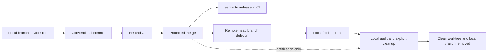

# MartiX Git Research Snapshot

<!-- markdownlint-disable MD013 MD032 MD060 -->

> Research date: 2026-08-14
> Status: evidence snapshot and implementation input; implementation not started
> Brief preserved: [martix-git-research-resources.md](./martix-git-research-resources.md)

## Reading guide

This snapshot uses external primary sources for normative claims: specifications,
official Git documentation, official GitHub documentation/API/CLI manuals, and
the source repositories of the tools being evaluated. Local repository files are
identified separately as implementation evidence. Every external source in the
source map was retrieved on 2026-08-14.

Evidence labels:

- **Requirement**: the cited source uses normative language or defines behavior.
- **Implementation evidence**: the cited source is executable code or a local
  repository artifact that demonstrates behavior, not a general requirement.
- **Recommendation**: proposed MartiX policy based on the cited requirements and
  the repository's package contracts.
- **Inference**: a conclusion drawn by combining sources; it is not itself a
  source requirement.
- **Gap**: a requested source or behavior that could not be verified from the
  available primary page and is recorded rather than guessed.

## Executive synthesis

1. **Conventional Commits is a commit-message specification.** It defines the
   structure and semantics of commit messages, including `feat`, `fix`, optional
   scopes, footers, and breaking-change markers. It does not define branch names,
   pull-request fields, or a release tool. `[CC-1]`
2. **Conventional Branch is a separate specification.** The current site and
   repository publish Conventional Branch 1.1.0, with a `<type>/<description>`
   form, trunk exceptions, a formal grammar, a machine-readable specification,
   and optional AI-agent prefixes. Use it for branch names only; do not describe
   a branch name as a Conventional Commit. `[CB-1] [CB-2]`
3. **SemVer owns version syntax and precedence.** Conventional Commits describes
   a useful correlation to SemVer, but SemVer itself defines the public API
   contract, `MAJOR.MINOR.PATCH`, pre-release ordering, build metadata, and the
   immutability of released versions. `[CC-1] [SV-1]`
4. **semantic-release is policy-driven automation, not the Conventional Commits
   specification.** Its current documentation and source use Angular commit
   conventions by default, map recognized commit impact to releases, load
   configuration from supported files, and run a plugin pipeline. A project that
   wants the Conventional Commits preset must configure the analyzer and notes
   generator accordingly. `[SR-1] [SR-2] [SR-4] [SR-6]`
5. **Pull-request titles and bodies are GitHub fields, not Conventional Commits.**
   GitHub's API and CLI treat `title`, `body`, `head`, and `base` as separate PR
   inputs. GitHub can use a PR title or body when constructing a merge commit, so
   a project may choose to validate PR titles as release-facing commit subjects,
   especially for squash merges. That is a repository policy, not a requirement
   of Conventional Commits 1.0.0. PR bodies should carry context, tests, and issue
   references; only the final commit message needs the release-significant
   Conventional Commit footer. `[CC-1] [GH-3] [GH-4] [GH-5] [Rec-1]`
6. **Cleanup must be split into remote and local lanes.** GitHub Actions can
   observe merged PRs, delete remote head branches, comment, label, or schedule a
   report. A remote runner cannot remove a developer's local worktree directory or
   local branch ref. Local cleanup therefore needs a command, local scheduler, or
   a client-side lifecycle integration. `[GH-8] [GH-9] [GIT-4] [LOCAL-1]`
7. **The initial package should be conservative.** Put reusable Git, GitHub,
   Conventional Commits, Conventional Branch, release, hook, and worktree
   knowledge in a standalone `skills/martix-git` package. Put state-changing
   prompts, installers, native-hook templates, GitHub workflow templates, and
   cleanup orchestration in an optional `plugins/martix-git-automation` bundle.
   Keep cleanup report-only by default and require explicit confirmation for
   mutations. `[Repo-1] [Repo-2] [LOCAL-1] [Rec-2]`

## Normative boundary by artifact

| Artifact | Owning source | What the source requires or defines | MartiX policy recommendation |
| --- | --- | --- | --- |
| Commit message | Conventional Commits 1.0.0 | `<type>[optional scope]: <description>`, optional body and footers; `feat` and `fix` have defined meanings; breaking changes use `!` or `BREAKING CHANGE:`. `[CC-1]` | Validate the final commit message with a native `commit-msg` hook and CI. Keep the type list configurable; do not claim a local type allow-list is part of CC 1.0.0. |
| Branch name | Conventional Branch 1.1.0 plus Git ref rules | Conventional Branch recommends `<type>/<description>` and defines allowed prefixes; Git separately defines whether a ref name is valid. `[CB-1] [GIT-8]` | Validate both layers. Pin the Conventional Branch versioned JSON rather than the moving latest endpoint. |
| Pull-request title | GitHub PR API/CLI | A PR has a title field; GitHub may use it as a merge-commit title depending on repository settings. `[GH-3] [GH-4] [GH-9]` | Make CC-shaped titles an explicit repository policy only when the selected merge method makes the title part of the release commit. Otherwise use a concise change title and keep CC enforcement on commit messages. |
| Pull-request body | GitHub issue-linking and PR API docs | The body can contain issue-closing keywords and arbitrary Markdown context; it is not specified as a commit message. `[GH-1] [GH-3]` | Do not parse the whole body as a Conventional Commit. Require summary, motivation, tests, risk, and issue references through a PR template or prompt. |
| Merge commit | GitHub merge-method settings | Merge, squash, and rebase produce different histories; squash and merge can use PR title/body or commit messages according to settings. `[GH-5] [GH-9]` | Choose and document one merge policy. If squash uses the PR title, validate that title as a release-facing commit subject. |
| Version | SemVer 2.0.0 | `MAJOR.MINOR.PATCH`, precedence, pre-release and build metadata rules, and immutable released contents. `[SV-1]` | Treat version calculation as a release concern, never as a branch-name parser concern. |
| Release | semantic-release | Reads tags and commits, analyzes impact, generates notes, creates tags, publishes, and notifies through configured plugins. `[SR-3] [SR-4] [SR-5]` | Run from protected release branches in CI after all checks pass. Use dry runs for rollout and custom analyzer rules for repository-specific types. |
| Local worktree | Git | Linked worktrees have shared refs and per-worktree state; clean worktrees can be removed, missing metadata can be pruned, and locked worktrees are protected. `[GIT-4]` | Audit first, retain dirty/locked/current/unverifiable worktrees, and never force-remove by default. |
| Server policy | GitHub protections/rulesets | Protected branches can require reviews, checks, signatures, linear history, merge queues, and can block force pushes/deletion; rulesets layer and use the most restrictive applicable rule. `[GH-6] [GH-7]` | Enforce critical policy on GitHub because local hooks can be bypassed or omitted. |

## Findings by topic

### 1. Conventional Commits 1.0.0

#### What is specified

The specification describes itself as a lightweight convention on top of commit
messages. The canonical shape is:

```text
<type>[optional scope]: <description>

[optional body]

[optional footer(s)]
```

The type is required. `feat` is for a new feature and `fix` is for a bug fix. A
scope is optional and is a noun in parentheses. A description follows the colon
and space. A body is optional and starts after one blank line. Footers are
optional, use a token plus a separator and value, and follow trailer-like rules.
`BREAKING CHANGE:` is a special uppercase footer token; `BREAKING-CHANGE` is
synonymous when used as a footer token. `[CC-1]`

The specification allows types other than `feat` and `fix`, and says those extra
types have no implicit SemVer effect unless the commit contains a breaking change.
This is the controlling evidence against treating a repository's preferred list
such as `docs`, `test`, or `chore` as a requirement of the standard. `[CC-1]`

Breaking changes are indicated either by `!` immediately before the colon in the
type/scope prefix or by a `BREAKING CHANGE:` footer. A breaking-change footer can
occur with any commit type. The specification also says implementors must treat
the structural units as case-insensitive except that `BREAKING CHANGE` must be
uppercase. `[CC-1]`

The specification explains that conventional messages can drive changelog
generation, semantic version calculation, communication, and build or publish
processes. These are intended uses, not a requirement that every Conventional
Commit trigger a release. `[CC-1]`

#### What is not specified

- No branch-name grammar is defined. `[CC-1]`
- No pull-request title or description grammar is defined. `[CC-1]`
- No mandatory type list beyond the semantic meanings of `feat` and `fix` is
  defined. `[CC-1]`
- No revert algorithm is defined; the FAQ leaves revert handling to tooling
  authors and gives `revert` as one possible convention. `[CC-1]`
- No hook, CI provider, GitHub setting, or release tool is mandated. `[CC-1]`

**Recommendation:** treat the 1.0.0 specification as the parser contract and
keep prose preferences such as imperative mood, maximum header length, required
scopes, allowed scopes, and type allow-lists in MartiX policy. Label those rules
as policy in the generated skill and configuration.

### 2. Conventional Branch and its relationship to commits

The Conventional Branch site currently presents version 1.1.0. Its purpose is to
give Git branches human- and machine-readable meaning. The main form is
`<type>/<description>`. The site lists purpose prefixes such as `feature/` or
`feat/`, `bugfix/` or `fix/`, `hotfix/`, `release/`, and `chore/`; version 1.1.0
also lists `ai/`, `copilot/`, `cursor/`, `claude/`, and `codex/` prefixes for
agent-origin identification. `main`, `master`, and `develop` are trunk branches
without a prefix. `[CB-1] [CB-2]`

The formal grammar is stricter than a generic Git ref: it defines the supported
prefixes and a lowercase description made from alphanumeric segments, hyphens,
and version dots where permitted. The repository publishes `spec.json`, a JSON
Schema, and conformance fixtures. The versioned endpoint
`https://conventionalbranch.org/v1.1.0/spec.json` should be pinned by a validator;
the unversioned `/spec.json` endpoint tracks the latest version. `[CB-1] [CB-3]`

The Conventional Branch FAQ explicitly distinguishes branch names from commit
messages and says the specifications complement one another. The list of branch
types is intentionally smaller because branches are temporary and mainly express
work purpose. Aligning `feature/*` with `feat:` is therefore a useful convention,
not a cross-specification requirement. `[CB-1]`

The GitHub `awesome-copilot` Conventional Branch skill is useful inspiration for
an agent workflow: gather branch type and description, detect the repository's
trunk, validate the assembled name, create the branch, and confirm the result.
Its mapping between branch prefixes and commit types is explicitly workflow
guidance from that skill, not a new requirement in either specification. The
skill's current documented source uses the older `conventional-branch.github.io`
URL in its description while its content points at the current Conventional
Branch rules; the source repository itself is the authoritative copy of that
skill snapshot. `[CB-4]`

**Recommendation:** generate branch names with Conventional Branch, then run
`git check-ref-format --branch` as the independent Git validity check. Do not
force a `build`, `ci`, `docs`, `style`, `refactor`, or `test` branch prefix merely
because those are common commit types. Offer repository-configured aliases where
the project has a different branching vocabulary.

### 3. Semantic Versioning

SemVer 2.0.0 requires a declared public API and defines normal versions as
non-negative numeric `X.Y.Z` components without leading zeroes. Patch increments
represent backward-compatible bug fixes, minor increments add backward-compatible
public API functionality and include public deprecations, and major increments
represent backward-incompatible public API changes. Minor and patch components are
reset when the major component changes; patch is reset when the minor component
changes. `[SV-1]`

SemVer defines pre-release identifiers after a hyphen and build metadata after a
plus sign. Pre-release versions have lower precedence than their associated normal
version; build metadata does not affect precedence. Released version contents must
not be modified; changes require a new version. `[SV-1]`

The SemVer FAQ distinguishes a version from a tag name: `v1.2.3` is not itself a
SemVer string, although `v1.2.3` is a common Git tag spelling for the SemVer
`1.2.3`. That distinction matters because semantic-release's default tag format
is `v${version}`. `[SV-1] [SR-2]`

**Recommendation:** use SemVer as the release-output contract and keep tag
formatting separate. Never infer a version from a branch prefix alone; release
automation must inspect the release history and public API impact.

### 4. semantic-release behavior and configuration

#### Current source of truth

The old semantic-release GitBook site is marked discontinued. The current official
documentation is on `semantic-release.org`, backed by the
`semantic-release/docs` repository. The old GitBook URLs are retained in the
source map only as a migration note and are not used as current evidence. `[SR-0]`

The current introduction says semantic-release automates version calculation,
release-note generation, and package publishing. It describes CI execution after a
successful build on a release branch and lists release steps from verification and
last-release discovery through commit analysis, notes, tagging, preparation,
publishing, and notification. `[SR-1] [SR-3]`

By default, semantic-release uses Angular Commit Message Conventions. The current
documentation maps `fix` to patch, `feat` to minor, and a `BREAKING CHANGE` footer
to major under the default analyzer. The `@semantic-release/commit-analyzer`
plugin documents the `angular` default preset, supports the
`conventionalcommits` preset, and supports custom `releaseRules`. Unmatched types
such as `docs`, `test`, and `chore` produce no release under the default rules.
`releaseRules` can deliberately assign those types a release impact. `[SR-1]
[SR-6]`

This means **Conventional Commits 1.0.0 and semantic-release defaults are related
but not identical**. A MartiX setup must choose and document one of these paths:

- Angular-compatible defaults, with the project policy aligned to the analyzer.
- The `conventionalcommits` preset, explicitly installed and configured.
- A custom analyzer and release-rule policy, with tests proving the mapping.

#### Configuration model

The current configuration documentation supports `.releaserc` in YAML or JSON
with supported extensions, `release.config.(js|ts|cjs|mjs)`, or a `release` key in
`package.json`. CLI options take precedence over configuration-file options;
plugin options must be in configuration. The documented options include
`branches`, `repositoryUrl`, `tagFormat`, `plugins`, `dryRun`, `ci`, and `debug`.
`branches` accepts strings, globs, or branch objects. `[SR-2]`

The default branch configuration includes `main` and `master`, maintenance-range
patterns, `next`, `next-major`, `beta`, and `alpha` when those branches exist. A
repository with no active release branch fails with `ERELEASEBRANCHES`. The docs
warn that anyone able to push to a configured release branch can publish and
recommend protecting those branches. `[SR-2]`

The documented default `tagFormat` is `v${version}` and the value must contain
the `version` variable exactly once and compile to a valid Git reference. The
default plugin list includes commit analysis, release notes, npm, and GitHub
plugins. Dry-run prints the pending version and notes while skipping mutating
release hooks such as prepare and publish. `[SR-2]`

The source implementation confirms these defaults in `lib/get-config.js`: it loads
the `release` configuration through `cosmiconfig`, merges CLI/API options, loads
shareable configurations, supplies default branches, repository URL, tag format,
and plugins, and translates `ci: false` to `noCi`. `[SR-4]`

The source implementation in `index.js` adds important operational details: a
non-CI run becomes dry-run unless explicitly allowed, pull-request CI runs do not
publish a new version, the configured branch must match the CI branch, commit
analysis determines whether a release exists, the next version is calculated and
tagged, and plugins then publish and notify. `[SR-5]`

#### Supported workflow implications

The current supported-branching documentation favors trunk-based development and
GitHub Flow with short-lived branches. It marks long-lived Git Flow-style
`develop`/`release`/`hotfix` orchestration as unsupported by the semantic-release
project team. The workflow-configuration documentation defines release,
maintenance, and pre-release branch types and explains how branch merges affect
distribution channels and version ranges. `[SR-7] [SR-8]`

The GitHub Actions recipe requires verification to complete before the release job,
uses a full checkout for tag/history analysis, and documents `contents`, `issues`,
and `pull-requests` permissions for the default flow. Its current recommended npm
publishing path uses OIDC trusted publishing with `id-token: write` when available;
an `NPM_TOKEN` is the fallback. Manual or API-triggered releases are described as
exceptional rather than the normal delivery path. `[SR-9]`

**Recommendation:** a MartiX release module should generate a verify-then-release
workflow, protect the release branch, pin the analyzer/preset policy, expose a
dry-run command, and refuse to suggest publishing from a pull-request validation
run. It should not silently add `@semantic-release/git` commits to a protected
branch; that is a separate, higher-risk policy requiring an explicitly authorized
GitHub App or equivalent credential. `[SR-2] [SR-5] [SR-9] [GH-6]`

### 5. Git branching, commits, and workflow practice

`git branch --merged <commit>` lists branch tips reachable from the named commit.
Git documents this as a way to find branches fully contained by `HEAD`, and
`git branch -d` refuses deletion unless the branch is fully merged into its
upstream or `HEAD`. This is graph reachability, not GitHub pull-request state.
Squash and rebase merges can leave the original local branch tip unreachable even
though the pull request was merged, so ancestry-only cleanup has false negatives.
`[GIT-1] [GH-5]`

Git's workflow guidance recommends small logical changes that can stand alone,
pass tests, and be reviewed independently. It recommends a topic branch for each
nontrivial feature or bug fix and warns against habitually merging upstream into
downstream topic branches. These are Git workflow recommendations, not rules of
Conventional Commits. `[GIT-7]`

Git accepts branch names only when they pass its reference checks. The documented
checks reject control characters, spaces, `..`, `~`, `^`, `:`, `?`, `*`, `[`, bad
slash placement, `@{`, a lone `@`, backslashes, and other ambiguous forms. The
`--branch` form applies branch-specific validation. `[GIT-8]`

`git commit` records the current index and message, supports trailers, and can use
a commit template. Its discussion recommends a short title followed by a blank
line and a detailed body. Its `--no-verify` option bypasses `pre-commit` and
`commit-msg`. `[GIT-2]`

**Recommendation:** use Git's native `git switch -c` or `git worktree add` for
state changes, pass arguments without shell interpolation, keep generated commit
messages in a temporary file when they have bodies or footers, and make each
commit reviewable. Use Conventional Commit structure as the message policy layered
on top of these Git mechanics.

### 6. Git hooks and quality gates

Git hooks live under `$GIT_DIR/hooks` by default or under the configured
`core.hooksPath`. Git changes the working directory before invoking a hook and
exports repository environment variables. Hooks can inspect arguments, standard
input, and environment. `[GIT-3]`

The relevant local hooks are:

| Hook | Git behavior | Recommended use |
| --- | --- | --- |
| `commit-msg` | Receives the proposed message file and can edit or reject it; non-zero aborts the commit; `git commit --no-verify` bypasses it. `[GIT-3] [GIT-2]` | Parse Conventional Commits, preserve valid trailers, and report the exact rule that failed. |
| `pre-commit` | Runs before the message is obtained; non-zero aborts the commit; it can be bypassed with `--no-verify`. `[GIT-3] [GIT-2]` | Run staged-file linting, formatting checks, secret checks, or a cheap targeted test. |
| `prepare-commit-msg` | Runs after Git prepares the default message and can edit the file; Git says it should not replace `pre-commit`. `[GIT-3]` | Add a template or generated context, not the authoritative validator. |
| `pre-push` | Receives the destination and proposed ref updates on standard input and can prevent a push. `[GIT-3]` | Run a bounded test suite or verify branch/release policy before publishing. |
| `post-checkout` | Runs after checkout, switch, clone, and normal worktree creation unless checkout is suppressed. `[GIT-3]` | Optional environment setup or a cheap validity check; never remove a worktree here. |
| `post-commit` | Runs after the commit and cannot affect its outcome. `[GIT-3]` | Notification or telemetry only. |

Local hooks are not sufficient as the only enforcement boundary because they can
be absent, changed locally, or bypassed. Repeat commit-policy checks in CI and use
GitHub rulesets or protected branches for the server-side conditions that must not
be bypassed. `[GIT-2] [GH-6] [GH-7]`

The repository's existing hook example is a plugin-scoped `postToolUse` command
that runs `markdown-check.ps1`. It is useful evidence for the repository's hook
wrapper style, but it is an AI-tool lifecycle hook, not a native Git hook and does
not cover commits made by a terminal, GUI, CI runner, or another client. `[LOCAL-2]`

**Recommendation:** provide an opt-in native hook installer and checked-in hook
templates, but keep the hook bodies thin and call deterministic scripts. Offer a
`commit-msg` validator and staged-file `pre-commit` checks first. Leave full tests,
network operations, release publishing, and worktree deletion to CI or explicit
commands.

### 7. Worktrees, pruning, and local cleanup

Git worktrees allow multiple working trees attached to one repository. Git
distinguishes the main worktree from linked worktrees, shares normal refs, and
keeps per-worktree state such as `HEAD` and the index separate. A linked worktree
should normally be removed with `git worktree remove`. `[GIT-4]`

For automation, `git worktree list --porcelain -z` is the appropriate inventory
interface. Git documents the format as stable and recommends `--porcelain` with
`-z`; records begin with `worktree`, include `HEAD`, `branch` or `detached`, and
may include `locked` or `prunable`. NUL termination prevents a newline in a path
or reason from corrupting a parser. `[GIT-4]`

`git worktree remove` removes only clean worktrees by default. Unclean worktrees
require `--force`, locked worktrees require `--force` twice, and the main worktree
cannot be removed. `git worktree lock` protects a worktree from pruning, moving,
and deletion. `git worktree prune` removes administrative records for missing
worktree paths; `gc.worktreePruneExpire` controls automatic pruning of stale
records. `[GIT-4]`

Remote-tracking cleanup is a different operation. Git retains local references to
remote branches by default; `git fetch --prune <remote>` or `git remote prune
<remote>` removes remote-tracking references that no longer exist on the remote.
Pruning tags is more dangerous because it can remove local tags, so it should not
be implied by a general branch cleanup command. `[GIT-5] [GIT-6]`

Object cleanup is also separate. Git says users normally should run `git gc`, not
`git prune` directly. `git gc` performs housekeeping, including stale worktree
metadata and unreachable-object handling, with grace periods such as
`gc.pruneExpire` and `gc.worktreePruneExpire`; immediate pruning increases
concurrency risk. `[GIT-6]`

#### Local script evidence

The repository's [git-cleanup.ps1](../../../scripts/git-cleanup.ps1) already
implements most of the desired safety posture:

- It is audit-only by default and requires `-Apply` for worktree or branch
  removal. `SupportsShouldProcess` provides `-WhatIf` and confirmation behavior.
- It resolves a base branch conservatively, protects the current branch, local
  `main`, and the selected base, and never removes remote refs, remote branches,
  or unreachable objects.
- It parses `git worktree list --porcelain -z`, retains locked and missing paths
  by default, and makes `-PruneWorktreeMetadata` an explicit opt-in.
- It refuses dirty, locked, missing, detached/unverifiable, or changed-after-check
  worktrees. It invokes `git worktree remove` without force.
- It verifies the branch tip, rechecks worktree path, lock, `HEAD`, and status before
  removal, and deletes the local branch with `git update-ref -d` guarded by the
  expected object ID. This is an implementation-level compare-and-delete guard,
  not a GitHub policy.
- Its default evidence is ancestry. `-GitHubMerged` adds a GitHub CLI query for
  merged pull requests and accepts a local branch only when the returned PR
  `headRefOid` exactly matches the current local tip. This covers merge methods
  whose original tip is not reachable from the base, but it still requires an
  authenticated `gh`, a resolvable repository, and a local branch tip that has not
  changed.
- It returns a structured result containing candidates, retained branches,
  removals, failures, and a success flag, which is suitable for a report-first
  plugin command.

The companion [git-cleanup.sh](../../../scripts/git-cleanup.sh) is a compatibility
launcher for PowerShell 7. It keeps audit as the default and makes unattended
mutation explicit with `--apply` and `--no-confirm`. `[LOCAL-1]`

**Recommendation:** retain this script as the deterministic cleanup engine, add
tests around its fixtures and edge cases, and build only a thin prompt or plugin
wrapper around it. Do not attach destructive cleanup to a generic AI stop event
until the hook runtime, ownership, and user-confirmation behavior are tested.

### 8. GitHub pull requests, issue links, and references

GitHub's pull-request REST API models PR title, body, head branch, and base branch
as separate fields. It supports creating, viewing, editing, listing, merging, and
checking whether a PR was merged. The list endpoint can filter by `state`, `head`,
and `base`; the PR object exposes `head.ref`, `head.sha`, `merged`, `merged_at`,
and `merge_commit_sha`. The merged-check endpoint returns HTTP 204 when the PR is
merged and 404 otherwise. `[GH-3]`

The GitHub CLI mirrors this separation. `gh pr create` supports explicit
`--title`, `--body` or `--body-file`, `--head`, `--base`, `--draft`, and `--fill`.
Its manual says `--fill` uses commit information, but explicit title/body values
take precedence. It also documents that `Fixes #123` or `Closes #123` in the body
links and closes the referenced issue when the PR merges. `[GH-4]`

`gh pr list` supports `--state merged`, `--head`, `--base`, JSON output, and fields
including `headRefOid`, `headRefName`, `mergedAt`, and `mergeCommit`. `gh pr view`
exposes the same structured fields. `gh pr merge` supports merge, squash, and
rebase methods plus `--delete-branch`; `gh pr close --delete-branch` can delete a
branch even when a PR is closed without merging, so that option must not be used
as a generic merged-only cleanup substitute. `[GH-4]`

GitHub's issue-linking documentation defines the supported closing keywords:
`close`, `closes`, `closed`, `fix`, `fixes`, `fixed`, `resolve`, `resolves`, and
`resolved`. The keyword may be in a PR description or commit message and must
target the repository's default branch for automatic issue closure. Keywords used
against another target branch are ignored for that automatic behavior. Use full
`OWNER/REPOSITORY#NUMBER` syntax for a cross-repository issue. `[GH-1]`

GitHub automatically autolinks `#26`, `GH-26`, full issue/PR URLs, and qualified
`OWNER/REPOSITORY#26` references in conversations. The autolink behavior does not
apply to repository wikis or files, so a Markdown file containing `#26` should not
be treated as equivalent to a PR conversation. `[GH-2]`

#### PR title and body policy

There is no Conventional Commits requirement for PR titles or bodies in the
Conventional Commits 1.0.0 specification. GitHub's API/CLI define them as PR
fields, and the issue-linking docs define special body/commit keywords. Therefore:

- **Requirement:** the final release-significant commit must obey the selected
  commit-message policy. `[CC-1]`
- **Requirement:** issue-closing keywords must be used deliberately and only when
  the target/default-branch behavior is understood. `[GH-1]`
- **Recommendation:** validate a PR title as `type(scope): description` only when
  the merge policy makes that title the resulting commit title, or when the team
  wants title consistency as a separate policy. `[GH-3] [GH-5] [GH-9]`
- **Recommendation:** keep PR body validation focused on required sections,
  Markdown links, issue references, test evidence, risk, and breaking-change
  explanation. Do not require the body to be a single Conventional Commit.
- **Inference:** if a project uses squash merge with `PR_TITLE` as the squash
  title and uses commit history for release automation, title validation provides
  an early guard. It still does not prove that the final body/footer contains a
  correctly formatted `BREAKING CHANGE:` note.

### 9. Merge methods, protections, and rulesets

GitHub's documented merge methods have materially different history effects:

- A normal merge adds the topic commits and a merge commit.
- Squash and merge combines the topic commits into one commit and loses the
  original individual commit SHAs from the base history.
- Rebase and merge adds commits individually but creates new commit SHAs and
  rewrites committer information.

These differences explain why ancestry-only branch cleanup cannot infer every
merged PR and why a release policy must decide whether it reads individual commit
messages, a squash title/body, or both. `[GH-5] [GIT-1]`

The repository REST API exposes `delete_branch_on_merge`, merge-method enablement,
and the source of default merge commit titles and bodies. Squash titles can default
to the PR title or a commit/PR title choice; squash bodies can come from the PR
body, commit messages, or be blank. Merge commit titles and bodies have analogous
settings. The API documents this as repository configuration, not as a Conventional
Commits rule. `[GH-9]`

Protected branch rules default to blocking force pushes and deletion. They can
require pull-request reviews, status checks, conversation resolution, signed
commits, linear history, a merge queue, deployment success, restricted pushers,
and no administrator bypass. Required checks should have unique job names to avoid
ambiguous status results. `[GH-6]`

Rulesets can target branches or tags with `fnmatch` patterns, can coexist with
branch-protection rules, and apply the most restrictive applicable version when
rules overlap. GitHub's ruleset documentation also describes rules that can control
commit metadata, including commit messages, but the exact availability depends on
the GitHub product and the applicable ruleset documentation. `[GH-7]`

**Recommendation:** protect `main` and every semantic-release release branch;
require the verification checks that feed release; select one merge method; enable
automatic remote head-branch deletion only after confirming the team understands
that it does not delete local branches or worktrees; and use rulesets for
server-enforced branch and metadata policy.

### 10. GitHub Actions and lifecycle triggers

The `pull_request` event supports a `closed` activity type. GitHub's Actions
documentation gives the required merged filter:

```yaml
on:
  pull_request:
    types: [closed]

jobs:
  after-merge:
    if: github.event.pull_request.merged == true
```

A closed PR is not necessarily merged. The event documentation also says that the
payload is empty for merged pull requests and fork pull requests in relevant
cases, that `GITHUB_REF` differs between closed-without-merge and merged runs, and
that `pull_request` tests the merge ref by default. Use the PR API or the available
event fields deliberately when the workflow needs exact head identity. `[GH-8]`

`pull_request_target` runs in the base repository's default-branch context and is
appropriate for controlled label/comment actions that must work for forks, but
GitHub warns against checking out or executing untrusted PR code under that event.
Use least-privilege permissions and do not combine a privileged event with an
untrusted checkout. `[GH-8]`

The `delete` event runs on the default branch when a ref is deleted, and the
workflow file must exist on that default branch. The `schedule` event also runs
from the default branch, uses POSIX cron, can be delayed or dropped under load,
and public-repository scheduled workflows are disabled after 60 days without
activity. `merge_group` is a separate event needed when required checks must run
for a merge queue. `[GH-8]`

**Inference:** a remote cleanup workflow can safely do the following after a
merged PR: record the merge method and head identity, verify the base branch,
delete or confirm deletion of the remote head branch, post a cleanup instruction,
and emit a machine-readable report. It cannot safely remove a local worktree or
local branch because those objects exist on a developer's filesystem. `[GH-8]
[GH-9] [GIT-4] [LOCAL-1]`

### 11. Inspiration and non-normative implementation options

The GitHub `awesome-copilot` Conventional Commit skill is a concise workflow for
reviewing status/diff, staging changes, generating an XML-shaped message, and
running `git commit`. Its examples and validation point to the Conventional
Commits specification. It is useful as an interaction pattern, but its documented
automatic commit step is a product-specific behavior and should not be copied as
an unconditional mutation in a general MartiX workflow. `[CC-2]`

The GitHub `awesome-copilot` Conventional Branch skill gathers intent, detects a
base branch, validates a name, creates a branch, and confirms it. Its relationship
table is a helpful UX pattern for aligning branch and commit vocabulary, but its
workflow and preferred aliases remain skill guidance. `[CB-4]`

`commitlint` is a first-party project in the Conventional Changelog organization.
Its official documentation describes local and CI setup, configurable rules, and
the conventional commit parser shape. It is a credible implementation option for
`commit-msg` and CI validation, but it is not the owner of the Conventional
Commits specification. `[OPT-1]`

`commit-check-action` is a third-party GitHub Action maintained by the
`commit-check` project. Its README documents validation for commit messages,
branches, and optional PR titles, including the rationale that PR-title checking
is useful with squash merge. It should be treated as an optional enforcement
provider, not as an official GitHub or Conventional Commits standard. `[OPT-2]`

The two Marketplace links in the original brief are also third-party options:

- **Git Automatic Semantic Versioning** is the `bitshifted/git-auto-semver` action.
  Its Marketplace page says it parses Conventional Commits, calculates a version
  from tags, and is not certified by GitHub. `[OPT-3]`
- **Semver Conventional Commits** is the `ietf-tools/semver-action` action. Its
  Marketplace page documents configurable commit-prefix lists, tag selection, and
  version outputs, and also says it is not certified by GitHub. `[OPT-4]`

These actions can be compared in implementation work, but semantic-release is the
better primary release reference for the requested release workflow because it
owns the documented plugin pipeline, branch/channel model, tag behavior, and
verify-then-publish lifecycle. `[SR-1] [SR-2] [SR-3]`

## Decision matrix for the requested workflow

| Question | Source-backed answer | Proposed MartiX behavior |
| --- | --- | --- |
| Should Conventional Commits apply to commit messages? | Yes. This is its defined scope. `[CC-1]` | Always validate the final commit message when the policy is enabled. |
| Should Conventional Commits apply to branch names? | No. Conventional Branch owns that separate naming problem. `[CC-1] [CB-1]` | Use Conventional Branch plus Git ref validation. |
| Should every PR title be a Conventional Commit? | No source requirement. The title is a GitHub PR field. `[CC-1] [GH-3]` | Make it opt-in or require it only when it becomes the merge commit title. |
| Should a PR body be parsed as a commit message? | No. The body carries context and issue-linking keywords. `[GH-1] [GH-3]` | Validate sections and links; keep commit syntax in the final commit. |
| How should issue references work? | Use autolink references for navigation and closing keywords deliberately for lifecycle closure. `[GH-1] [GH-2]` | Offer `Refs #N` for a non-closing link and `Fixes #N`/`Closes #N` only when closure is intended. |
| How should breaking changes reach release automation? | Put `!` in the commit prefix or `BREAKING CHANGE:` in the final commit footer. `[CC-1] [SR-1]` | Require an explicit breaking-change explanation in the PR body and verify the final commit representation. |
| How should semantic-release be configured? | It is configurable and Angular-based by default; branches, plugins, analyzer preset, tag format, and release rules matter. `[SR-1] [SR-2] [SR-6]` | Generate explicit config and a release matrix; never assume CC 1.0.0 mapping is active without configuration. |
| How should merged branches be cleaned? | Remote branch deletion and local worktree/branch cleanup are different operations. `[GH-8] [GH-9] [GIT-4]` | Remote notification/action plus local audit/apply command. |
| Which hook should enforce commit syntax? | `commit-msg` receives the message file and can reject it. `[GIT-3]` | Use `commit-msg`; repeat in CI because local hooks are bypassable. |
| Should cleanup be automatic after an AI session stops? | No stable source contract was verified for ownership or end-of-session cleanup. | Start with report-only local commands and explicit confirmation; do not infer ownership from a stop event. |

## Proposed package architecture

### Selected boundary

#### Standalone skill: `skills/martix-git`

Own reusable domain knowledge that is useful without a plugin:

```text
skills/martix-git/
├── plugin.json
├── metadata.json
├── README.md
├── SKILL.md
├── AGENTS.md
├── LICENSE.txt
├── rules/
│   ├── conventional-commits.md
│   ├── conventional-branches.md
│   ├── pull-requests-and-issues.md
│   ├── semantic-versioning-and-release.md
│   ├── git-workflows-and-hooks.md
│   └── worktree-lifecycle.md
├── references/
│   ├── source-map.md
│   ├── semantic-release-config.md
│   └── github-event-matrix.md
├── templates/
│   ├── commit-message.md
│   ├── pull-request-body.md
│   └── release-policy.md
├── assets/
│   ├── taxonomy.json
│   └── section-order.json
└── evals/
    └── evals.json
```

The skill should route to the smallest rule file, explain the distinction
between requirements and project policy, and return safe commands without
silently executing destructive operations. It should include pinned source URLs,
not copied third-party skill text. `[Repo-1] [Repo-2] [Rec-2]`

#### Optional plugin: `plugins/martix-git-automation`

Own assets that require packaging, lifecycle events, or one-step workflow setup:

```text
plugins/martix-git-automation/
├── plugin.json
├── README.md
├── hooks.json
├── agents/
├── instructions/
├── prompts/
├── hooks/
│   ├── README.md
│   ├── install-native-git-hooks.ps1
│   ├── inspect-worktrees.ps1
│   └── session-stop-report.ps1
├── workflows/
│   ├── commit-policy.yml
│   ├── pull-request-policy.yml
│   ├── verify-and-release.yml
│   └── merged-pr-notification.yml
└── templates/
    ├── commitlint.config.mjs
    ├── pull-request-template.md
    └── release.config.cjs
```

The plugin may call Git, `gh`, and the existing cleanup script, but it must not
reimplement Git's ref, worktree, merge, or hook semantics. It should own prompts
for `/branch`, `/commit`, `/pr`, `/setup-git-policy`, and `/audit-worktrees`, plus
thin adapters around deterministic scripts. A plugin hook is not a substitute for
a native Git hook or GitHub branch protection. `[Repo-1] [LOCAL-1] [LOCAL-2]`

#### Smaller alternative

If the first release needs a narrower scope, the standalone package can initially
be `skills/martix-conventional-commit`, with the plugin owning Git/GitHub workflow
orchestration. That follows the existing local plan, but it leaves reusable
branch, PR, release, and worktree knowledge split across plugin assets. The
broader `martix-git` skill is the preferred long-term boundary because the brief
requests one coherent Git lifecycle and the repository prefers reusable domain
knowledge in standalone skills. `[Repo-1] [Repo-3] [Rec-2]`

### Ownership rules

| Concern | Owner |
| --- | --- |
| Commit/branch/PR/release/worktree guidance | Standalone skill |
| User-invoked branch/commit/PR workflows | Plugin prompts |
| Native hook installation and deterministic checks | Plugin scripts/templates, installed into the target repository only with consent |
| CI policy and semantic-release example | Plugin workflow templates, customized by the target repository |
| Local worktree audit and cleanup engine | Existing `scripts/git-cleanup.ps1`, wrapped but not duplicated |
| Remote PR state and issue links | GitHub API/CLI or Actions |
| Server-side enforcement | GitHub protected branches/rulesets |
| Project-specific type/scope/version policy | Target repository configuration |

## Automation lifecycle

### Phase A: repository setup

1. Detect the default/trunk branch from repository evidence.
2. Choose and record a Conventional Branch version and frozen `spec.json`.
3. Choose the commit convention: CC 1.0.0 parser, accepted types, scopes,
   header length, subject style, and breaking-change policy.
4. Choose merge method and whether PR titles become merge commit titles.
5. Generate optional native hooks and CI policy. Keep all generated checks
   deterministic and explain how to remove them.
6. Configure protected branches/rulesets before enabling release publishing.

### Phase B: branch and worktree creation

1. Gather work intent and optional issue number.
2. Generate a Conventional Branch name and validate it with the pinned branch
   spec and `git check-ref-format --branch`.
3. Use `git switch -c` for a normal branch or `git worktree add -b` for an
   isolated worktree. Do not create a branch with the name of a trunk branch.
4. Record the worktree path only as a reconciliation hint; Git's worktree list is
   the source of truth.

### Phase C: local change and commit

1. Inspect `git status` and the staged diff.
2. Suggest a Conventional Commit message from the actual staged changes.
3. Ask for confirmation before invoking `git commit`; write body/footer content
   through a temporary message file.
4. Let `commit-msg` validate syntax and `pre-commit` run cheap staged checks.
5. Repeat the policy in CI because local hooks can be bypassed.

### Phase D: pull request

1. Draft a title according to the selected title policy. Default to a concise
   human-readable title; use CC shape only when required by the merge/release
   contract.
2. Build the body from summary, motivation, implementation, tests, risk,
   migration/breaking-change notes, and issue references.
3. Use `Refs #N` for a non-closing link. Use `Fixes #N` or `Closes #N` only when
   the issue should close after merge to the default branch.
4. Create a draft PR with `gh pr create --body-file` after human review. Use
   `--fill` only as a starting point because commit text may not be a good PR
   explanation.
5. Run PR checks on `opened`, `synchronize`, `reopened`, and `edited` when title
   validation is enabled. Add `merge_group` when required checks participate in a
   merge queue.

### Phase E: merge and release

1. Require the configured review, check, signing, linear-history, deployment, or
   merge-queue rules.
2. Merge using the repository's selected method. Record the method, final merge
   SHA, head SHA, and resulting commit message for cleanup/release diagnostics.
3. Trigger semantic-release only from configured release branches after all tests
   pass. Do not publish from a PR validation run.
4. Let semantic-release analyze commits since the last tag, calculate the next
   SemVer, generate notes, create the configured tag, publish, and notify.
5. Verify the release job has only the permissions and credential mechanism it
   needs; prefer OIDC/trusted publishing where the target registry supports it.

### Phase F: remote cleanup and notification

1. On `pull_request` `closed`, continue only when `merged == true`.
2. Verify the base branch and retain the PR's head identity for local
   reconciliation.
3. Rely on GitHub's `delete_branch_on_merge` or an explicit `gh pr merge
   --delete-branch` policy for the remote head branch. Do not use
   `gh pr close --delete-branch` in a merged-only workflow.
4. Post a concise comment, label, or workflow summary instructing the developer
   to run local cleanup. Use least-privilege permissions.
5. Optionally run a remote scheduled report for stale PRs or branch references;
   document that it cannot touch local worktrees.

### Phase G: local reconciliation and cleanup

1. Run `git fetch --prune` only when the user wants remote-tracking refs refreshed.
   Do not imply tag pruning.
2. Run the existing cleanup script in audit mode.
3. Resolve or explicitly retain dirty, locked, missing, current, protected, and
   unverifiable worktrees.
4. For an approved candidate, run `-Apply` with confirmation or an explicit
   `-Confirm:$false` in a controlled automation context. Use `-WhatIf` first in
   scheduled jobs.
5. Use `-PruneWorktreeMetadata` only when the user accepts Git's configured expiry
   policy for missing worktrees.
6. Re-run the audit and report idempotent results. Never force-remove a dirty or
   locked worktree as an unattended default.

### Local versus remote lifecycle



The dashed relationship is intentional: a GitHub event can tell a local user
that cleanup is available, but it does not grant the remote runner access to the
local filesystem. `[GH-8] [GIT-4] [LOCAL-1]`

## Hook recommendations

### Minimum viable enforcement

1. **Native `commit-msg` hook**: parse the proposed message file against the
   selected Conventional Commits policy; allow valid extra footers and report
   breaking-change errors precisely.
2. **Native `pre-commit` hook**: run staged-file linting and formatting checks;
   avoid full builds, release commands, and network calls by default.
3. **CI commit-policy job**: inspect every commit in the PR or the effective merge
   commit, and validate the branch name and optional PR title according to project
   policy.
4. **GitHub ruleset/protection**: require the CI job and the other checks that must
   not be bypassed.
5. **Optional `pre-push` hook**: run a bounded test or package validation where
   local feedback is valuable; CI remains authoritative.

### Hook installation design

- Prefer a versioned installer that configures `core.hooksPath` or writes a
  repository-local hook directory after explicit approval.
- Keep hook wrappers portable across Windows PowerShell and POSIX shells, or
  provide separate thin launchers that call one deterministic implementation.
- Make every hook opt-in, fast, non-interactive, and documented with exit codes.
- Provide a bypass procedure for emergencies and require CI to catch bypassed
  checks.
- Do not install an AI stop hook that deletes files. A stop hook may emit an audit
  report after runtime support and ownership are verified.
- Do not treat the existing `postToolUse` Markdown hook as a substitute for Git
  hooks; it validates a tool event, not Git's commit lifecycle. `[GIT-3]
  [LOCAL-2]`

## Validation and evaluation ideas

### Deterministic tests

| Area | Fixtures/assertions |
| --- | --- |
| Conventional Commits | Valid `feat`, `fix(scope)`, extra types, body, multiple footers, `!`, `BREAKING CHANGE`, `BREAKING-CHANGE`, invalid prefix, missing description, malformed footer, and case handling. |
| Conventional Branch | Frozen v1.1.0 valid/invalid fixtures, trunk names, aliases, AI prefixes, dots in release versions, spaces, underscores, consecutive separators, and unknown prefixes. |
| Git ref safety | `git check-ref-format --branch` agrees with the branch validator; unusual but valid Git names are passed as argument values, never interpolated into a shell command. |
| PR policy | Closing versus non-closing issue references, cross-repository references, title policy enabled/disabled, edited title events, draft PRs, fork PRs, and merge-queue events. |
| Release mapping | `fix` -> patch, `feat` -> minor, breaking -> major, unmatched types -> no release under defaults, custom release rules, tag format, existing tags, maintenance ranges, pre-releases, and version conflicts. |
| Hooks | Hook receives the correct message file, rejects invalid syntax, preserves valid trailers, handles `--no-verify` as a CI-detectable bypass, and does not run expensive commands on an unchanged path. |
| Worktrees | Clean, dirty, untracked, locked, missing/prunable, detached, main/current, branch checked out elsewhere, newline/unicode paths, submodules, and stale metadata. |
| Cleanup mutation | Audit has no mutations; `-WhatIf` has no mutations; `-Apply` removes only clean/unlocked eligible worktrees; branch tip changes abort deletion; repeated runs are idempotent. |
| Merge evidence | True merge ancestry, squash merge with original head OID, rebase merge with original head OID, closed-but-not-merged PR, deleted remote branch, missing `gh`, API failure, and more than the query limit. |
| Permissions | Release workflow fails safely with missing credentials; tokens are scoped; no untrusted fork code executes in a privileged event. |

### Skill routing/evals

- Positive activation: "write a Conventional Commit from this staged diff",
  "name a branch for issue 123", "draft a PR and link the issue", "configure
  semantic-release for Conventional Commits", "audit stale worktrees", and
  "set up commit hooks".
- Negative activation: generic Git merge questions, unrelated version parsing,
  application-specific release logic, and requests to delete arbitrary folders
  without Git/worktree context.
- Expected-output assertions: cite the owning specification, distinguish
  recommendation from requirement, identify PR title/body scope correctly, use
  audit-before-apply language, and state when a remote workflow cannot touch local
  state.
- Safety assertions: never force-remove dirty/locked worktrees by default, never
  close issues unintentionally through a generated `Fixes` keyword, never publish
  from a PR validation run, and never claim that a local hook is authoritative.
- Quality measurement: score source ownership, command correctness, policy
  labeling, lifecycle completeness, and destructive-action confirmation
  separately. Run the same fixtures repeatedly to detect model variance.

## Risks and open questions

1. **Version drift:** Conventional Branch's unversioned endpoint changes. Pin
   v1.1.0 or deliberately version-upgrade with conformance tests. `[CB-1]`
2. **Analyzer mismatch:** semantic-release defaults to Angular, while the user
   asked for Conventional Commits. The package must not present one as the other
   without explicit configuration. `[SR-1] [SR-2]`
3. **Merge representation:** the release-significant message may come from an
   individual commit, a squash PR title, a PR body, or a generated merge message.
   The repository must choose a merge method and configure title/body sources.
   `[GH-5] [GH-9]`
4. **Squash/rebase cleanup evidence:** Git ancestry alone is incomplete. The
   cleanup script's exact `headRefOid` check is useful but depends on an
   authenticated GitHub query, branch identity, retention of the local tip, and
   the query limit. `[GIT-1] [GH-3] [LOCAL-1]`
5. **Local/remote ownership:** GitHub Actions, GitHub API calls, and remote
   schedules cannot remove local worktrees. A local scheduler or explicit user
   invocation must own local deletion. `[GH-8] [GIT-4]`
6. **Hook coverage:** native hooks are local and bypassable. CI and server rules
   must repeat critical checks. `[GIT-2] [GH-6]`
7. **Runtime hook contract:** no primary source was verified for a stable AI-agent
   session-end ownership API that would make automatic cleanup safe. Treat any
   client-specific stop hook as experimental until its documented contract and
   concurrency behavior are verified.
8. **Credential risk:** semantic-release and GitHub automation need push or API
   permissions. Prefer short-lived GitHub App or OIDC credentials and keep release
   and cleanup permissions separate. `[SR-9] [GH-8]`
9. **Scheduled workflow reliability:** GitHub scheduled runs execute on the
   default branch and can be delayed, dropped under load, or disabled after long
   inactivity. A local Windows Task Scheduler job is a better owner for local
   cleanup. `[GH-8]`
10. **Product scope:** the repository is a skills marketplace, not necessarily an
    npm package. semantic-release should be an optional template and documented
    integration, not a mandatory dependency of the Git skill.

## Implementation backlog

### P0: policy decisions

- Decide whether the first package is the broad `martix-git` skill or the narrower
  `martix-conventional-commit` skill plus a Git workflow plugin.
- Pin Conventional Commits 1.0.0 and Conventional Branch 1.1.0 in a source map.
- Decide accepted types, scope rules, subject style, footers, and whether PR titles
  must be CC-shaped.
- Select the repository merge method and configure where merge commit titles and
  bodies come from.
- Decide whether semantic-release is a supported integration profile and which
  analyzer preset/rules apply.

### P1: reusable skill

- Create the standalone package structure and compact routing `SKILL.md`.
- Add source-backed rules for commits, branches, PRs/issues, SemVer/release,
  hooks, and worktrees.
- Add templates for commit messages, PR bodies, release policy, and source maps.
- Add canonical repository evals with positive and negative activation cases.
- Add a fixture-driven parser/validator decision record without copying upstream
  skill text.

### P1: deterministic enforcement

- Build the native `commit-msg` validator and CI equivalent.
- Add branch validation using pinned Conventional Branch fixtures plus
  `git check-ref-format --branch`.
- Add staged-file `pre-commit` and optional bounded `pre-push` templates.
- Define hook installation and uninstall behavior for Windows and POSIX.
- Add GitHub ruleset/protection guidance and a minimal policy workflow.

### P2: PR and release workflow

- Add `/branch`, `/commit`, `/pr`, and `/setup-git-policy` prompts.
- Use `gh pr create --body-file` and structured JSON reads for PR state.
- Add PR title validation only behind the selected merge-policy setting.
- Add issue-linking guidance that distinguishes `Refs` from `Fixes`/`Closes`.
- Add a verify-then-release semantic-release template with dry-run instructions,
  protected branches, full history checkout, and least-privilege permissions.

### P2: cleanup reconciliation

- Add tests around the existing `git-cleanup.ps1`; do not duplicate its engine.
- Add `/audit-worktrees` and a structured report renderer.
- Add a merged-PR notification workflow that records head identity and explains
  the local cleanup command.
- Add a Windows Task Scheduler example for local audit-only runs.
- Keep `-Apply`, branch deletion, and metadata pruning explicit and confirmed.

### P3: hardening and measurement

- Add fixtures for squash/rebase merges, dirty/locked/missing worktrees, path
  edge cases, TOCTOU changes, and API failures.
- Test idempotence and concurrent invocation behavior.
- Measure hook latency, CI false positives, title/body policy adoption, and
  cleanup candidates retained for safety.
- Review source-map links and version pins on a scheduled documentation update.
- Only add plugin lifecycle hooks after their target runtime contract is verified.

## Primary-source gaps and retrieval notes

- The legacy semantic-release GitBook pages are explicitly discontinued. Current
  evidence was taken from `semantic-release.org` and the live
  `semantic-release/semantic-release` source. `[SR-0]`
- The GitHub Docs URLs named in the brief for PR creation, PR best practices, and
  automatic head-branch deletion returned HTTP 404 during retrieval on
  2026-08-14. The live GitHub REST API, CLI manuals, issue-linking page, merge
  method page, protected-branch/ruleset pages, and Actions event page were
  verified instead. The requested best-practices page was not replaced with an
  unverified URL. `[GH-GAP-1]`
- The GitHub Docs source repository currently exposes the merge-method Markdown
  source, but the corresponding older automatic-deletion source path also
  returned 404. The repository API's `delete_branch_on_merge` field is the
  verified primary evidence for that setting. `[GH-9] [GH-GAP-1]`
- Marketplace action pages describe third-party implementations and explicitly say
  they are not GitHub-certified. They are implementation options, not standards.
  `[OPT-3] [OPT-4]`
- No stable primary source was verified for an AI-agent session-end event that
  owns a local worktree. The proposal therefore uses explicit local invocation or
  a local scheduler for local deletion and treats agent stop hooks as report-only
  until proven otherwise.
- The current terminal environment did not expose `git` on `PATH` during research,
  so no live repository graph or worktree inventory was used as evidence. The
  research conclusions rely on the documented Git behavior and the checked-in
  cleanup implementation.

## Evidence table and source map

### Standards and owning specifications

| ID | Source and exact URL | Relevant section/anchor | Retrieved |
| --- | --- | --- | --- |
| CC-1 | [Conventional Commits 1.0.0](https://www.conventionalcommits.org/en/v1.0.0/) | `#summary`, `#specification`, `#why-use-conventional-commits`, `#faq` | 2026-08-14 |
| CB-1 | [Conventional Branch site](https://conventionalbranch.org/) | Specification: Branch Naming Prefixes, Basic Rules, Formal Grammar, FAQ | 2026-08-14 |
| CB-2 | [Conventional Branch repository](https://github.com/conventional-branch/conventional-branch) | Quick Start, Machine-Readable Spec, Enforcing It; current 1.1.0 site content | 2026-08-14 |
| CB-3 | [Frozen Conventional Branch 1.1.0 spec.json](https://conventionalbranch.org/v1.1.0/spec.json) | Complete machine-readable specification endpoint | 2026-08-14 |
| SV-1 | [Semantic Versioning 2.0.0](https://semver.org/) | `#semantic-versioning-specification-semver`, `#backusnaur-form-grammar-for-valid-semver-versions`, `#faq` | 2026-08-14 |
| SV-2 | [SemVer source repository](https://github.com/semver/semver/blob/master/semver.md) | Specification source and version history | 2026-08-14 |

### semantic-release documentation, source, and plugins

| ID | Source and exact URL | Relevant section/anchor | Retrieved |
| --- | --- | --- | --- |
| SR-0 | [Discontinued semantic-release GitBook README](https://semantic-release.gitbook.io/semantic-release/) | Discontinuation Notice | 2026-08-14 |
| SR-1 | [semantic-release Introduction](https://semantic-release.org/intro/) | `#commit-message-format`, `#automation-with-ci`, `#triggering-a-release`, `#release-steps` | 2026-08-14 |
| SR-2 | [semantic-release Configuration](https://semantic-release.org/usage/configuration/) | `#configuration-file`, `#cli-arguments`, `#branches`, `#tagformat`, `#plugins`, `#dryrun`, `#existing-version-tags` | 2026-08-14 |
| SR-3 | [semantic-release Release Steps](https://semantic-release.org/foundation/release-steps/) | `#step-sequence`, `#release-decision-logic`, `#operational-expectations` | 2026-08-14 |
| SR-4 | [semantic-release `lib/get-config.js`](https://raw.githubusercontent.com/semantic-release/semantic-release/master/lib/get-config.js) | Configuration loader and default options object | 2026-08-14 |
| SR-5 | [semantic-release `index.js`](https://raw.githubusercontent.com/semantic-release/semantic-release/master/index.js) | `run()` and exported release execution flow | 2026-08-14 |
| SR-6 | [semantic-release commit-analyzer](https://github.com/semantic-release/commit-analyzer) | Configuration, release rules, default rules, and options | 2026-08-14 |
| SR-7 | [semantic-release Supported Branching Models](https://semantic-release.org/foundation/supported-branching/) | Supported and officially unsupported branching models | 2026-08-14 |
| SR-8 | [semantic-release Workflow Configuration](https://semantic-release.org/foundation/workflow-configuration/) | Branch properties and release/maintenance/pre-release branch types | 2026-08-14 |
| SR-9 | [semantic-release GitHub Actions recipe](https://semantic-release.org/recipes/ci-configurations/github-actions/) | Quick start, verify-and-release, trusted publishing, permissions, on-demand caveat | 2026-08-14 |

### Official Git documentation

| ID | Source and exact URL | Relevant section/anchor | Retrieved |
| --- | --- | --- | --- |
| GIT-1 | [git-branch](https://git-scm.com/docs/git-branch) | `#_description`, `#_options`, `#_notes`; `--merged`, `-d`, `-D` | 2026-08-14 |
| GIT-2 | [git-commit](https://git-scm.com/docs/git-commit) | `#_options`, `#_discussion`, `#_hooks`; trailers, templates, `--no-verify` | 2026-08-14 |
| GIT-3 | [githooks](https://git-scm.com/docs/githooks) | `#_description`, `#_hooks`; `pre-commit`, `prepare-commit-msg`, `commit-msg`, `pre-push`, `post-checkout` | 2026-08-14 |
| GIT-4 | [git-worktree](https://git-scm.com/docs/git-worktree) | `#_commands`, `#_options`, `#_list_output_format`, `#_details`, `#_configuration` | 2026-08-14 |
| GIT-5 | [git-fetch](https://git-scm.com/docs/git-fetch) | `#_options`, `#_pruning`, `#_output`; `--prune`, remote-tracking refs | 2026-08-14 |
| GIT-6 | [git-remote, git-gc, and git-prune](https://git-scm.com/docs/git-remote) | `git remote prune`; companion [git-gc](https://git-scm.com/docs/git-gc) `#_configuration` and [git-prune](https://git-scm.com/docs/git-prune) `#_notes` | 2026-08-14 |
| GIT-7 | [gitworkflows](https://git-scm.com/docs/gitworkflows) | `#_separate_changes`, `#_managing_branches`, `#_distributed_workflows` | 2026-08-14 |
| GIT-8 | [git-check-ref-format](https://git-scm.com/docs/git-check-ref-format) | `#_description`, `--branch`, ref-name restrictions | 2026-08-14 |

### Official GitHub Docs, REST API, and CLI

| ID | Source and exact URL | Relevant section/anchor | Retrieved |
| --- | --- | --- | --- |
| GH-1 | [Linking a pull request to an issue](https://docs.github.com/en/issues/tracking-your-work-with-issues/using-issues/linking-a-pull-request-to-an-issue) | About linked issues; keyword syntax and default-branch limitation | 2026-08-14 |
| GH-2 | [Autolinked references and URLs](https://docs.github.com/en/get-started/writing-on-github/working-with-advanced-formatting/autolinked-references-and-urls#issues-and-pull-requests) | Issues and pull requests; qualified references and conversation scope | 2026-08-14 |
| GH-3 | [REST API endpoints for pull requests](https://docs.github.com/en/rest/pulls/pulls?apiVersion=2022-11-28) | List, create, get, update, merged check, merge; PR fields and merge methods | 2026-08-14 |
| GH-4 | [GitHub CLI `gh pr`](https://cli.github.com/manual/gh_pr) | [create](https://cli.github.com/manual/gh_pr_create), [list](https://cli.github.com/manual/gh_pr_list), [view](https://cli.github.com/manual/gh_pr_view), [merge](https://cli.github.com/manual/gh_pr_merge), [close](https://cli.github.com/manual/gh_pr_close) | 2026-08-14 |
| GH-5 | [About merge methods on GitHub](https://docs.github.com/en/repositories/configuring-branches-and-merges-in-your-repository/configuring-pull-request-merges/about-merge-methods-on-github) | Merge, squash, and rebase effects | 2026-08-14 |
| GH-6 | [About protected branches](https://docs.github.com/en/repositories/configuring-branches-and-merges-in-your-repository/managing-protected-branches/about-protected-branches) | `#about-branch-protection-rules`, `#about-branch-protection-settings`, status checks, linear history, deletion | 2026-08-14 |
| GH-7 | [About rulesets](https://docs.github.com/en/repositories/configuring-branches-and-merges-in-your-repository/managing-rulesets/about-rulesets) | Branch/tag rulesets, protection layering, enforcement status | 2026-08-14 |
| GH-8 | [Actions events](https://docs.github.com/en/actions/writing-workflows/choosing-when-your-workflow-runs/events-that-trigger-workflows) | `#pull_request`, merged filter, `#pull_request_target`, `#delete`, `#schedule`, `#merge_group`, `#repository_dispatch` | 2026-08-14 |
| GH-9 | [REST API endpoints for repositories](https://docs.github.com/en/rest/repos/repos?apiVersion=2022-11-28) | `#update-a-repository`; `delete_branch_on_merge`, merge-method and PR-title/body defaults | 2026-08-14 |
| GH-GAP-1 | [Requested old PR creation URL](https://docs.github.com/en/pull-requests/collaborating-with-pull-requests/creating-a-pull-request), [requested old best-practices URL](https://docs.github.com/en/pull-requests/collaborating-with-pull-requests/working-with-pull-requests/best-practices-for-pull-requests), and [requested old automatic-deletion URL](https://docs.github.com/en/repositories/configuring-branches-and-merges-in-your-repository/configuring-pull-request-merges/managing-the-automatic-deletion-of-head-branches) | HTTP 404 during 2026-08-14 retrieval; not used as verified evidence | 2026-08-14 |

### GitHub-owned inspiration and optional validators

| ID | Source and exact URL | Relevant section/anchor | Retrieved |
| --- | --- | --- | --- |
| CC-2 | [GitHub awesome-copilot Conventional Commit skill](https://raw.githubusercontent.com/github/awesome-copilot/main/skills/conventional-commit/SKILL.md) | Workflow, Commit Message Structure, Validation, Final Step | 2026-08-14 |
| CB-4 | [GitHub awesome-copilot Conventional Branch skill](https://raw.githubusercontent.com/github/awesome-copilot/main/skills/conventional-branch/SKILL.md) | Branch Name Format, Naming Rules, Workflow, Relationship with Conventional Commits | 2026-08-14 |
| OPT-1 | [Conventional Changelog commitlint](https://github.com/conventional-changelog/commitlint) | Official project README links to current getting-started documentation, local/CI setup, configurable rules | 2026-08-14 |
| OPT-2 | [commit-check-action](https://github.com/commit-check/commit-check-action) | Usage; `message`, `branch`, `pr-title`, dry-run, permissions, fork PR comments | 2026-08-14 |
| OPT-3 | [Git Automatic Semantic Versioning Marketplace page](https://github.com/marketplace/actions/git-automatic-semantic-versioning) | Conventional Commit parsing, inputs, tag assumptions, third-party certification notice | 2026-08-14 |
| OPT-4 | [Semver Conventional Commits Marketplace page](https://github.com/marketplace/actions/semver-conventional-commits) | Inputs, outputs, tag/commit selection, third-party certification notice | 2026-08-14 |

### Local repository evidence and architecture

| ID | Local source | Relevant evidence |
| --- | --- | --- |
| LOCAL-1 | [scripts/git-cleanup.ps1](../../../scripts/git-cleanup.ps1) and [scripts/git-cleanup.sh](../../../scripts/git-cleanup.sh) | Audit/apply/WhatIf semantics, worktree parser, ancestry/GitHub merge evidence, explicit metadata pruning, safe mutation checks, structured result |
| LOCAL-2 | [plugins/martix-markdown-automation/hooks.json](../../../plugins/martix-markdown-automation/hooks.json), [markdown-check.ps1](../../../plugins/martix-markdown-automation/hooks/markdown-check.ps1), and [hooks README](../../../plugins/martix-markdown-automation/hooks/README.md) | Event-keyed plugin hook wrapper and deterministic Markdown check example |
| LOCAL-3 | [plugins/martix-dotnet-library/hooks/README.md](../../../plugins/martix-dotnet-library/hooks/README.md) | Repository preference for opt-in, deterministic, cheap future hooks |
| Repo-1 | [Repository knowledge guide](../../knowledge/repository/knowledge.md) | Standalone skills for reusable domain knowledge; plugins for bundled workflow assets |
| Repo-2 | [Plugin bundle strategy](../../architecture/plugin-bundle-strategy.md) and [custom artifact rules](../../policy/custom-ai-artifact-rules.md) | Narrowest artifact decision, plugin ownership, hook/template/eval contracts |
| Repo-3 | [Existing local MartiX Git plugin plan](../../knowledge/repository/research/git-worktree-workflows/martix-git-plugin-plan.md) | Prior local proposal for a Conventional Commit skill plus Git workflow plugin; treated as local context, not external authority |
